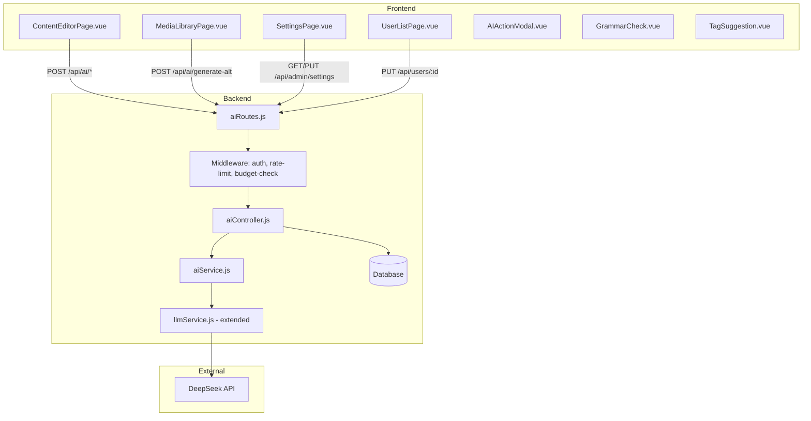
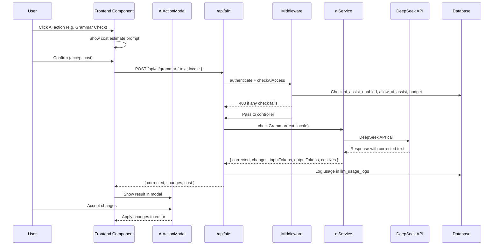

# AI Assist for Content Management — Implementation Plan

## Overview

Extend the existing CMS with AI‑assisted features (grammar check, translation, tag suggestion, SEO suggestions, writing improvement, image alt text generation) using the DeepSeek API (already integrated for summarisation). All features are toggleable via global settings, respect per‑user `allow_ai_assist` permission, and enforce a monthly KES budget.

---

## Architecture



---

## Backend Changes

### 1. Database Migration

#### 1a. Add `allow_ai_assist` to `users` table
- Column: `allow_ai_assist` (BOOLEAN, default false)
- Add to [`User.js`](backend/src/models/User.js) model definition

#### 1b. Add new settings keys (seeded in [`cmsSeeder.js`](backend/src/seeders/cmsSeeder.js))
| Key | Type | Default | Description |
|-----|------|---------|-------------|
| `ai_assist_enabled` | boolean | `false` | Global AI Assist toggle |
| `ai_assist_monthly_budget_kes` | decimal | `0` | Monthly budget in KES (0 = unlimited) |

#### 1c. Modify `llm_usage_logs` table — add `feature` column
- Column: `feature` (ENUM: `grammar`, `translate`, `tags`, `seo`, `alt`, `improve`, `summarise`)
- Update [`LlmUsageLog.js`](backend/src/models/LlmUsageLog.js) model

### 2. New AI Service — [`backend/src/services/aiService.js`](backend/src/services/aiService.js)

Extends the existing [`llmService.js`](backend/src/services/llmService.js) with feature-specific methods:

| Method | Endpoint | Prompt Strategy |
|--------|----------|-----------------|
| `checkGrammar(text, locale)` | `POST /ai/grammar` | System prompt: "You are a grammar checker for {locale}. Return JSON with corrected text and list of changes." |
| `translateText(text, sourceLocale, targetLocale)` | `POST /ai/translate` | System prompt: "Translate from {source} to {target}. Preserve HTML formatting. Return JSON with translated text." |
| `suggestTags(title, body, maxTags)` | `POST /ai/suggest-tags` | System prompt: "Generate up to {maxTags} relevant tags as a JSON array of strings." |
| `suggestSeo(title, body, locale)` | `POST /ai/suggest-seo` | System prompt: "Generate SEO meta description and keywords. Return JSON with metaDescription and metaKeywords." |
| `generateAltText(imageUrl, context)` | `POST /ai/generate-alt` | System prompt: "Generate concise alt text for this image. Return JSON with altText." |
| `improveWriting(text, instruction)` | `POST /ai/improve-writing` | System prompt: "Rewrite the text according to instruction: {instruction}. Return JSON with rewritten text." |

All methods follow the same pattern as [`llmService.summarize()`](backend/src/services/llmService.js:51):
1. Check `ai_assist_enabled` setting
2. Check API key
3. Call DeepSeek API with feature-specific prompt
4. Parse JSON response
5. Calculate cost via `calculateCost()`
6. Return `{ result, inputTokens, outputTokens, costKes }`

### 3. New AI Controller — [`backend/src/controllers/aiController.js`](backend/src/controllers/aiController.js)

Each handler:
1. Validates request body
2. Checks `req.user.allow_ai_assist` (from DB)
3. Checks global `ai_assist_enabled` setting
4. Checks rate limit (20 req/user/hour via in-memory map)
5. Checks monthly budget (sum `cost_kes` from `llm_usage_logs` for current month)
6. Calls `aiService` method
7. Logs usage in `llm_usage_logs` with `feature` field
8. Returns result

**Rate limiting**: In-memory `Map<userId, { count, resetAt }>` — simple, no external dependency.

**Budget check**: 
```sql
SELECT SUM(cost_kes) FROM llm_usage_logs 
WHERE user_id = ? AND createdAt >= DATE_TRUNC('month', NOW())
```
If `ai_assist_monthly_budget_kes > 0` AND `totalCost + estimatedCost > budget` → return 403.

### 4. New AI Routes — [`backend/src/routes/aiRoutes.js`](backend/src/routes/aiRoutes.js)

```javascript
// All require authenticate + ai_assist middleware
router.post('/grammar', authenticate, aiController.checkGrammar);
router.post('/translate', authenticate, aiController.translateText);
router.post('/suggest-tags', authenticate, aiController.suggestTags);
router.post('/suggest-seo', authenticate, aiController.suggestSeo);
router.post('/generate-alt', authenticate, aiController.generateAltText);
router.post('/improve-writing', authenticate, aiController.improveWriting);
```

Mounted at `/api/ai` in [`index.js`](backend/src/index.js:73).

### 5. Middleware — [`backend/src/middleware/checkAiAccess.js`](backend/src/middleware/checkAiAccess.js)

```javascript
// Checks:
// 1. Global ai_assist_enabled === 'true'
// 2. req.user.allow_ai_assist === true
// 3. Budget not exceeded
// Returns 403 with specific message if any check fails
```

### 6. User Model Update — [`backend/src/models/User.js`](backend/src/models/User.js)

Add field:
```javascript
allow_ai_assist: {
  type: DataTypes.BOOLEAN,
  defaultValue: false,
}
```

### 7. User Controller Update — [`backend/src/controllers/userController.js`](backend/src/controllers/userController.js)

Allow admin to update `allow_ai_assist` field when editing users.

### 8. Register in [`backend/src/index.js`](backend/src/index.js)

Add: `app.use('/api/ai', aiRoutes);`

---

## Frontend Changes

### 1. New Components

#### 1a. [`frontend/src/components/AIActionModal.vue`](frontend/src/components/AIActionModal.vue)

Reusable modal for any AI action:
- Props: `show`, `title`, `loading`, `result`, `costEstimate`, `error`
- Emits: `close`, `accept`, `cancel`
- Shows loading spinner (DaisyUI `loading loading-spinner`)
- Shows result preview
- Shows cost estimate with confirmation prompt
- Accept/Cancel buttons

#### 1b. [`frontend/src/components/GrammarCheck.vue`](frontend/src/components/GrammarCheck.vue)

Diff viewer for grammar changes:
- Props: `original`, `corrected`, `changes`
- Shows side-by-side or inline diff
- Highlights changes with color coding (green for additions, red for removals)
- Accept/Reject buttons for each change

#### 1c. [`frontend/src/components/TagSuggestion.vue`](frontend/src/components/TagSuggestion.vue)

Tag chip selector:
- Props: `suggestions` (string[]), `existingTags` (id[])
- Emits: `add(tagName)`, `dismiss(tagName)`
- Displays suggested tags as DaisyUI `badge` chips
- Click to add (turns `badge-primary`)
- Click again to remove

### 2. Settings Page Update — [`frontend/src/views/admin/SettingsPage.vue`](frontend/src/views/admin/SettingsPage.vue)

Add new card "AI Assist" section below existing "AI Summarisation" card:
- Toggle: `Enable AI Assist` (checkbox → `ai_assist_enabled`)
- Input: `Monthly Budget (KES)` (number → `ai_assist_monthly_budget_kes`)
- Usage summary: total cost this month, per-feature breakdown (fetch from `/api/admin/llm-usage`)

### 3. User Management Update — [`frontend/src/views/admin/UserListPage.vue`](frontend/src/views/admin/UserListPage.vue)

In the user edit modal/row:
- Add checkbox "Allow AI Assist" (`allow_ai_assist`)
- Only visible if global `ai_assist_enabled` is true
- Save via `PUT /api/users/:id`

### 4. Content Editor Integration — [`frontend/src/views/admin/ContentEditorPage.vue`](frontend/src/views/admin/ContentEditorPage.vue)

Add AI toolbar button (✨ icon) that opens a dropdown with:

```html
<div class="dropdown dropdown-end">
  <label tabindex="0" class="btn btn-ghost btn-sm gap-1">
    <span>✨ AI</span>
  </label>
  <ul tabindex="0" class="dropdown-content menu p-2 shadow bg-base-100 rounded-box w-56">
    <li><a @click="openAiAction('grammar')">📝 Grammar Check</a></li>
    <li><a @click="openAiAction('translate')">🌐 Translate</a></li>
    <li><a @click="openAiAction('tags')">🏷️ Generate Tags</a></li>
    <li><a @click="openAiAction('seo')">🔍 Generate SEO</a></li>
    <li><a @click="openAiAction('improve')">✏️ Improve Writing</a></li>
    <li><a @click="openAiAction('summarise')">📋 Summarise</a></li>
  </ul>
</div>
```

**Action handlers** (in `<script setup>`):

| Action | API Call | Target Field | UX Flow |
|--------|----------|-------------|---------|
| `grammar` | `POST /api/ai/grammar` | Current locale body | Show GrammarCheck modal → Accept replaces body |
| `translate` | `POST /api/ai/translate` | Target locale body | Select target locale → Show AIActionModal → Accept fills target tab |
| `tags` | `POST /api/ai/suggest-tags` | Tag selector | Show TagSuggestion → Click to add to `taxonomy_ids` |
| `seo` | `POST /api/ai/suggest-seo` | meta_description, meta_keywords | Show AIActionModal → Accept fills fields |
| `improve` | `POST /api/ai/improve-writing` | Current locale body | Select instruction → Show AIActionModal → Accept replaces body |
| `summarise` | `POST /api/content/:id/summarize` | (existing) | Already implemented |

### 5. Media Library Integration — [`frontend/src/views/admin/MediaLibraryPage.vue`](frontend/src/views/admin/MediaLibraryPage.vue)

Add "✨ Generate Alt Text" button next to each image:
- Visible when media is an image (mime_type starts with `image/`)
- Calls `POST /api/ai/generate-alt` with image URL
- Shows AIActionModal with generated alt text
- Accept → updates alt text via `PUT /api/media/:id`

### 6. API Client — [`frontend/src/api/ai.js`](frontend/src/api/ai.js)

```javascript
import apiClient from './axios'

export const aiApi = {
  checkGrammar(text, locale) { ... },
  translate(text, sourceLocale, targetLocale) { ... },
  suggestTags(title, body, maxTags = 5) { ... },
  suggestSeo(title, body, locale) { ... },
  generateAltText(imageUrl, context = '') { ... },
  improveWriting(text, instruction) { ... },
}
```

---

## Data Flow



---

## File Change Summary

### Backend (New Files)
| File | Purpose |
|------|---------|
| `backend/src/services/aiService.js` | AI feature methods (grammar, translate, tags, seo, alt, improve) |
| `backend/src/controllers/aiController.js` | Request handlers with validation, budget check, logging |
| `backend/src/routes/aiRoutes.js` | Route definitions for `/api/ai/*` |
| `backend/src/middleware/checkAiAccess.js` | Middleware for AI access control |

### Backend (Modified Files)
| File | Changes |
|------|---------|
| `backend/src/models/User.js` | Add `allow_ai_assist` field |
| `backend/src/models/LlmUsageLog.js` | Add `feature` enum field |
| `backend/src/seeders/cmsSeeder.js` | Add `ai_assist_enabled`, `ai_assist_monthly_budget_kes` settings |
| `backend/src/index.js` | Mount `/api/ai` routes |
| `backend/src/controllers/userController.js` | Allow updating `allow_ai_assist` |

### Frontend (New Files)
| File | Purpose |
|------|---------|
| `frontend/src/components/AIActionModal.vue` | Reusable AI action modal |
| `frontend/src/components/GrammarCheck.vue` | Grammar diff viewer |
| `frontend/src/components/TagSuggestion.vue` | Tag chip selector |
| `frontend/src/api/ai.js` | AI API client |

### Frontend (Modified Files)
| File | Changes |
|------|---------|
| `frontend/src/views/admin/SettingsPage.vue` | Add AI Assist section with toggle, budget, usage |
| `frontend/src/views/admin/UserListPage.vue` | Add "Allow AI Assist" checkbox in user edit |
| `frontend/src/views/admin/ContentEditorPage.vue` | Add AI toolbar dropdown + action handlers |
| `frontend/src/views/admin/MediaLibraryPage.vue` | Add "Generate Alt Text" button per image |

---

## Implementation Order

1. **Backend foundation**: Database migration (User model, LlmUsageLog, seeder), middleware, aiService
2. **Backend API**: aiController, aiRoutes, register in index.js
3. **Frontend components**: AIActionModal, GrammarCheck, TagSuggestion, ai.js API client
4. **Frontend integration**: SettingsPage, UserListPage, ContentEditorPage, MediaLibraryPage
5. **Testing**: Verify all endpoints, budget enforcement, UI flows
