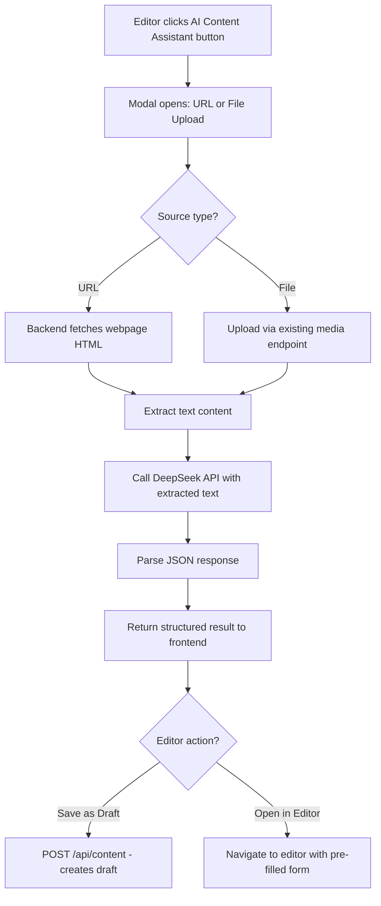
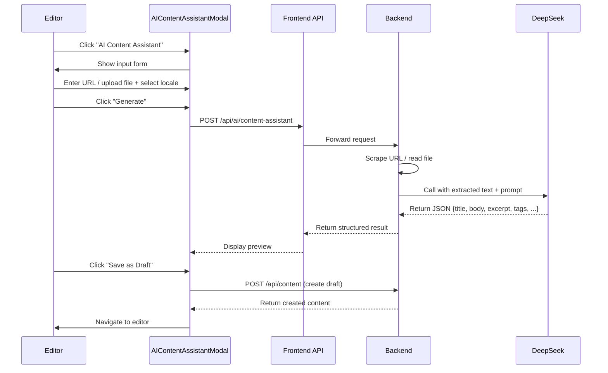

# AI Content Assistant — Implementation Plan

## Overview

Add a new "AI Content Assistant" feature that lets editors scrape content from URLs or uploaded files, generate structured draft content via DeepSeek API, and save it directly as a CMS draft or open it in the full editor.

## Architecture



## Files to Create

### 1. `backend/src/services/scraperService.js` (NEW)

A lightweight web scraping service using `axios` (already installed) and regex-based text extraction. No additional npm packages needed.

```javascript
// scraperService.js
const axios = require('axios');

/**
 * Fetch and extract meaningful text content from a URL.
 * Uses axios to fetch HTML, then strips tags to get plain text.
 * @param {string} url - The URL to scrape
 * @returns {Promise<string>} Extracted text content
 */
async function scrapeUrl(url) {
  const response = await axios.get(url, {
    timeout: 15000,
    headers: {
      'User-Agent': 'Mozilla/5.0 (compatible; WestPokotCMS/1.0)',
      'Accept': 'text/html,application/xhtml+xml',
    },
  });
  
  const html = response.data;
  
  // Remove script, style, nav, footer, header tags and their content
  let text = html.replace(/<script[^>]*>[\s\S]*?<\/script>/gi, ' ');
  text = text.replace(/<style[^>]*>[\s\S]*?<\/style>/gi, ' ');
  text = text.replace(/<nav[^>]*>[\s\S]*?<\/nav>/gi, ' ');
  text = text.replace(/<footer[^>]*>[\s\S]*?<\/footer>/gi, ' ');
  text = text.replace(/<header[^>]*>[\s\S]*?<\/header>/gi, ' ');
  
  // Strip remaining HTML tags
  text = text.replace(/<[^>]+>/g, ' ');
  
  // Decode common HTML entities
  text = text.replace(/&/g, '&');
  text = text.replace(/</g, '<');
  text = text.replace(/>/g, '>');
  text = text.replace(/"/g, '"');
  text = text.replace(/&#x27;/g, "'");
  text = text.replace(/&#x2F;/g, '/');
  text = text.replace(/&nbsp;/g, ' ');
  
  // Collapse whitespace
  text = text.replace(/\s+/g, ' ').trim();
  
  // Limit to first 8000 characters to avoid excessive token usage
  return text.substring(0, 8000);
}

/**
 * Extract text content from a file stored in the media system.
 * Supports: PDF, DOCX, TXT
 * @param {string} filePath - Full path to the file on disk
 * @param {string} mimeType - MIME type of the file
 * @returns {Promise<string>} Extracted text content
 */
async function extractFileText(filePath, mimeType) {
  const fs = require('fs');
  
  if (mimeType === 'text/plain') {
    return fs.readFileSync(filePath, 'utf-8').substring(0, 8000);
  }
  
  // For PDF and DOCX, return a message since we don't have parsing libraries
  // The extracted text from the filename + basic content will still be useful
  if (mimeType === 'application/pdf') {
    // Simple approach: read raw text from PDF (will get some content)
    const raw = fs.readFileSync(filePath, 'utf-8');
    // PDFs often have text between parentheses or BT...ET blocks
    const text = raw.replace(/\(([^)]*)\)/g, '$1 ')
                    .replace(/[^a-zA-Z0-9\s.,!?;:'"-]/g, ' ')
                    .replace(/\s+/g, ' ')
                    .trim()
                    .substring(0, 8000);
    return text || `[PDF file: ${path.basename(filePath)}. Text extraction limited. The AI will work with available content.]`;
  }
  
  if (mimeType === 'application/vnd.openxmlformats-officedocument.wordprocessingml.document') {
    // DOCX is a ZIP file; we can't easily extract without a library
    return `[DOCX file: ${path.basename(filePath)}. Full text extraction requires additional libraries. The AI will use the filename as context.]`;
  }
  
  return `[Unsupported file type: ${mimeType}]`;
}

module.exports = { scrapeUrl, extractFileText };
```

### 2. `backend/src/services/aiContentAssistantService.js` (NEW)

The core service that orchestrates scraping + AI generation.

```javascript
// aiContentAssistantService.js
const { scrapeUrl, extractFileText } = require('./scraperService');
const { callDeepSeek, parseJsonResponse } = require('./aiService');
const { calculateCost } = require('./llmService');

/**
 * Generate structured content from a source URL or uploaded file.
 * 
 * @param {object} params
 * @param {'url'|'file'} params.sourceType
 * @param {string} params.source - URL string or media ID
 * @param {string} params.targetLocale - 'en' | 'sw' | 'pok'
 * @param {string} params.additionalInstructions - Optional instructions
 * @returns {Promise<object>} { title, body, excerpt, tags, metaDescription, suggestedCategory, inputTokens, outputTokens, costKes }
 */
async function generateContent(params) {
  const { sourceType, source, targetLocale, additionalInstructions } = params;
  
  // Step 1: Extract text from source
  let extractedText = '';
  
  if (sourceType === 'url') {
    extractedText = await scrapeUrl(source);
  } else if (sourceType === 'file') {
    // Look up the media record to get file path and mime type
    const Media = require('../models/Media');
    const path = require('path');
    
    const media = await Media.findByPk(source);
    if (!media) {
      throw new Error('Media file not found.');
    }
    
    const filePath = path.join(__dirname, '..', '..', 'storage', 'media', media.storage_path || media.disk_filename);
    extractedText = await extractFileText(filePath, media.mime_type);
  }
  
  if (!extractedText || extractedText.trim().length < 20) {
    throw new Error('Could not extract meaningful content from the source.');
  }
  
  // Step 2: Build locale-specific prompt
  const localeNames = { en: 'English', sw: 'Kiswahili', pok: 'Pokot' };
  const langName = localeNames[targetLocale] || 'English';
  
  const instructions = additionalInstructions 
    ? `\nAdditional instructions from the editor: ${additionalInstructions}` 
    : '';
  
  const systemPrompt = `You are a professional content writer for the West Pokot County Government website. 
Based on the provided source text, generate structured content in ${langName}.

Return a JSON object with the following fields:
- "title": A compelling, SEO-friendly title (max 120 characters)
- "body": The full article body in HTML format. Use <p>, <h2>, <h3>, <ul>, <ol>, <li>, <strong>, <em> tags as appropriate. Make it comprehensive and well-structured.
- "excerpt": A brief summary of the content (2-3 sentences, max 300 characters)
- "tags": An array of 3-7 relevant tags (lowercase, single words or short phrases)
- "metaDescription": An SEO meta description (150-160 characters)
- "suggestedCategory": A suggested category name (e.g., "News", "Announcements", "Projects", "Services")${instructions}

Important guidelines:
- Write in ${langName} only
- Make the content factual and professional, suitable for a government website
- Preserve key facts, dates, names, and statistics from the source
- Do not fabricate information not present in the source text
- Format the body as clean HTML without markdown`;

  const userContent = `Source text:\n\n${extractedText}`;
  
  // Step 3: Call DeepSeek with higher max tokens for full article generation
  const { content, inputTokens, outputTokens } = await callDeepSeek(
    [
      { role: 'system', content: systemPrompt },
      { role: 'user', content: userContent },
    ],
    { maxTokens: 4000, temperature: 0.3 }
  );
  
  // Step 4: Parse response
  const parsed = parseJsonResponse(content);
  const costKes = calculateCost(inputTokens, outputTokens);
  
  return {
    title: parsed.title || 'Untitled',
    body: parsed.body || '<p>No content generated.</p>',
    excerpt: parsed.excerpt || '',
    tags: Array.isArray(parsed.tags) ? parsed.tags : [],
    metaDescription: parsed.metaDescription || '',
    suggestedCategory: parsed.suggestedCategory || '',
    inputTokens,
    outputTokens,
    costKes,
  };
}

module.exports = { generateContent };
```

### 3. `backend/src/controllers/aiContentAssistantController.js` (NEW)

```javascript
// aiContentAssistantController.js
const aiContentAssistantService = require('../services/aiContentAssistantService');
const LlmUsageLog = require('../models/LlmUsageLog');

// Reuse rate limiter from aiController pattern
const rateLimitMap = new Map();
const RATE_LIMIT = 10; // Lower limit since this is a heavy operation
const RATE_WINDOW_MS = 60 * 60 * 1000;

const checkRateLimit = (userId) => {
  const now = Date.now();
  const entry = rateLimitMap.get(userId);
  if (!entry || now > entry.resetAt) {
    rateLimitMap.set(userId, { count: 1, resetAt: now + RATE_WINDOW_MS });
    return { allowed: true, remaining: RATE_LIMIT - 1 };
  }
  if (entry.count >= RATE_LIMIT) {
    const resetMinutes = Math.ceil((entry.resetAt - now) / 60000);
    return { allowed: false, remaining: 0, resetMinutes };
  }
  entry.count++;
  return { allowed: true, remaining: RATE_LIMIT - entry.count };
};

const logUsage = async (userId, inputTokens, outputTokens, costKes, locale = 'en') => {
  try {
    await LlmUsageLog.create({
      user_id: userId,
      locale,
      feature: 'content-assistant',
      input_tokens: inputTokens,
      output_tokens: outputTokens,
      cost_kes: costKes,
    });
  } catch (error) {
    console.error('Failed to log AI usage:', error.message);
  }
};

/**
 * POST /api/ai/content-assistant
 * Generate structured content from a URL or uploaded file.
 */
const generateContent = async (req, res, next) => {
  try {
    const { sourceType, source, targetLocale, additionalInstructions } = req.body;
    
    // Validate
    if (!sourceType || !['url', 'file'].includes(sourceType)) {
      return res.status(400).json({ error: 'Validation error', message: 'sourceType must be "url" or "file".' });
    }
    if (!source || typeof source !== 'string' || source.trim().length === 0) {
      return res.status(400).json({ error: 'Validation error', message: 'source is required.' });
    }
    if (sourceType === 'url') {
      try { new URL(source); } catch {
        return res.status(400).json({ error: 'Validation error', message: 'Invalid URL format.' });
      }
    }
    if (!targetLocale || !['en', 'sw', 'pok'].includes(targetLocale)) {
      return res.status(400).json({ error: 'Validation error', message: 'targetLocale must be "en", "sw", or "pok".' });
    }
    
    // Rate limit check
    const rateCheck = checkRateLimit(req.user.id);
    if (!rateCheck.allowed) {
      return res.status(429).json({
        error: 'Rate limit exceeded',
        message: `You have exceeded the rate limit of ${RATE_LIMIT} requests per hour. Try again in ${rateCheck.resetMinutes} minutes.`,
      });
    }
    
    // Generate content
    const result = await aiContentAssistantService.generateContent({
      sourceType,
      source,
      targetLocale,
      additionalInstructions: additionalInstructions || '',
    });
    
    // Log usage
    await logUsage(req.user.id, result.inputTokens, result.outputTokens, result.costKes, targetLocale);
    
    res.json({
      title: result.title,
      body: result.body,
      excerpt: result.excerpt,
      tags: result.tags,
      metaDescription: result.metaDescription,
      suggestedCategory: result.suggestedCategory,
      cost: result.costKes,
      usage: { inputTokens: result.inputTokens, outputTokens: result.outputTokens },
    });
  } catch (error) {
    next(error);
  }
};

module.exports = { generateContent };
```

### 4. Update `backend/src/routes/aiRoutes.js` — Add new route

Add after existing routes:
```javascript
// AI Content Assistant
router.post('/content-assistant', authenticate, checkAiAccess, aiContentAssistantController.generateContent);
```

### 5. Update `backend/src/services/aiService.js` — Export `callDeepSeek` and `parseJsonResponse`

The `aiContentAssistantService.js` needs access to `callDeepSeek` and `parseJsonResponse`. Currently they are not exported. Add to `module.exports`:

```javascript
module.exports = {
  checkGrammar,
  translateText,
  suggestTags,
  suggestSeo,
  generateAltText,
  improveWriting,
  callDeepSeek,      // NEW
  parseJsonResponse, // NEW
};
```

### 6. `frontend/src/api/aiContentAssistant.js` (NEW)

```javascript
import apiClient from './axios'

/**
 * Generate structured content from a URL or uploaded file.
 * @param {object} params
 * @param {'url'|'file'} params.sourceType
 * @param {string} params.source - URL or media ID
 * @param {string} params.targetLocale - 'en' | 'sw' | 'pok'
 * @param {string} [params.additionalInstructions] - Optional instructions
 * @returns {Promise<{title, body, excerpt, tags, metaDescription, suggestedCategory, cost, usage}>}
 */
export async function generateContent(params) {
  const response = await apiClient.post('/ai/content-assistant', params)
  return response.data
}
```

### 7. `frontend/src/components/AIContentAssistantModal.vue` (NEW)

A new modal component with:
- Tab toggle: URL / File Upload
- URL input field (shown when URL tab active)
- File upload area (shown when File tab active) — uses existing media upload endpoint
- Target locale selector (en/sw/pok)
- Optional instructions textarea
- Generate button
- Loading state with progress messages
- Result preview showing: title, excerpt, tags, suggested category, meta description, cost
- Two action buttons: "Save as Draft" and "Open in Editor"

```vue
<script setup>
import { ref } from 'vue'
import { generateContent } from '../api/aiContentAssistant'
import { useContentStore } from '../stores/content'
import { useRouter } from 'vue-router'
import { useMediaStore } from '../stores/media'

const props = defineProps({
  visible: { type: Boolean, default: false },
})

const emit = defineEmits(['close'])

const router = useRouter()
const contentStore = useContentStore()
const mediaStore = useMediaStore()

const sourceType = ref('url')
const url = ref('')
const targetLocale = ref('en')
const additionalInstructions = ref('')
const loading = ref(false)
const error = ref('')
const result = ref(null)
const costKes = ref(0)
const saving = ref(false)

// File upload state
const selectedFile = ref(null)
const uploadedMediaId = ref(null)
const uploading = ref(false)

async function handleFileChange(event) {
  const file = event.target.files?.[0]
  if (!file) return
  selectedFile.value = file
  uploading.value = true
  try {
    const media = await mediaStore.uploadMedia([file])
    uploadedMediaId.value = media[0]?.id
  } catch (err) {
    error.value = 'Failed to upload file.'
  } finally {
    uploading.value = false
  }
}

async function handleGenerate() {
  loading.value = true
  error.value = ''
  result.value = null
  
  try {
    const source = sourceType.value === 'url' ? url.value : String(uploadedMediaId.value)
    const response = await generateContent({
      sourceType: sourceType.value,
      source,
      targetLocale: targetLocale.value,
      additionalInstructions: additionalInstructions.value || undefined,
    })
    result.value = response
    costKes.value = response.cost || 0
  } catch (err) {
    error.value = err.response?.data?.message || 'Failed to generate content.'
  } finally {
    loading.value = false
  }
}

async function saveAsDraft() {
  if (!result.value) return
  saving.value = true
  try {
    const contentData = {
      type: 'page',
      slug: result.value.title
        .toLowerCase()
        .replace(/[^a-z0-9]+/g, '-')
        .replace(/^-|-$/g, '')
        .substring(0, 100),
      translations: [
        {
          locale: targetLocale.value,
          title: result.value.title,
          body: result.value.body,
          excerpt: result.value.excerpt,
          meta_description: result.value.metaDescription,
          meta_keywords: result.value.tags?.join(', ') || '',
        },
      ],
      meta: result.value.metaDescription
        ? [{ meta_key: 'ai_generated', meta_value: 'true' }]
        : [],
    }
    
    const created = await contentStore.createContent(contentData)
    emit('close')
    router.push(`/admin/content/${created.id}/edit`)
  } catch (err) {
    error.value = err.response?.data?.message || 'Failed to save draft.'
  } finally {
    saving.value = false
  }
}

function openInEditor() {
  if (!result.value) return
  // Navigate to create page with pre-filled data via query params
  // The ContentEditorPage will read these and pre-fill the form
  const query = {
    ai_title: result.value.title,
    ai_body: result.value.body,
    ai_excerpt: result.value.excerpt,
    ai_locale: targetLocale.value,
    ai_metaDescription: result.value.metaDescription,
    ai_tags: result.value.tags?.join(','),
    ai_category: result.value.suggestedCategory,
  }
  emit('close')
  router.push({ name: 'ContentCreate', query })
}

function reset() {
  sourceType.value = 'url'
  url.value = ''
  targetLocale.value = 'en'
  additionalInstructions.value = ''
  result.value = null
  error.value = ''
  costKes.value = 0
  selectedFile.value = null
  uploadedMediaId.value = null
}

function handleClose() {
  if (!loading.value && !saving.value) {
    reset()
    emit('close')
  }
}
</script>

<template>
  <dialog :open="visible" class="modal" :class="{ 'modal-open': visible }" @click.self="handleClose">
    <div class="modal-box max-w-3xl">
      <!-- Header -->
      <div class="flex items-center justify-between mb-4">
        <h3 class="font-bold text-lg flex items-center gap-2">
          <span>🤖</span>
          AI Content Assistant
        </h3>
        <button class="btn btn-sm btn-ghost btn-square" :disabled="loading || saving" @click="handleClose">✕</button>
      </div>

      <!-- Input Form (shown when no result yet) -->
      <div v-if="!result && !loading" class="space-y-4">
        <!-- Source Type Toggle -->
        <div class="tabs tabs-box">
          <a class="tab tab-sm" :class="{ 'tab-active': sourceType === 'url' }" @click="sourceType = 'url'">🌐 URL</a>
          <a class="tab tab-sm" :class="{ 'tab-active': sourceType === 'file' }" @click="sourceType = 'file'">📄 Upload File</a>
        </div>

        <!-- URL Input -->
        <div v-if="sourceType === 'url'" class="form-control">
          <label class="label"><span class="label-text">Paste a public webpage URL</span></label>
          <input v-model="url" type="url" placeholder="https://example.com/article" class="input input-bordered" />
        </div>

        <!-- File Upload -->
        <div v-else class="form-control">
          <label class="label"><span class="label-text">Upload a PDF, DOCX, or TXT file</span></label>
          <input type="file" accept=".pdf,.docx,.txt,text/plain" class="file-input file-input-bordered" @change="handleFileChange" />
          <div v-if="uploading" class="mt-2 text-sm text-base-content/60">Uploading file...</div>
          <div v-if="uploadedMediaId" class="mt-2 text-sm text-success">✅ File uploaded successfully</div>
        </div>

        <!-- Target Locale -->
        <div class="form-control">
          <label class="label"><span class="label-text">Target Language</span></label>
          <select v-model="targetLocale" class="select select-bordered">
            <option value="en">English</option>
            <option value="sw">Kiswahili</option>
            <option value="pok">Pokot</option>
          </select>
        </div>

        <!-- Additional Instructions -->
        <div class="form-control">
          <label class="label"><span class="label-text">Additional Instructions (optional)</span></label>
          <textarea v-model="additionalInstructions" class="textarea textarea-bordered" rows="2" placeholder="e.g., Focus on the new water project..."></textarea>
        </div>

        <!-- Error -->
        <div v-if="error" class="alert alert-error"><span>⚠️ {{ error }}</span></div>

        <!-- Generate Button -->
        <button class="btn btn-primary w-full" :disabled="!canGenerate" @click="handleGenerate">
          🤖 Generate Content
        </button>
      </div>

      <!-- Loading State -->
      <div v-if="loading" class="flex flex-col items-center py-8">
        <span class="loading loading-spinner loading-lg text-primary"></span>
        <p class="mt-4 text-base-content/60">Scraping source and generating content...</p>
        <p class="text-sm text-base-content/40">This may take 30-60 seconds.</p>
      </div>

      <!-- Result Preview -->
      <div v-if="result && !loading" class="space-y-4">
        <!-- Title -->
        <div>
          <label class="label"><span class="label-text font-semibold">Title</span></label>
          <div class="bg-base-200 rounded-lg p-3 text-sm">{{ result.title }}</div>
        </div>

        <!-- Excerpt -->
        <div>
          <label class="label"><span class="label-text font-semibold">Excerpt</span></label>
          <div class="bg-base-200 rounded-lg p-3 text-sm">{{ result.excerpt }}</div>
        </div>

        <!-- Tags -->
        <div>
          <label class="label"><span class="label-text font-semibold">Tags</span></label>
          <div class="flex flex-wrap gap-1">
            <span v-for="tag in result.tags" :key="tag" class="badge badge-primary badge-sm">{{ tag }}</span>
          </div>
        </div>

        <!-- Suggested Category -->
        <div v-if="result.suggestedCategory">
          <label class="label"><span class="label-text font-semibold">Suggested Category</span></label>
          <div class="badge badge-outline">{{ result.suggestedCategory }}</div>
        </div>

        <!-- Meta Description -->
        <div>
          <label class="label"><span class="label-text font-semibold">Meta Description</span></label>
          <div class="bg-base-200 rounded-lg p-3 text-sm">{{ result.metaDescription }}</div>
        </div>

        <!-- Body Preview (collapsible) -->
        <details class="bg-base-200 rounded-lg">
          <summary class="p-3 cursor-pointer font-semibold text-sm">Preview Body Content</summary>
          <div class="p-3 pt-0 text-sm max-h-60 overflow-y-auto" v-html="result.body"></div>
        </details>

        <!-- Cost -->
        <div v-if="costKes > 0" class="flex items-center gap-2 text-sm text-base-content/60 bg-base-200 rounded-lg px-4 py-2">
          <span>💰</span>
          <span>Estimated cost: <strong>KES {{ costKes.toFixed(2) }}</strong></span>
        </div>

        <!-- Error -->
        <div v-if="error" class="alert alert-error"><span>⚠️ {{ error }}</span></div>

        <!-- Action Buttons -->
        <div class="flex gap-2">
          <button class="btn btn-ghost flex-1" @click="reset">🔄 Start Over</button>
          <button class="btn btn-outline flex-1" :disabled="saving" @click="openInEditor">
            ✏️ Open in Editor
          </button>
          <button class="btn btn-primary flex-1" :disabled="saving" @click="saveAsDraft">
            {{ saving ? 'Saving...' : '💾 Save as Draft' }}
          </button>
        </div>
      </div>
    </div>

    <form method="dialog" class="modal-backdrop">
      <button @click="handleClose" :disabled="loading || saving">close</button>
    </form>
  </dialog>
</template>
```

### 8. Update `frontend/src/views/admin/ContentListPage.vue` — Add AI Content Assistant button

Add a button next to the "Create New" button in the page header:

```vue
<button class="btn btn-ghost" @click="showAiAssistant = true">
  🤖 AI Content Assistant
</button>

<!-- AI Content Assistant Modal -->
<AIContentAssistantModal :visible="showAiAssistant" @close="showAiAssistant = false" />
```

And in `<script setup>`:
```javascript
import AIContentAssistantModal from '../../components/AIContentAssistantModal.vue'
const showAiAssistant = ref(false)
```

### 9. Update `frontend/src/views/admin/ContentEditorPage.vue` — Handle pre-filled data from query params

In the `onMounted` or initialization logic, check for `route.query.ai_title` and pre-fill the form:

```javascript
// Check for AI-generated content in query params
if (route.query.ai_title) {
  form.value.translations[0].title = route.query.ai_title
  form.value.translations[0].body = route.query.ai_body || ''
  form.value.translations[0].excerpt = route.query.ai_excerpt || ''
  form.value.translations[0].meta_description = route.query.ai_metaDescription || ''
  form.value.translations[0].meta_keywords = route.query.ai_tags || ''
  // Set locale if provided
  if (route.query.ai_locale) {
    activeLocale.value = route.query.ai_locale
  }
}
```

## Data Flow



## Files Modified

| File | Change |
|------|--------|
| `backend/src/services/aiService.js` | Export `callDeepSeek` and `parseJsonResponse` |
| `backend/src/routes/aiRoutes.js` | Add `POST /content-assistant` route |
| `frontend/src/views/admin/ContentListPage.vue` | Add AI Content Assistant button + modal |
| `frontend/src/views/admin/ContentEditorPage.vue` | Handle pre-filled data from query params |

## Files Created

| File | Purpose |
|------|---------|
| `backend/src/services/scraperService.js` | URL scraping + file text extraction |
| `backend/src/services/aiContentAssistantService.js` | Orchestrates scrape + AI generation |
| `backend/src/controllers/aiContentAssistantController.js` | Request handler with validation + rate limiting |
| `frontend/src/api/aiContentAssistant.js` | API client for the new endpoint |
| `frontend/src/components/AIContentAssistantModal.vue` | Full modal UI for the assistant |

## Edge Cases & Considerations

1. **Large URLs**: Text is truncated to 8000 characters to avoid excessive token usage
2. **Unsupported file types**: PDF and DOCX have limited extraction; the AI still gets filename context
3. **Rate limiting**: 10 requests/hour/user (lower than other AI features since this is a heavy operation)
4. **Budget enforcement**: Uses existing `checkAiAccess` middleware which checks monthly KES budget
5. **Slug generation**: Auto-generated from title, truncated to 100 chars, sanitized
6. **Error handling**: All API errors are caught and displayed in the modal
7. **Loading state**: Modal shows spinner with descriptive text during generation
8. **Empty state**: Modal shows input form when no result yet
9. **Duplicate prevention**: The existing `createContent` controller checks slug uniqueness
