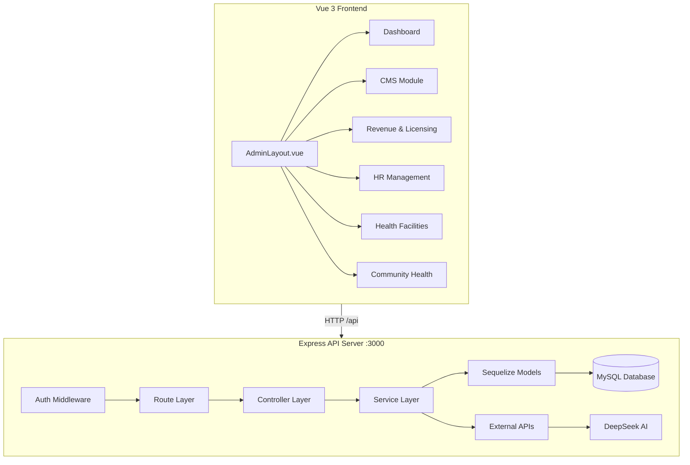

# West Pokot County ERP — Application Analysis

## Overview

**West Pokot County ERP** is a full-featured Enterprise Resource Planning system built for the West Pokot County Government. It is a **monolithic backend API** (Express + Sequelize + MySQL) with a **Vue.js frontend** (likely Vue 3 + Pinia + DaisyUI). The system manages multiple county operations through modular domains.

---

## System Architecture



---

## Technology Stack

| Layer | Technology | Purpose |
|-------|-----------|---------|
| **Runtime** | Node.js | Server-side JavaScript |
| **Framework** | Express 4.21 | HTTP server & routing |
| **ORM** | Sequelize 6.37 | MySQL database abstraction |
| **Database** | MySQL 8 | Relational data store |
| **Auth** | JWT + bcrypt | Token-based authentication |
| **AI** | DeepSeek API | Content generation & analysis |
| **Frontend** | Vue 3 + Pinia + DaisyUI | SPA admin panel |
| **Editor** | TipTap | Rich text editing (CMS) |

---

## Module Breakdown

### 1. Core User & Role Management
- **Models**: [`Role`](backend/src/models/Role.js), [`Department`](backend/src/models/Department.js), [`User`](backend/src/models/User.js)
- **Auth**: JWT-based with bcrypt password hashing
- **Routes**: `/api/auth`, `/api/users`
- **Key features**: Role-based access control, department hierarchy

### 2. Content Management System (CMS)
- **Status**: Implemented (per plans/cms-module-plan.md)
- **Models**: 13+ models including [`Content`](backend/src/models/Content.js), [`ContentTranslation`](backend/src/models/ContentTranslation.js), [`ContentMeta`](backend/src/models/ContentMeta.js), [`ContentWorkflowLog`](backend/src/models/ContentWorkflowLog.js), [`ContentVersion`](backend/src/models/ContentVersion.js), [`Media`](backend/src/models/Media.js), [`Taxonomy`](backend/src/models/Taxonomy.js), [`Person`](backend/src/models/Person.js), [`Fact`](backend/src/models/Fact.js), [`Setting`](backend/src/models/Setting.js), [`Menu`](backend/src/models/Menu.js), [`MenuItem`](backend/src/models/MenuItem.js), [`HeroSlide`](backend/src/models/HeroSlide.js), [`ContactMessage`](backend/src/models/ContactMessage.js), [`NewsletterSubscriber`](backend/src/models/NewsletterSubscriber.js)
- **Routes**: `/api/content`, `/api/media`, `/api/taxonomies`, `/api/public`, `/api/admin`, `/api/llm`, `/api/ai`, `/api/admin/menus`
- **Key features**:
  - Multilingual content (English, Kiswahili, Pokot)
  - Content workflow: draft → pending_review → approved → published/scheduled
  - Versioning with rollback (keeps last 10 versions)
  - Media library with UUID-based file storage
  - Taxonomy (categories/tags) with hierarchy
  - AI-powered summarization via DeepSeek
  - Menu builder with nested items
  - Contact form & newsletter subscriptions

### 3. AI Content Assistant
- **Status**: Planned (per plans/ai-content-assistant-plan.md)
- **Purpose**: Generate structured content from URLs or uploaded files via DeepSeek
- **Components**:
  - [`scraperService.js`](backend/src/services/scraperService.js) — URL scraping + file text extraction
  - [`aiContentAssistantService.js`](backend/src/services/aiContentAssistantService.js) — Orchestrates scrape + AI generation
  - [`aiContentAssistantController.js`](backend/src/controllers/aiContentAssistantController.js) — Request handler
  - [`AIContentAssistantModal.vue`](frontend/src/components/AIContentAssistantModal.vue) — Frontend modal UI

### 4. Revenue & Business Licensing
- **Models**: [`PermitType`](backend/src/models/PermitType.js), [`Permit`](backend/src/models/Permit.js), [`Transaction`](backend/src/models/Transaction.js), [`PermitAssignment`](backend/src/models/PermitAssignment.js), [`CitizenRepresentation`](backend/src/models/CitizenRepresentation.js)
- **Routes**: `/api/permits`, `/api/mpesa/callback`, `/api/verify/:permit_id`
- **Key features**: Permit lifecycle, M-Pesa payment integration, clerk assignment, renewals

### 5. Human Capital Management (HR)
- **Models**: [`Position`](backend/src/models/Position.js), [`Employee`](backend/src/models/Employee.js), [`EmploymentHistory`](backend/src/models/EmploymentHistory.js), [`LeaveRequest`](backend/src/models/LeaveRequest.js), [`LeaveBalance`](backend/src/models/LeaveBalance.js), [`AttendanceLog`](backend/src/models/AttendanceLog.js), [`RecruitmentVacancy`](backend/src/models/RecruitmentVacancy.js), [`RecruitmentApplication`](backend/src/models/RecruitmentApplication.js), [`PerformanceReview`](backend/src/models/PerformanceReview.js), [`DisciplinaryCase`](backend/src/models/DisciplinaryCase.js)
- **Routes**: `/api/hr/*`, `/api/public/*` (HR-related public endpoints)
- **Key features**: Employee lifecycle, leave management, attendance, recruitment, performance reviews, disciplinary cases

### 6. Health Facility Management
- **Models**: [`HealthInventoryItem`](backend/src/models/HealthInventoryItem.js), [`HealthInventoryTransaction`](backend/src/models/HealthInventoryTransaction.js), [`HealthSupplier`](backend/src/models/HealthSupplier.js), [`HealthPatient`](backend/src/models/HealthPatient.js), [`HealthPatientVisit`](backend/src/models/HealthPatientVisit.js), [`HealthAppointment`](backend/src/models/HealthAppointment.js), [`HealthCampaign`](backend/src/models/HealthCampaign.js), [`HealthCampaignParticipant`](backend/src/models/HealthCampaignParticipant.js), [`HealthAmbulanceRequest`](backend/src/models/HealthAmbulanceRequest.js)
- **Routes**: `/api/health`
- **Key features**: Inventory management, patient records, appointments, health campaigns, ambulance requests

### 7. Community Health Extension
- **Models**: [`HealthCommunityUnit`](backend/src/models/HealthCommunityUnit.js), [`HealthCommunityCommittee`](backend/src/models/HealthCommunityCommittee.js), [`HealthCommunityAssistant`](backend/src/models/HealthCommunityAssistant.js), [`HealthCommunityVolunteer`](backend/src/models/HealthCommunityVolunteer.js), [`HealthHousehold`](backend/src/models/HealthHousehold.js), [`HealthHouseholdMember`](backend/src/models/HealthHouseholdMember.js), [`HealthHouseholdVisit`](backend/src/models/HealthHouseholdVisit.js), [`HealthCommunityDialogue`](backend/src/models/HealthCommunityDialogue.js), [`HealthCommunityActionDay`](backend/src/models/HealthCommunityActionDay.js), [`HealthChvKit`](backend/src/models/HealthChvKit.js), [`HealthCommunitySupplyRequest`](backend/src/models/HealthCommunitySupplyRequest.js)
- **Routes**: `/api/health/community`
- **Key features**: Community units, CHVs (Community Health Volunteers), household tracking, supply chain for CHV kits, referral system

---

## Database Architecture

The database uses **MySQL** with Sequelize ORM. Key characteristics:

- **~60+ models** across all modules
- **Soft deletes** (paranoid mode) on Content model
- **Cascading deletes** on child records (translations, versions, workflow logs)
- **Self-referencing** for taxonomy hierarchy, menu items, employee supervisor, permit renewals
- **Many-to-many** via junction tables: ContentMedia, ContentTaxonomy
- **Connection pool**: max 10 connections, 30s acquire timeout

---

## API Route Map

```
/api/auth          → Authentication (login, register, profile)
/api/users         → User management
/api/lookups       → Reference data lookups
/api/dashboard     → Dashboard analytics

# CMS
/api/content       → Content CRUD + workflow (submit, approve, reject, publish, schedule)
/api/media         → Media upload, list, delete
/api/taxonomies    → Category/tag CRUD
/api/public        → Public-facing content endpoints
/api/admin         → System settings
/api/llm           → AI summarization
/api/ai            → AI features (grammar, translation, tags, SEO, content assistant)
/api/admin/menus   → Menu builder

# Revenue
/api/permits       → Permit CRUD + M-Pesa integration
/api/mpesa/callback → M-Pesa payment callback
/api/verify/:id    → Permit verification

# HR
/api/hr/*          → HR management endpoints
/api/public/*      → Public HR endpoints (vacancies, etc.)

# Health
/api/health        → Health facility management
/api/health/community → Community health extension
```

---

## Key Observations

### Strengths
1. **Well-modularized** — Clear separation by domain (CMS, HR, Revenue, Health)
2. **Comprehensive model associations** — All relationships properly defined in [`models/index.js`](backend/src/models/index.js)
3. **Graceful error handling** — Unhandled rejections caught, graceful shutdown, database retry logic with exponential backoff
4. **Multilingual support** — Built for English, Kiswahili, and Pokot languages
5. **AI integration** — DeepSeek API for content generation, translation, summarization
6. **Security** — JWT auth, role-based access, rate limiting on AI endpoints

### Potential Areas for Improvement / Review
1. **No tests visible** — `jest` is in devDependencies but no test files were seen
2. **Frontend structure** — Not fully explored; would benefit from review of component architecture
3. **Environment configuration** — `.env` file not reviewed; ensure production secrets management
4. **API documentation** — No Swagger/OpenAPI spec visible
5. **File upload validation** — Media uploads should validate file types and sizes server-side
6. **Migration strategy** — Using `sync({ alter: false })` in dev; production should use proper migrations
7. **Cross-module dependencies** — Media model is shared across CMS, HR, and Health; ensure consistent usage

---

## Recommended Next Steps

1. **Review frontend implementation** — Check if Vue components match the planned architecture
2. **Add automated tests** — Unit tests for services, integration tests for API endpoints
3. **Implement AI Content Assistant** — Complete the planned feature (backend + frontend)
4. **Add API documentation** — Swagger/OpenAPI for developer onboarding
5. **Database migrations** — Replace `sync()` with proper migration files for production safety
6. **Performance audit** — Add indexes, query optimization for large datasets
7. **Security audit** — Rate limiting, input validation, CORS configuration review
