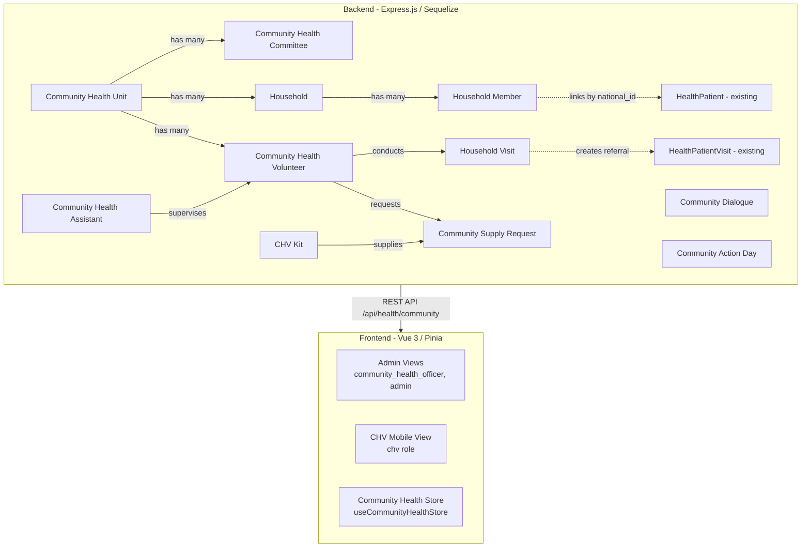
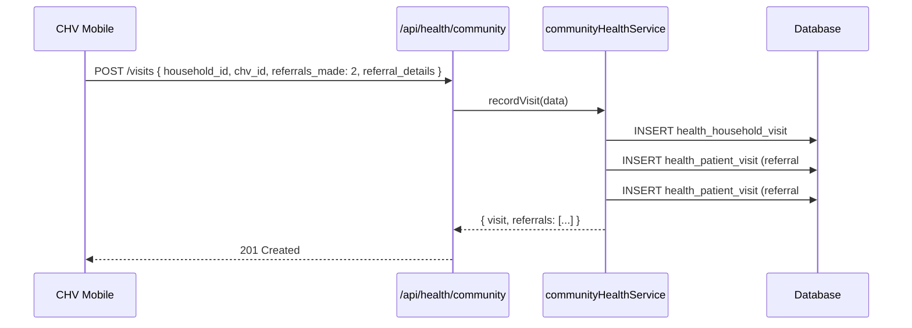
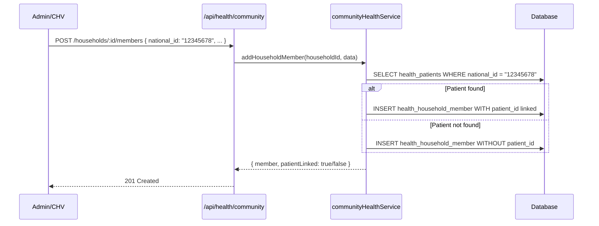

# Community Health Extension Module - Architectural Plan

## Overview

This module extends the existing Health Facility Management system with **Community Health Extension** features based on the **Kenya National Community Health Strategy 2020-2025**. It introduces Community Health Units (CHUs), Community Health Assistants (CHAs), Community Health Volunteers (CHVs), household-level tracking, community engagement activities, and supply chain management for CHVs.

---

## Architecture Diagram



---

## 1. New Database Models (10 models)

### 1.1 HealthCommunityUnit
Represents a geographic community health unit (CHU) - the foundational organizational unit.

| Column | Type | Constraints | Notes |
|--------|------|-------------|-------|
| id | INTEGER | PK, AutoIncrement | |
| name | STRING(100) | NOT NULL | e.g., "Kapenguria Ward CHU" |
| code | STRING(20) | UNIQUE, NOT NULL | e.g., "CHU-001" |
| ward | STRING(100) | NOT NULL | Administrative ward |
| sub_county | STRING(100) | NOT NULL | |
| village | STRING(100) | nullable | |
| status | ENUM('active','inactive') | default 'active' | |
| established_date | DATEONLY | nullable | |
| total_households | INTEGER | default 0 | Target household count |
| total_chvs | INTEGER | default 0 | Target CHV count |
| created_at | DATE | Auto | |
| updated_at | DATE | Auto | |

### 1.2 HealthCommunityCommittee
Community Health Committee members for a CHU.

| Column | Type | Constraints | Notes |
|--------|------|-------------|-------|
| id | INTEGER | PK, AutoIncrement | |
| community_unit_id | INTEGER | FK -> HealthCommunityUnit, NOT NULL | |
| full_name | STRING(100) | NOT NULL | |
| role | STRING(50) | NOT NULL | e.g., 'chairperson', 'secretary', 'treasurer', 'member' |
| phone | STRING(20) | nullable | |
| email | STRING(100) | nullable | |
| elected_date | DATEONLY | nullable | |
| term_end_date | DATEONLY | nullable | |
| is_active | BOOLEAN | default true | |
| created_at | DATE | Auto | |
| updated_at | DATE | Auto | |

### 1.3 HealthCommunityAssistant
Community Health Assistants - government health workers who supervise CHVs.

| Column | Type | Constraints | Notes |
|--------|------|-------------|-------|
| id | INTEGER | PK, AutoIncrement | |
| employee_id | INTEGER | FK -> Employee, UNIQUE, nullable | Links to HR employee record |
| full_name | STRING(100) | NOT NULL | |
| national_id | STRING(20) | UNIQUE, NOT NULL | |
| phone | STRING(20) | NOT NULL | |
| email | STRING(100) | nullable | |
| sub_county | STRING(100) | NOT NULL | |
| assigned_units | INTEGER | default 0 | Number of CHUs supervised |
| is_active | BOOLEAN | default true | |
| created_at | DATE | Auto | |
| updated_at | DATE | Auto | |

### 1.4 HealthCommunityVolunteer
Community Health Volunteers - the frontline community health workforce.

| Column | Type | Constraints | Notes |
|--------|------|-------------|-------|
| id | INTEGER | PK, AutoIncrement | |
| community_unit_id | INTEGER | FK -> HealthCommunityUnit, NOT NULL | |
| cha_id | INTEGER | FK -> HealthCommunityAssistant, nullable | Supervisor |
| full_name | STRING(100) | NOT NULL | |
| national_id | STRING(20) | UNIQUE, NOT NULL | |
| phone | STRING(20) | NOT NULL | |
| village | STRING(100) | NOT NULL | |
| household_assignments | INTEGER | default 0 | Number of assigned households |
| training_level | STRING(50) | nullable | e.g., 'basic', 'intermediate', 'advanced' |
| trained_date | DATEONLY | nullable | |
| certification_date | DATEONLY | nullable | |
| status | ENUM('active','inactive','suspended') | default 'active' | |
| created_at | DATE | Auto | |
| updated_at | DATE | Auto | |

### 1.5 HealthHousehold
A household unit within a community.

| Column | Type | Constraints | Notes |
|--------|------|-------------|-------|
| id | INTEGER | PK, AutoIncrement | |
| community_unit_id | INTEGER | FK -> HealthCommunityUnit, NOT NULL | |
| chv_id | INTEGER | FK -> HealthCommunityVolunteer, nullable | Assigned CHV |
| household_head | STRING(100) | NOT NULL | Name of household head |
| household_number | STRING(30) | UNIQUE, NOT NULL | e.g., "HH-001-CHA-001" |
| village | STRING(100) | NOT NULL | |
| sub_location | STRING(100) | nullable | |
| latitude | DECIMAL(10,7) | nullable | GPS coordinates |
| longitude | DECIMAL(10,7) | nullable | GPS coordinates |
| family_size | INTEGER | default 0 | |
| number_of_rooms | INTEGER | nullable | |
| has_electricity | BOOLEAN | default false | |
| has_improved_sanitation | BOOLEAN | default false | |
| main_water_source | STRING(50) | nullable | e.g., 'piped', 'well', 'river', 'borehole' |
| status | ENUM('active','inactive','closed') | default 'active' | |
| created_at | DATE | Auto | |
| updated_at | DATE | Auto | |

### 1.6 HealthHouseholdMember
Individual members of a household, linked to patients by national ID.

| Column | Type | Constraints | Notes |
|--------|------|-------------|-------|
| id | INTEGER | PK, AutoIncrement | |
| household_id | INTEGER | FK -> HealthHousehold, NOT NULL | |
| full_name | STRING(100) | NOT NULL | |
| national_id | STRING(20) | nullable | Used to auto-link to HealthPatient |
| date_of_birth | DATEONLY | nullable | |
| gender | ENUM('male','female','other') | nullable | |
| relationship_to_head | STRING(50) | NOT NULL | e.g., 'self', 'spouse', 'child', 'parent' |
| is_head | BOOLEAN | default false | |
| education_level | STRING(50) | nullable | |
| occupation | STRING(100) | nullable | |
| is_pregnant | BOOLEAN | default false | |
| has_chronic_illness | BOOLEAN | default false | |
| chronic_illness_notes | TEXT | nullable | |
| is_disabled | BOOLEAN | default false | |
| disability_type | STRING(100) | nullable | |
| is_active | BOOLEAN | default true | |
| created_at | DATE | Auto | |
| updated_at | DATE | Auto | |

### 1.7 HealthHouseholdVisit
CHV household visit records.

| Column | Type | Constraints | Notes |
|--------|------|-------------|-------|
| id | INTEGER | PK, AutoIncrement | |
| household_id | INTEGER | FK -> HealthHousehold, NOT NULL | |
| chv_id | INTEGER | FK -> HealthCommunityVolunteer, NOT NULL | |
| visit_date | DATEONLY | NOT NULL | |
| visit_type | ENUM('routine','follow_up','emergency','referral_follow_up') | default 'routine' | |
| household_condition | TEXT | nullable | General observations |
| health_education_provided | BOOLEAN | default false | |
| health_education_topic | STRING(200) | nullable | |
| children_under_5_checked | INTEGER | default 0 | |
| pregnant_women_identified | INTEGER | default 0 | |
| referrals_made | INTEGER | default 0 | |
| referral_details | TEXT | nullable | JSON array of referrals |
| follow_up_required | BOOLEAN | default false | |
| follow_up_date | DATEONLY | nullable | |
| notes | TEXT | nullable | |
| created_at | DATE | Auto | |
| updated_at | DATE | Auto | |

### 1.8 HealthCommunityDialogue
Community dialogue days - structured community engagement sessions.

| Column | Type | Constraints | Notes |
|--------|------|-------------|-------|
| id | INTEGER | PK, AutoIncrement | |
| community_unit_id | INTEGER | FK -> HealthCommunityUnit, NOT NULL | |
| title | STRING(200) | NOT NULL | |
| date | DATEONLY | NOT NULL | |
| venue | STRING(200) | NOT NULL | |
| topic | STRING(200) | NOT NULL | Main discussion topic |
| facilitator | STRING(100) | nullable | |
| total_attendees | INTEGER | default 0 | |
| male_attendees | INTEGER | default 0 | |
| female_attendees | INTEGER | default 0 | |
| youth_attendees | INTEGER | default 0 | |
| key_discussion_points | TEXT | nullable | |
| action_items | TEXT | nullable | JSON array |
| status | ENUM('planned','completed','cancelled') | default 'planned' | |
| created_at | DATE | Auto | |
| updated_at | DATE | Auto | |

### 1.9 HealthCommunityActionDay
Community action days - mass health campaigns (clean-ups, vaccination drives, etc.).

| Column | Type | Constraints | Notes |
|--------|------|-------------|-------|
| id | INTEGER | PK, AutoIncrement | |
| community_unit_id | INTEGER | FK -> HealthCommunityUnit, NOT NULL | |
| title | STRING(200) | NOT NULL | |
| date | DATEONLY | NOT NULL | |
| activity_type | STRING(100) | NOT NULL | e.g., 'clean_up', 'vaccination', 'screening', 'tree_planting' |
| venue | STRING(200) | NOT NULL | |
| coordinator | STRING(100) | nullable | |
| total_participants | INTEGER | default 0 | |
| resources_used | TEXT | nullable | JSON |
| outcomes | TEXT | nullable | |
| status | ENUM('planned','completed','cancelled') | default 'planned' | |
| created_at | DATE | Auto | |
| updated_at | DATE | Auto | |

### 1.10 HealthChvKit
CHV supply kits - items issued to CHVs for their work.

| Column | Type | Constraints | Notes |
|--------|------|-------------|-------|
| id | INTEGER | PK, AutoIncrement | |
| kit_name | STRING(100) | NOT NULL | e.g., 'CHV Basic Kit', 'Maternal Health Kit' |
| description | TEXT | nullable | |
| items_included | TEXT | nullable | JSON array of items |
| unit_cost | DECIMAL(10,2) | default 0 | |
| created_at | DATE | Auto | |
| updated_at | DATE | Auto | |

### 1.11 HealthCommunitySupplyRequest
CHV requests for supplies/kits.

| Column | Type | Constraints | Notes |
|--------|------|-------------|-------|
| id | INTEGER | PK, AutoIncrement | |
| chv_id | INTEGER | FK -> HealthCommunityVolunteer, NOT NULL | |
| kit_id | INTEGER | FK -> HealthChvKit, nullable | |
| request_date | DATEONLY | NOT NULL | |
| quantity | INTEGER | default 1 | |
| reason | TEXT | nullable | |
| status | ENUM('pending','approved','fulfilled','rejected') | default 'pending' | |
| approved_by | INTEGER | FK -> User, nullable | |
| approved_date | DATEONLY | nullable | |
| fulfilled_date | DATEONLY | nullable | |
| notes | TEXT | nullable | |
| created_at | DATE | Auto | |
| updated_at | DATE | Auto | |

---

## 2. Model Associations (in `models/index.js`)

Add after existing Health associations (line ~684):

```javascript
// ============================================================
// Community Health Extension Associations
// ============================================================

// HealthCommunityUnit -> HealthCommunityCommittee
HealthCommunityUnit.hasMany(HealthCommunityCommittee, {
  foreignKey: 'community_unit_id',
  as: 'committeeMembers',
  onDelete: 'CASCADE',
});
HealthCommunityCommittee.belongsTo(HealthCommunityUnit, {
  foreignKey: 'community_unit_id',
  as: 'communityUnit',
});

// HealthCommunityUnit -> HealthCommunityVolunteer
HealthCommunityUnit.hasMany(HealthCommunityVolunteer, {
  foreignKey: 'community_unit_id',
  as: 'volunteers',
  onDelete: 'CASCADE',
});
HealthCommunityVolunteer.belongsTo(HealthCommunityUnit, {
  foreignKey: 'community_unit_id',
  as: 'communityUnit',
});

// HealthCommunityUnit -> HealthHousehold
HealthCommunityUnit.hasMany(HealthHousehold, {
  foreignKey: 'community_unit_id',
  as: 'households',
  onDelete: 'CASCADE',
});
HealthHousehold.belongsTo(HealthCommunityUnit, {
  foreignKey: 'community_unit_id',
  as: 'communityUnit',
});

// HealthCommunityUnit -> HealthCommunityDialogue
HealthCommunityUnit.hasMany(HealthCommunityDialogue, {
  foreignKey: 'community_unit_id',
  as: 'dialogues',
  onDelete: 'CASCADE',
});
HealthCommunityDialogue.belongsTo(HealthCommunityUnit, {
  foreignKey: 'community_unit_id',
  as: 'communityUnit',
});

// HealthCommunityUnit -> HealthCommunityActionDay
HealthCommunityUnit.hasMany(HealthCommunityActionDay, {
  foreignKey: 'community_unit_id',
  as: 'actionDays',
  onDelete: 'CASCADE',
});
HealthCommunityActionDay.belongsTo(HealthCommunityUnit, {
  foreignKey: 'community_unit_id',
  as: 'communityUnit',
});

// HealthCommunityAssistant -> HealthCommunityVolunteer (supervisor)
HealthCommunityAssistant.hasMany(HealthCommunityVolunteer, {
  foreignKey: 'cha_id',
  as: 'supervisedVolunteers',
});
HealthCommunityVolunteer.belongsTo(HealthCommunityAssistant, {
  foreignKey: 'cha_id',
  as: 'supervisor',
});

// HealthCommunityVolunteer -> HealthHousehold (assigned)
HealthCommunityVolunteer.hasMany(HealthHousehold, {
  foreignKey: 'chv_id',
  as: 'assignedHouseholds',
});
HealthHousehold.belongsTo(HealthCommunityVolunteer, {
  foreignKey: 'chv_id',
  as: 'assignedChv',
});

// HealthHousehold -> HealthHouseholdMember
HealthHousehold.hasMany(HealthHouseholdMember, {
  foreignKey: 'household_id',
  as: 'members',
  onDelete: 'CASCADE',
});
HealthHouseholdMember.belongsTo(HealthHousehold, {
  foreignKey: 'household_id',
  as: 'household',
});

// HealthCommunityVolunteer -> HealthHouseholdVisit
HealthCommunityVolunteer.hasMany(HealthHouseholdVisit, {
  foreignKey: 'chv_id',
  as: 'visits',
  onDelete: 'CASCADE',
});
HealthHouseholdVisit.belongsTo(HealthCommunityVolunteer, {
  foreignKey: 'chv_id',
  as: 'chv',
});

// HealthHousehold -> HealthHouseholdVisit
HealthHousehold.hasMany(HealthHouseholdVisit, {
  foreignKey: 'household_id',
  as: 'visits',
  onDelete: 'CASCADE',
});
HealthHouseholdVisit.belongsTo(HealthHousehold, {
  foreignKey: 'household_id',
  as: 'household',
});

// HealthChvKit -> HealthCommunitySupplyRequest
HealthChvKit.hasMany(HealthCommunitySupplyRequest, {
  foreignKey: 'kit_id',
  as: 'supplyRequests',
});
HealthCommunitySupplyRequest.belongsTo(HealthChvKit, {
  foreignKey: 'kit_id',
  as: 'kit',
});

// HealthCommunityVolunteer -> HealthCommunitySupplyRequest
HealthCommunityVolunteer.hasMany(HealthCommunitySupplyRequest, {
  foreignKey: 'chv_id',
  as: 'supplyRequests',
  onDelete: 'CASCADE',
});
HealthCommunitySupplyRequest.belongsTo(HealthCommunityVolunteer, {
  foreignKey: 'chv_id',
  as: 'chv',
});

// HealthCommunitySupplyRequest -> User (approved_by)
HealthCommunitySupplyRequest.belongsTo(User, {
  foreignKey: 'approved_by',
  as: 'approver',
});
```

Also add all 11 new models to the `module.exports` block.

---

## 3. Backend Service (`communityHealthService.js`)

New file: `backend/src/services/communityHealthService.js`

### Functions:

**Community Units:**
- `listCommunityUnits({ search, ward, sub_county, status, page, limit })` - Paginated list with filters
- `createCommunityUnit(data)` - Create new CHU
- `getCommunityUnit(id)` - Single CHU with committee members, volunteers count, households count
- `updateCommunityUnit(id, data)` - Update CHU
- `deleteCommunityUnit(id)` - Soft delete (set status to inactive)

**Community Committees:**
- `listCommitteeMembers(unitId, { page, limit })` - Members of a CHU
- `addCommitteeMember(unitId, data)` - Add member
- `updateCommitteeMember(id, data)` - Update member
- `removeCommitteeMember(id)` - Soft delete

**Community Health Assistants:**
- `listAssistants({ search, sub_county, page, limit })` - Paginated list
- `createAssistant(data)` - Create CHA
- `updateAssistant(id, data)` - Update CHA
- `deleteAssistant(id)` - Soft delete

**Community Health Volunteers:**
- `listVolunteers({ unitId, chaId, status, search, page, limit })` - Paginated list with filters
- `createVolunteer(data)` - Create CHV
- `updateVolunteer(id, data)` - Update CHV
- `deleteVolunteer(id)` - Soft delete

**Households:**
- `listHouseholds({ unitId, chvId, village, status, search, page, limit })` - Paginated list
- `createHousehold(data)` - Create household
- `getHousehold(id)` - Single household with members
- `updateHousehold(id, data)` - Update household
- `deleteHousehold(id)` - Soft delete

**Household Members:**
- `listHouseholdMembers(householdId, { page, limit })` - Members of a household
- `addHouseholdMember(householdId, data)` - Add member (auto-link to HealthPatient by national_id)
- `updateHouseholdMember(id, data)` - Update member
- `removeHouseholdMember(id)` - Soft delete

**Household Visits:**
- `listVisits({ householdId, chvId, startDate, endDate, page, limit })` - Paginated list
- `recordVisit(data)` - Record visit (if referrals_made > 0, create HealthPatientVisit records)
- `updateVisit(id, data)` - Update visit

**Community Dialogues:**
- `listDialogues({ unitId, status, startDate, endDate, page, limit })` - Paginated list
- `createDialogue(data)` - Create dialogue
- `updateDialogue(id, data)` - Update dialogue
- `deleteDialogue(id)` - Soft delete

**Community Action Days:**
- `listActionDays({ unitId, status, activityType, startDate, endDate, page, limit })` - Paginated list
- `createActionDay(data)` - Create action day
- `updateActionDay(id, data)` - Update action day
- `deleteActionDay(id)` - Soft delete

**CHV Kits & Supply Requests:**
- `listKits({ page, limit })` - List available kits
- `createKit(data)` - Create new kit
- `updateKit(id, data)` - Update kit
- `listSupplyRequests({ chvId, status, page, limit })` - List supply requests
- `createSupplyRequest(data)` - CHV requests supplies
- `approveSupplyRequest(id, approvedBy)` - Approve request
- `fulfillSupplyRequest(id)` - Mark as fulfilled
- `rejectSupplyRequest(id, reason)` - Reject request

**Dashboard:**
- `getCommunityDashboardMetrics()` - Total CHUs, active CHVs, total households, visits this month, pending supply requests

---

## 4. Backend Routes (`communityHealthRoutes.js`)

New file: `backend/src/routes/communityHealthRoutes.js`

### Role Arrays:
```javascript
const COMMUNITY_ADMIN = ['community_health_officer', 'admin'];
const COMMUNITY_READ = ['community_health_officer', 'chv', 'health_manager', 'admin'];
const CHV_WRITE = ['chv', 'community_health_officer', 'admin'];
const SUPPLY_MANAGER = ['community_health_officer', 'admin'];
```

### Route Structure (mounted at `/api/health/community`):

```
GET    /dashboard                          → COMMUNITY_READ
GET    /units                              → COMMUNITY_READ
POST   /units                              → COMMUNITY_ADMIN
GET    /units/:id                          → COMMUNITY_READ
PUT    /units/:id                          → COMMUNITY_ADMIN
DELETE /units/:id                          → COMMUNITY_ADMIN

GET    /units/:unitId/committee            → COMMUNITY_READ
POST   /units/:unitId/committee            → COMMUNITY_ADMIN
PUT    /committee/:id                      → COMMUNITY_ADMIN
DELETE /committee/:id                      → COMMUNITY_ADMIN

GET    /assistants                         → COMMUNITY_READ
POST   /assistants                         → COMMUNITY_ADMIN
PUT    /assistants/:id                     → COMMUNITY_ADMIN
DELETE /assistants/:id                     → COMMUNITY_ADMIN

GET    /volunteers                         → COMMUNITY_READ
POST   /volunteers                         → COMMUNITY_ADMIN
PUT    /volunteers/:id                     → COMMUNITY_ADMIN
DELETE /volunteers/:id                     → COMMUNITY_ADMIN

GET    /households                         → COMMUNITY_READ
POST   /households                         → COMMUNITY_ADMIN
GET    /households/:id                     → COMMUNITY_READ
PUT    /households/:id                     → COMMUNITY_ADMIN
DELETE /households/:id                     → COMMUNITY_ADMIN

GET    /households/:householdId/members    → COMMUNITY_READ
POST   /households/:householdId/members    → CHV_WRITE
PUT    /members/:id                        → CHV_WRITE
DELETE /members/:id                        → COMMUNITY_ADMIN

GET    /visits                             → COMMUNITY_READ
POST   /visits                             → CHV_WRITE
PUT    /visits/:id                         → CHV_WRITE

GET    /dialogues                          → COMMUNITY_READ
POST   /dialogues                          → COMMUNITY_ADMIN
PUT    /dialogues/:id                      → COMMUNITY_ADMIN
DELETE /dialogues/:id                      → COMMUNITY_ADMIN

GET    /action-days                        → COMMUNITY_READ
POST   /action-days                        → COMMUNITY_ADMIN
PUT    /action-days/:id                    → COMMUNITY_ADMIN
DELETE /action-days/:id                    → COMMUNITY_ADMIN

GET    /kits                               → COMMUNITY_READ
POST   /kits                               → SUPPLY_MANAGER
PUT    /kits/:id                           → SUPPLY_MANAGER

GET    /supply-requests                    → COMMUNITY_READ
POST   /supply-requests                    → CHV_WRITE
PUT    /supply-requests/:id/approve        → SUPPLY_MANAGER
PUT    /supply-requests/:id/fulfill        → SUPPLY_MANAGER
PUT    /supply-requests/:id/reject         → SUPPLY_MANAGER
```

---

## 5. Backend Integration (`backend/index.js`)

Add after line 83 (health routes mount):
```javascript
// Community Health Extension Routes
const communityHealthRoutes = require('./routes/communityHealthRoutes');
app.use('/api/health/community', communityHealthRoutes);
```

---

## 6. Role Model & Seeder Updates

### Role Model (`backend/src/models/Role.js`)
Add to `isIn` array (line 34):
```javascript
'community_health_officer',
'chv',
```

### Seeder (`backend/src/seeders/index.js`)
Add to `roles` array:
```javascript
{ name: 'community_health_officer', description: 'Community health officer managing CHUs and CHVs' },
{ name: 'chv', description: 'Community Health Volunteer - frontline community health worker' },
```

---

## 7. Frontend Store (`communityHealth.js`)

New file: `frontend/src/stores/communityHealth.js`

Pattern follows existing [`health.js`](frontend/src/stores/health.js) store:
- State refs for each entity type (communityUnits, volunteers, households, etc.)
- Pagination refs for each list
- Loading/error state
- API functions using `api.get('/health/community/...')`

### State:
```javascript
const communityUnits = ref([]);
const communityUnitsPagination = ref({ total: 0, page: 1, limit: 20, totalPages: 0 });
const committeeMembers = ref([]);
const assistants = ref([]);
const assistantsPagination = ref({ total: 0, page: 1, limit: 20, totalPages: 0 });
const volunteers = ref([]);
const volunteersPagination = ref({ total: 0, page: 1, limit: 20, totalPages: 0 });
const households = ref([]);
const householdsPagination = ref({ total: 0, page: 1, limit: 20, totalPages: 0 });
const householdMembers = ref([]);
const visits = ref([]);
const visitsPagination = ref({ total: 0, page: 1, limit: 20, totalPages: 0 });
const dialogues = ref([]);
const actionDays = ref([]);
const kits = ref([]);
const supplyRequests = ref([]);
const communityDashboardMetrics = ref(null);
```

### Functions (matching all API endpoints):
- `fetchCommunityDashboardMetrics()`
- `fetchCommunityUnits(params)`, `createCommunityUnit(data)`, `fetchCommunityUnit(id)`, `updateCommunityUnit(id, data)`, `deleteCommunityUnit(id)`
- `fetchCommitteeMembers(unitId, params)`, `addCommitteeMember(unitId, data)`, `updateCommitteeMember(id, data)`, `removeCommitteeMember(id)`
- `fetchAssistants(params)`, `createAssistant(data)`, `updateAssistant(id, data)`, `deleteAssistant(id)`
- `fetchVolunteers(params)`, `createVolunteer(data)`, `updateVolunteer(id, data)`, `deleteVolunteer(id)`
- `fetchHouseholds(params)`, `createHousehold(data)`, `fetchHousehold(id)`, `updateHousehold(id, data)`, `deleteHousehold(id)`
- `fetchHouseholdMembers(householdId, params)`, `addHouseholdMember(householdId, data)`, `updateHouseholdMember(id, data)`, `removeHouseholdMember(id)`
- `fetchVisits(params)`, `recordVisit(data)`, `updateVisit(id, data)`
- `fetchDialogues(params)`, `createDialogue(data)`, `updateDialogue(id, data)`, `deleteDialogue(id)`
- `fetchActionDays(params)`, `createActionDay(data)`, `updateActionDay(id, data)`, `deleteActionDay(id)`
- `fetchKits(params)`, `createKit(data)`, `updateKit(id, data)`
- `fetchSupplyRequests(params)`, `createSupplyRequest(data)`, `approveSupplyRequest(id)`, `fulfillSupplyRequest(id)`, `rejectSupplyRequest(id, reason)`

---

## 8. Frontend Pages

### Admin Pages (for `community_health_officer` and `admin` roles)

All pages go in: `frontend/src/views/admin/communityHealth/`

#### 8.1 DashboardPage.vue
- Summary cards: Total CHUs, Active CHVs, Total Households, Visits This Month
- Recent activity feed
- Pending supply requests alert
- Quick action buttons (New CHU, New CHV, Record Visit)

#### 8.2 CommunityUnitsPage.vue
- Table with search/filter (ward, sub_county, status)
- Create/Edit modal with form fields
- Click to view CHU detail (committee members, volunteer count, household count)
- Delete confirmation

#### 8.3 AssistantsPage.vue
- Table with search/filter
- Create/Edit modal
- Delete confirmation

#### 8.4 VolunteersPage.vue
- Table with search/filter (unit, CHA, status)
- Create/Edit modal
- Filter by CHU
- Delete confirmation

#### 8.5 HouseholdsPage.vue
- Table with search/filter (unit, CHV, village, status)
- Create/Edit modal with GPS coordinates
- Click to view household detail with members list
- Add/Edit/Remove members inline
- Delete confirmation

#### 8.6 VisitsPage.vue
- Table with filters (household, CHV, date range)
- Record Visit modal with referral tracking
- View visit details

#### 8.7 DialoguesPage.vue
- Table with filters (unit, status, date range)
- Create/Edit modal
- Delete confirmation

#### 8.8 ActionDaysPage.vue
- Table with filters (unit, activity type, status, date range)
- Create/Edit modal
- Delete confirmation

#### 8.9 SupplyChainPage.vue
- Two tabs: Kits | Supply Requests
- Kits: table + create/edit kit modal
- Supply Requests: table with approve/fulfill/reject actions

### CHV Mobile View (for `chv` role)

#### 8.10 ChvDashboardPage.vue
- My assigned households count
- My recent visits
- Quick actions: Record Visit, View My Households, Request Supplies
- Pending supply requests status

#### 8.11 ChvHouseholdsPage.vue
- List of assigned households
- Click to view household members
- Add/Edit household members
- Record visit button per household

#### 8.12 ChvVisitsPage.vue
- Record Visit form (household select, visit type, observations, referrals)
- My visit history

#### 8.13 ChvSuppliesPage.vue
- Request supplies (select kit, quantity, reason)
- My request history with status

---

## 9. Frontend Routes

Add to `frontend/src/router/index.js` children array (after health routes, before HR routes):

```javascript
// --- Community Health Extension ---
{
  path: 'health/community/dashboard',
  name: 'CommunityHealthDashboard',
  component: () => import('../views/admin/communityHealth/DashboardPage.vue'),
  meta: { requiresAuth: true },
},
{
  path: 'health/community/units',
  name: 'CommunityHealthUnits',
  component: () => import('../views/admin/communityHealth/CommunityUnitsPage.vue'),
  meta: { requiresAuth: true },
},
{
  path: 'health/community/assistants',
  name: 'CommunityHealthAssistants',
  component: () => import('../views/admin/communityHealth/AssistantsPage.vue'),
  meta: { requiresAuth: true },
},
{
  path: 'health/community/volunteers',
  name: 'CommunityHealthVolunteers',
  component: () => import('../views/admin/communityHealth/VolunteersPage.vue'),
  meta: { requiresAuth: true },
},
{
  path: 'health/community/households',
  name: 'CommunityHealthHouseholds',
  component: () => import('../views/admin/communityHealth/HouseholdsPage.vue'),
  meta: { requiresAuth: true },
},
{
  path: 'health/community/visits',
  name: 'CommunityHealthVisits',
  component: () => import('../views/admin/communityHealth/VisitsPage.vue'),
  meta: { requiresAuth: true },
},
{
  path: 'health/community/dialogues',
  name: 'CommunityHealthDialogues',
  component: () => import('../views/admin/communityHealth/DialoguesPage.vue'),
  meta: { requiresAuth: true },
},
{
  path: 'health/community/action-days',
  name: 'CommunityHealthActionDays',
  component: () => import('../views/admin/communityHealth/ActionDaysPage.vue'),
  meta: { requiresAuth: true },
},
{
  path: 'health/community/supply-chain',
  name: 'CommunityHealthSupplyChain',
  component: () => import('../views/admin/communityHealth/SupplyChainPage.vue'),
  meta: { requiresAuth: true },
},
// --- CHV Mobile Views ---
{
  path: 'chv/dashboard',
  name: 'ChvDashboard',
  component: () => import('../views/admin/communityHealth/ChvDashboardPage.vue'),
  meta: { requiresAuth: true },
},
{
  path: 'chv/households',
  name: 'ChvHouseholds',
  component: () => import('../views/admin/communityHealth/ChvHouseholdsPage.vue'),
  meta: { requiresAuth: true },
},
{
  path: 'chv/visits',
  name: 'ChvVisits',
  component: () => import('../views/admin/communityHealth/ChvVisitsPage.vue'),
  meta: { requiresAuth: true },
},
{
  path: 'chv/supplies',
  name: 'ChvSupplies',
  component: () => import('../views/admin/communityHealth/ChvSuppliesPage.vue'),
  meta: { requiresAuth: true },
},
```

---

## 10. Sidebar Updates (`AdminLayout.vue`)

### Add Lucide icon imports:
```javascript
import {
  // ... existing icons ...
  // Community Health icons
  TreePine,       // Community Health module icon
  MapPin,         // Community Units
  UserCheck,      // CHAs
  Handshake,      // CHVs
  Home,           // Households
  ClipboardCheck, // Visits
  MessageCircle,  // Dialogues
  CalendarCheck,  // Action Days
  PackageOpen,    // Supply Chain
  Smartphone,     // CHV Mobile
} from '@lucide/vue'
```

### Add computed property:
```javascript
const isCommunityHealth = computed(() =>
  ['community_health_officer', 'chv'].includes(userRole.value)
)
```

### Add Community Health module (after Health module, before Admin-only modules):
```javascript
// ── Community Health Extension ──
const communityHealthVisible = isAdmin.value || isCommunityHealth.value
if (communityHealthVisible) {
  const chvOnly = userRole.value === 'chv'
  items.push({
    key: 'communityHealth',
    label: 'Community Health',
    icon: TreePine,
    visible: true,
    children: chvOnly
      ? [
          { label: 'My Dashboard', icon: LayoutDashboard, to: '/chv/dashboard' },
          { label: 'My Households', icon: Home, to: '/chv/households' },
          { label: 'My Visits', icon: ClipboardCheck, to: '/chv/visits' },
          { label: 'Request Supplies', icon: PackageOpen, to: '/chv/supplies' },
        ]
      : [
          { label: 'Dashboard', icon: LayoutDashboard, to: '/health/community/dashboard' },
          { label: 'Community Units', icon: MapPin, to: '/health/community/units' },
          { label: 'CH Assistants', icon: UserCheck, to: '/health/community/assistants' },
          { label: 'CH Volunteers', icon: Handshake, to: '/health/community/volunteers' },
          { label: 'Households', icon: Home, to: '/health/community/households' },
          { label: 'Visits', icon: ClipboardCheck, to: '/health/community/visits' },
          { label: 'Dialogues', icon: MessageCircle, to: '/health/community/dialogues' },
          { label: 'Action Days', icon: CalendarCheck, to: '/health/community/action-days' },
          { label: 'Supply Chain', icon: PackageOpen, to: '/health/community/supply-chain' },
        ],
  })
}
```

### Update `isHealth` computed property
Add `community_health_officer` to the Health module visibility so community health officers can also see the existing Health module:
```javascript
const isHealth = computed(() =>
  ['health_officer', 'health_worker', 'health_manager', 'health_records_officer', 'pharmacy_tech', 'community_health_officer'].includes(userRole.value)
)
```

---

## 11. HealthPatientVisit Model Update

Add `referral_source_chv_id` column to [`HealthPatientVisit`](backend/src/models/HealthPatientVisit.js) to track community referrals:

| Column | Type | Constraints | Notes |
|--------|------|-------------|-------|
| referral_source_chv_id | INTEGER | FK -> HealthCommunityVolunteer, nullable | CHV who made the referral |

Add association in `models/index.js`:
```javascript
// HealthPatientVisit -> HealthCommunityVolunteer (referral source)
HealthPatientVisit.belongsTo(HealthCommunityVolunteer, {
  foreignKey: 'referral_source_chv_id',
  as: 'referralChv',
});
HealthCommunityVolunteer.hasMany(HealthPatientVisit, {
  foreignKey: 'referral_source_chv_id',
  as: 'referralVisits',
});
```

---

## 12. Implementation Order

The implementation should proceed in this order:

| Step | Task | Files | Dependencies |
|------|------|-------|-------------|
| 1 | Create 11 backend models | `backend/src/models/Health*.js` | None |
| 2 | Update models/index.js with associations | `backend/src/models/index.js` | Step 1 |
| 3 | Update Role model with new roles | `backend/src/models/Role.js` | None |
| 4 | Update seeder with new roles | `backend/src/seeders/index.js` | Step 3 |
| 5 | Create communityHealthService.js | `backend/src/services/communityHealthService.js` | Steps 1-2 |
| 6 | Create communityHealthRoutes.js | `backend/src/routes/communityHealthRoutes.js` | Step 5 |
| 7 | Update backend/index.js to mount routes | `backend/src/index.js` | Step 6 |
| 8 | Update HealthPatientVisit model | `backend/src/models/HealthPatientVisit.js` | None |
| 9 | Create frontend communityHealth store | `frontend/src/stores/communityHealth.js` | Step 6 |
| 10 | Create 13 frontend pages | `frontend/src/views/admin/communityHealth/*.vue` | Step 9 |
| 11 | Update frontend router | `frontend/src/router/index.js` | Step 10 |
| 12 | Update AdminLayout.vue sidebar | `frontend/src/layouts/AdminLayout.vue` | None |
| 13 | Restart servers and verify | - | All steps |

---

## 13. Key Business Logic Rules

1. **Household Member auto-linking**: When adding a household member with a `national_id`, the service should look up the corresponding [`HealthPatient`](backend/src/models/HealthPatient.js) record and link them. If no patient record exists, the member is still created but without the patient link.

2. **Referral creation**: When recording a household visit with `referrals_made > 0`, the service should create [`HealthPatientVisit`](backend/src/models/HealthPatientVisit.js) records with `visit_type = 'referral'` and `referral_source_chv_id` set to the CHV's ID.

3. **CHV data scoping**: CHV users (role `chv`) should only see data related to their own CHV record. The backend should filter by `chv_id` based on the authenticated user's linked CHV record. This requires a `user_id` column on [`HealthCommunityVolunteer`](backend/src/models/HealthCommunityVolunteer.js) or a lookup mechanism.

4. **Household number generation**: Auto-generate household numbers in the format `HH-{CHU_CODE}-{SEQUENTIAL}` when creating a new household.

5. **CHV assignment limit**: A CHV should not be assigned more than a configurable maximum number of households (default: 50).

6. **Visit follow-up tracking**: If `follow_up_required` is true on a visit, the system should flag it for the CHV's attention on their dashboard.

---

## 14. Data Flow Diagrams

### Household Visit with Referral Flow



### Household Member Auto-Linking Flow



---

## 15. File Manifest

### Backend (new files)
| File | Purpose |
|------|---------|
| `backend/src/models/HealthCommunityUnit.js` | CHU model |
| `backend/src/models/HealthCommunityCommittee.js` | Committee member model |
| `backend/src/models/HealthCommunityAssistant.js` | CHA model |
| `backend/src/models/HealthCommunityVolunteer.js` | CHV model |
| `backend/src/models/HealthHousehold.js` | Household model |
| `backend/src/models/HealthHouseholdMember.js` | Household member model |
| `backend/src/models/HealthHouseholdVisit.js` | Household visit model |
| `backend/src/models/HealthCommunityDialogue.js` | Community dialogue model |
| `backend/src/models/HealthCommunityActionDay.js` | Community action day model |
| `backend/src/models/HealthChvKit.js` | CHV kit model |
| `backend/src/models/HealthCommunitySupplyRequest.js` | Supply request model |
| `backend/src/services/communityHealthService.js` | Business logic service |
| `backend/src/routes/communityHealthRoutes.js` | API routes |

### Backend (modified files)
| File | Changes |
|------|---------|
| `backend/src/models/index.js` | Add 11 model imports, all associations, export additions |
| `backend/src/models/Role.js` | Add `community_health_officer`, `chv` to isIn array |
| `backend/src/seeders/index.js` | Add 2 new role entries |
| `backend/src/index.js` | Import and mount community health routes |
| `backend/src/models/HealthPatientVisit.js` | Add `referral_source_chv_id` column |

### Frontend (new files)
| File | Purpose |
|------|---------|
| `frontend/src/stores/communityHealth.js` | Pinia store |
| `frontend/src/views/admin/communityHealth/DashboardPage.vue` | Admin dashboard |
| `frontend/src/views/admin/communityHealth/CommunityUnitsPage.vue` | CHU management |
| `frontend/src/views/admin/communityHealth/AssistantsPage.vue` | CHA management |
| `frontend/src/views/admin/communityHealth/VolunteersPage.vue` | CHV management |
| `frontend/src/views/admin/communityHealth/HouseholdsPage.vue` | Household management |
| `frontend/src/views/admin/communityHealth/VisitsPage.vue` | Visit management |
| `frontend/src/views/admin/communityHealth/DialoguesPage.vue` | Dialogue management |
| `frontend/src/views/admin/communityHealth/ActionDaysPage.vue` | Action day management |
| `frontend/src/views/admin/communityHealth/SupplyChainPage.vue` | Supply chain management |
| `frontend/src/views/admin/communityHealth/ChvDashboardPage.vue` | CHV dashboard |
| `frontend/src/views/admin/communityHealth/ChvHouseholdsPage.vue` | CHV households view |
| `frontend/src/views/admin/communityHealth/ChvVisitsPage.vue` | CHV visits view |
| `frontend/src/views/admin/communityHealth/ChvSuppliesPage.vue` | CHV supplies view |

### Frontend (modified files)
| File | Changes |
|------|---------|
| `frontend/src/router/index.js` | Add 13 new routes |
| `frontend/src/layouts/AdminLayout.vue` | Add Community Health sidebar module with role-based children |