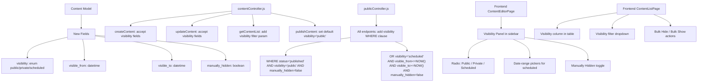
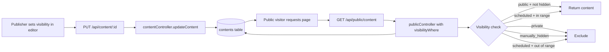

# West Pokot CMS — Admin Control Over Content Visibility

## Overview

Add visibility controls to CMS content, allowing admins/publishers to set content as **public**, **private**, or **scheduled** (visible only within a date range). A `manually_hidden` flag lets admins temporarily hide published content without unpublishing it.

---

## Architecture



---

## Business Rules

1. **Visibility only applies to published content** — draft/pending/approved content ignores visibility fields
2. **Default on publish**: `visibility = 'public'`, `manually_hidden = false`, `visible_from = null`, `visible_to = null`
3. **`manually_hidden = true` overrides everything** — even public content with valid dates will not appear on the public site
4. **Scheduled visibility**: content appears only when `NOW()` is between `visible_from` and `visible_to` (inclusive)
5. **Private content**: never appears on public API regardless of status
6. **Admin API always returns all content** — visibility filtering only applies to public endpoints

---

## Implementation Steps

### Step 1: Database — Update Content Model

**File**: [`backend/src/models/Content.js`](backend/src/models/Content.js)

Add these fields to the Sequelize model definition (after `published_at`):

```javascript
visibility: {
  type: DataTypes.ENUM('public', 'private', 'scheduled'),
  defaultValue: 'public',
  allowNull: false,
  comment: 'Controls public visibility: public=visible, private=hidden, scheduled=date-range',
},
visible_from: {
  type: DataTypes.DATE,
  allowNull: true,
  comment: 'Start date for scheduled visibility',
},
visible_to: {
  type: DataTypes.DATE,
  allowNull: true,
  comment: 'End date for scheduled visibility',
},
manually_hidden: {
  type: DataTypes.BOOLEAN,
  defaultValue: false,
  allowNull: false,
  comment: 'Admin can manually hide published content without unpublishing',
},
```

Add indexes:
```javascript
{ fields: ['visibility'] },
{ fields: ['visible_from'] },
{ fields: ['visible_to'] },
{ fields: ['manually_hidden'] },
```

Since `sequelize.sync({ alter: true })` is used in development, these columns will be added automatically on server restart.

---

### Step 2: Backend — Update Content Controller

**File**: [`backend/src/controllers/contentController.js`](backend/src/controllers/contentController.js)

#### 2a. `createContent` (line ~207)

Add `visibility`, `visible_from`, `visible_to`, `manually_hidden` to destructured body and pass to `Content.create()`:

```javascript
const { type, slug, translations, meta, taxonomy_ids, media_ids, visibility, visible_from, visible_to, manually_hidden } = req.body;

// In Content.create():
const content = await Content.create({
  type: type || 'page',
  slug,
  status: 'draft',
  author_id: req.user.id,
  visibility: visibility || 'public',
  visible_from: visible_from || null,
  visible_to: visible_to || null,
  manually_hidden: manually_hidden || false,
});
```

#### 2b. `updateContent` (line ~319)

Add visibility fields to destructured body and `updateFields`:

```javascript
const { type, slug, translations, meta, taxonomy_ids, media_ids, visibility, visible_from, visible_to, manually_hidden } = req.body;

const updateFields = {};
if (type) updateFields.type = type;
if (slug) updateFields.slug = slug;
if (visibility) updateFields.visibility = visibility;
if (visible_from !== undefined) updateFields.visible_from = visible_from;
if (visible_to !== undefined) updateFields.visible_to = visible_to;
if (manually_hidden !== undefined) updateFields.manually_hidden = manually_hidden;
```

#### 2c. `publishContent` (line ~518)

Set default visibility on publish:

```javascript
await content.update({
  status: 'published',
  publisher_id: req.user.id,
  published_at: new Date(),
  // Set defaults if not already set
  visibility: content.visibility || 'public',
  manually_hidden: content.manually_hidden || false,
});
```

#### 2d. `getContentList` (line ~145)

Add `visibility` query param filter:

```javascript
const {
  page = 1, limit = 20, type, status, search, author_id,
  visibility, // NEW
  sort_by = 'createdAt', sort_order = 'DESC',
} = req.query;

const where = {};
if (type) where.type = type;
if (status) where.status = status;
if (author_id) where.author_id = author_id;
if (visibility) where.visibility = visibility; // NEW
```

#### 2e. Add Bulk Hide/Show Endpoints

Add two new controller functions and routes:

**In [`contentController.js`](backend/src/controllers/contentController.js)** (before module.exports):

```javascript
/**
 * POST /api/content/bulk/hide - Bulk hide published content
 */
const bulkHideContent = async (req, res, next) => {
  try {
    const { ids } = req.body;
    if (!ids || !Array.isArray(ids) || !ids.length) {
      return res.status(400).json({ error: 'Validation error', message: 'ids array is required.' });
    }

    await Content.update(
      { manually_hidden: true },
      { where: { id: { [Op.in]: ids }, status: 'published' } }
    );

    res.json({ message: `${ids.length} content item(s) hidden.` });
  } catch (error) {
    next(error);
  }
};

/**
 * POST /api/content/bulk/show - Bulk unhide published content
 */
const bulkShowContent = async (req, res, next) => {
  try {
    const { ids } = req.body;
    if (!ids || !Array.isArray(ids) || !ids.length) {
      return res.status(400).json({ error: 'Validation error', message: 'ids array is required.' });
    }

    await Content.update(
      { manually_hidden: false },
      { where: { id: { [Op.in]: ids }, status: 'published' } }
    );

    res.json({ message: `${ids.length} content item(s) shown.` });
  } catch (error) {
    next(error);
  }
};
```

**In [`contentRoutes.js`](backend/src/routes/contentRoutes.js)**:

```javascript
// Bulk actions (must be before /:id routes)
router.post('/bulk/hide', authenticate, authorize('publisher', 'admin'), contentController.bulkHideContent);
router.post('/bulk/show', authenticate, authorize('publisher', 'admin'), contentController.bulkShowContent);
```

**In [`contentController.js`](backend/src/controllers/contentController.js)** module.exports:

```javascript
module.exports = {
  getContentList,
  createContent,
  getContentById,
  updateContent,
  deleteContent,
  submitContent,
  approveContent,
  rejectContent,
  publishContent,
  scheduleContent,
  unscheduleContent,
  archiveContent,
  getContentVersions,
  restoreContentVersion,
  summarizeContent,
  bulkHideContent,   // NEW
  bulkShowContent,   // NEW
};
```

---

### Step 3: Backend — Update Public Controller

**File**: [`backend/src/controllers/publicController.js`](backend/src/controllers/publicController.js)

Create a reusable visibility filter helper. For each public endpoint, add visibility conditions to the `where` clause.

#### Visibility Filter Logic

```javascript
/**
 * Build visibility WHERE clause for public endpoints.
 * Published content is visible if:
 *   - visibility = 'public' AND manually_hidden = false
 *   - OR visibility = 'scheduled' AND manually_hidden = false
 *     AND visible_from <= NOW() AND (visible_to IS NULL OR visible_to >= NOW())
 */
function visibilityWhere() {
  const now = new Date();
  return {
    [Op.or]: [
      {
        visibility: 'public',
        manually_hidden: false,
      },
      {
        visibility: 'scheduled',
        manually_hidden: false,
        visible_from: { [Op.lte]: now },
        visible_to: { [Op.or]: [{ [Op.eq]: null }, { [Op.gte]: now }] },
      },
    ],
  };
}
```

#### Endpoint Changes

| Endpoint | Current `where` | New `where` |
|----------|----------------|-------------|
| `getPublicContent` (line 27) | `{ status: 'published' }` | `{ status: 'published', ...visibilityWhere() }` |
| `getPublicContentBySlug` (line 87) | `{ slug, status: 'published' }` | `{ slug, status: 'published', ...visibilityWhere() }` |
| `getPublicEvents` (line 137) | `{ type: 'event', status: 'published' }` | `{ type: 'event', status: 'published', ...visibilityWhere() }` |
| `getPublicTenders` (line 195) | `{ type: 'tender', status: 'published' }` | `{ type: 'tender', status: 'published', ...visibilityWhere() }` |
| `getPublicVacancies` (line 246) | `{ type: 'vacancy', status: 'published' }` | `{ type: 'vacancy', status: 'published', ...visibilityWhere() }` |
| `getPublicDepartments` (line 298) | `{ type: 'department', status: 'published' }` | `{ type: 'department', status: 'published', ...visibilityWhere() }` |

---

### Step 4: Frontend — Content Store

**File**: [`frontend/src/stores/content.js`](frontend/src/stores/content.js)

Add two new store methods for bulk actions:

```javascript
async function bulkHideContent(ids) {
  const response = await apiClient.post('/content/bulk/hide', { ids })
  // Refresh list after bulk action
  return response.data
}

async function bulkShowContent(ids) {
  const response = await apiClient.post('/content/bulk/show', { ids })
  return response.data
}
```

Add to return object:
```javascript
return {
  // ... existing ...
  bulkHideContent,
  bulkShowContent,
}
```

---

### Step 5: Frontend — Content Editor Page (Visibility Panel)

**File**: [`frontend/src/views/admin/ContentEditorPage.vue`](frontend/src/views/admin/ContentEditorPage.vue)

#### 5a. Add visibility fields to form state (line ~38)

```javascript
const form = ref({
  type: 'page',
  slug: '',
  visibility: 'public',
  visible_from: '',
  visible_to: '',
  manually_hidden: false,
  // ... existing fields ...
})
```

#### 5b. Map visibility fields when loading content (line ~419)

After mapping meta fields, add:

```javascript
// Map visibility fields
if (content.visibility) form.value.visibility = content.visibility
if (content.visible_from) form.value.visible_from = content.visible_from
if (content.visible_to) form.value.visible_to = content.visible_to
if (content.manually_hidden !== undefined) form.value.manually_hidden = content.manually_hidden
```

#### 5c. Include visibility in save payload (line ~516)

```javascript
const payload = {
  type: form.value.type,
  slug: form.value.slug,
  visibility: form.value.visibility,
  visible_from: form.value.visible_from || null,
  visible_to: form.value.visible_to || null,
  manually_hidden: form.value.manually_hidden,
  // ... existing fields ...
}
```

#### 5d. Add Visibility Panel in sidebar (after Media card, before closing `</div>`)

New card component in the sidebar section (around line 1002-1027):

```html
<!-- Visibility Settings -->
<div class="card bg-base-100 shadow-sm">
  <div class="card-body p-4">
    <h3 class="font-semibold mb-2">Visibility</h3>

    <!-- Only editable when content is published -->
    <div v-if="contentStore.currentContent?.status === 'published' || !isEditing">
      <div class="form-control">
        <label class="label cursor-pointer justify-start gap-2">
          <input type="radio" v-model="form.visibility" value="public" class="radio radio-sm" />
          <span class="label-text">🌍 Public</span>
        </label>
        <p class="text-xs text-base-content/50 ml-6">Visible to everyone on the website</p>
      </div>

      <div class="form-control mt-1">
        <label class="label cursor-pointer justify-start gap-2">
          <input type="radio" v-model="form.visibility" value="private" class="radio radio-sm" />
          <span class="label-text">🔒 Private</span>
        </label>
        <p class="text-xs text-base-content/50 ml-6">Hidden from public website</p>
      </div>

      <div class="form-control mt-1">
        <label class="label cursor-pointer justify-start gap-2">
          <input type="radio" v-model="form.visibility" value="scheduled" class="radio radio-sm" />
          <span class="label-text">📅 Scheduled</span>
        </label>
        <p class="text-xs text-base-content/50 ml-6">Visible only within a date range</p>
      </div>

      <!-- Date range pickers (only when scheduled) -->
      <template v-if="form.visibility === 'scheduled'">
        <div class="form-control mt-2">
          <label class="label"><span class="label-text">Visible From</span></label>
          <input v-model="form.visible_from" type="datetime-local" class="input input-bordered input-sm" />
        </div>
        <div class="form-control mt-1">
          <label class="label"><span class="label-text">Visible To</span></label>
          <input v-model="form.visible_to" type="datetime-local" class="input input-bordered input-sm" />
        </div>
      </template>

      <!-- Manually Hidden toggle -->
      <div class="form-control mt-3 pt-3 border-t border-base-200">
        <label class="label cursor-pointer justify-start gap-2">
          <input type="checkbox" v-model="form.manually_hidden" class="toggle toggle-sm" />
          <span class="label-text">🚫 Manually Hidden</span>
        </label>
        <p class="text-xs text-base-content/50 ml-6">
          When checked, content is hidden from public even if published
        </p>
      </div>
    </div>

    <!-- Not published yet -->
    <div v-else class="text-sm text-base-content/50">
      <p>Visibility settings will be available after publishing.</p>
    </div>
  </div>
</div>
```

#### 5e. Reset visibility in form reset (line ~448)

Add to the form reset in the `watch(route.fullPath)` handler:

```javascript
form.value = {
  // ... existing ...
  visibility: 'public',
  visible_from: '',
  visible_to: '',
  manually_hidden: false,
}
```

---

### Step 6: Frontend — Content List Page (Visibility Column + Filters + Bulk Actions)

**File**: [`frontend/src/views/admin/ContentListPage.vue`](frontend/src/views/admin/ContentListPage.vue)

#### 6a. Add visibility filter dropdown (after status filter, line ~267)

```html
<div class="form-control">
  <label class="label py-1">
    <span class="label-text">Visibility</span>
  </label>
  <select v-model="filters.visibility" class="select select-bordered select-sm" @change="applyFilters">
    <option value="">All Visibility</option>
    <option value="public">Public</option>
    <option value="private">Private</option>
    <option value="scheduled">Scheduled</option>
  </select>
</div>
```

#### 6b. Add visibility to filters ref (line ~58)

```javascript
const filters = ref({
  type: '',
  status: '',
  visibility: '', // NEW
  search: '',
  page: 1,
  limit: 20,
})
```

#### 6c. Pass visibility param in loadContent (line ~119)

```javascript
if (filters.value.visibility) params.visibility = filters.value.visibility
```

#### 6d. Add Visibility column to table (after Status column, line ~323)

```html
<td>
  <div class="flex items-center gap-1">
    <span v-if="content.manually_hidden" class="tooltip" data-tip="Manually hidden">
      🚫
    </span>
    <span class="badge badge-sm" :class="visibilityBadgeClass(content.visibility)">
      {{ content.visibility || 'public' }}
    </span>
  </div>
</td>
```

#### 6e. Add visibility badge helper (line ~214)

```javascript
const visibilityBadgeClass = (visibility) => {
  const classes = {
    public: 'badge-success',
    private: 'badge-error',
    scheduled: 'badge-warning',
  }
  return classes[visibility] || 'badge-ghost'
}
```

#### 6f. Add bulk action toolbar (above the table, after filters)

```html
<!-- Bulk Actions -->
<div v-if="contentStore.contentList.length" class="flex items-center gap-2 px-4 py-2 border-b border-base-200">
  <input
    type="checkbox"
    class="checkbox checkbox-sm"
    :checked="allSelected"
    @change="toggleSelectAll"
  />
  <span class="text-sm text-base-content/60">{{ selectedIds.length }} selected</span>
  <button
    v-if="selectedIds.length && canPublish"
    class="btn btn-xs btn-outline"
    @click="handleBulkHide"
  >
    🚫 Hide Selected
  </button>
  <button
    v-if="selectedIds.length && canPublish"
    class="btn btn-xs btn-outline"
    @click="handleBulkShow"
  >
    👁️ Show Selected
  </button>
</div>
```

#### 6g. Add selection state and handlers

```javascript
// Bulk selection
const selectedIds = ref([])
const allSelected = computed(() =>
  contentStore.contentList.length > 0 && selectedIds.value.length === contentStore.contentList.length
)

function toggleSelectAll() {
  if (allSelected.value) {
    selectedIds.value = []
  } else {
    selectedIds.value = contentStore.contentList.map((c) => c.id)
  }
}

function toggleSelect(id) {
  const idx = selectedIds.value.indexOf(id)
  if (idx === -1) {
    selectedIds.value.push(id)
  } else {
    selectedIds.value.splice(idx, 1)
  }
}

async function handleBulkHide() {
  if (!confirm(`Hide ${selectedIds.value.length} content item(s) from public?`)) return
  try {
    await contentStore.bulkHideContent(selectedIds.value)
    showToast(`${selectedIds.value.length} content item(s) hidden.`)
    selectedIds.value = []
    loadContent()
  } catch (err) {
    showToast('Failed to hide content.', 'error')
  }
}

async function handleBulkShow() {
  if (!confirm(`Show ${selectedIds.value.length} content item(s) on public?`)) return
  try {
    await contentStore.bulkShowContent(selectedIds.value)
    showToast(`${selectedIds.value.length} content item(s) shown.`)
    selectedIds.value = []
    loadContent()
  } catch (err) {
    showToast('Failed to show content.', 'error')
  }
}
```

#### 6h. Add checkbox column to table rows

Add before Title column:
```html
<th class="w-8">
  <input
    type="checkbox"
    class="checkbox checkbox-sm"
    :checked="allSelected"
    @change="toggleSelectAll"
  />
</th>
```

Add checkbox in each row (before title cell):
```html
<td class="w-8">
  <input
    type="checkbox"
    class="checkbox checkbox-sm"
    :checked="selectedIds.includes(content.id)"
    @change="toggleSelect(content.id)"
  />
</td>
```

Update colspan for empty/loading states from `6` to `8` (added checkbox + visibility columns).

---

### Step 7: Frontend — Content Store (Bulk Actions)

**File**: [`frontend/src/stores/content.js`](frontend/src/stores/content.js)

Add the two bulk action methods as described in Step 4.

---

## Summary of Files to Modify

| # | File | Change |
|---|------|--------|
| 1 | [`backend/src/models/Content.js`](backend/src/models/Content.js) | Add 4 new fields + 4 indexes |
| 2 | [`backend/src/controllers/contentController.js`](backend/src/controllers/contentController.js) | Update createContent, updateContent, publishContent, getContentList; add bulkHideContent + bulkShowContent |
| 3 | [`backend/src/routes/contentRoutes.js`](backend/src/routes/contentRoutes.js) | Add 2 bulk routes |
| 4 | [`backend/src/controllers/publicController.js`](backend/src/controllers/publicController.js) | Add visibilityWhere() helper; update all 6 public endpoints |
| 5 | [`frontend/src/stores/content.js`](frontend/src/stores/content.js) | Add bulkHideContent + bulkShowContent methods |
| 6 | [`frontend/src/views/admin/ContentEditorPage.vue`](frontend/src/views/admin/ContentEditorPage.vue) | Add visibility panel, form fields, save payload, load mapping |
| 7 | [`frontend/src/views/admin/ContentListPage.vue`](frontend/src/views/admin/ContentListPage.vue) | Add visibility column, filter, bulk actions, selection state |

---

## Data Flow Diagram



---

## Edge Cases & Notes

1. **Content not yet published**: Visibility fields are stored but ignored by public API until `status = 'published'`
2. **Changing visibility after publish**: Works immediately — no need to republish
3. **Scheduled with no end date**: Content becomes visible from `visible_from` and stays visible indefinitely
4. **Scheduled with no start date**: Content is visible until `visible_to` (effectively "visible until X")
5. **Bulk hide/show**: Only affects published content; other statuses are silently skipped
6. **Admin API unaffected**: All admin content endpoints (`/api/content/*`) return content regardless of visibility
7. **Sequelize sync**: Since `alter: true` is used in development, new columns are added automatically on server restart — no manual migration needed
