# DeepSeek Token Optimization — Roo Code Configuration Plan

## Current State Analysis

### Current Settings (from [`settings.json`](c:/Users/LevisKip/AppData/Roaming/Code/User/settings.json))

| Setting | Current Value | Problem |
|---------|--------------|---------|
| `maxTokens` | 2048 | Too high for simple responses; DeepSeek wastes tokens on verbose output |
| `contextBudget` | 16000 | No limit on accumulated context; conversation history grows unbounded |
| `maxTurns` | 20 | Allows long conversations that accumulate massive context |
| `cacheEnabled` | true | Good, but no cache invalidation strategy |
| `streamingEnabled` | true | Good — keep this |

### Token Waste Sources Identified

1. **System prompt bloat** — The default Roo Code system prompt is verbose with extensive markdown formatting rules, tool descriptions, and mode instructions that get repeated every turn
2. **Environment details repetition** — Full file tree, open tabs, terminal state sent on every turn
3. **Conversation history accumulation** — No sliding window; all prior turns stay in context
4. **Verbose tool output** — `read_file` returns full file contents even when only a few lines needed
5. **Redundant context** — `environment_details` includes VSCode state (open tabs, visible files) that rarely changes
6. **No response length constraints** — DeepSeek defaults to verbose, explanatory responses
7. **Tool call overhead** — Each tool invocation includes full parameter serialization

---

## Optimization Strategy

### Strategy Overview

```mermaid
flowchart TD
    A[Token Waste Sources] --> B[System Prompt]
    A --> C[Context Management]
    A --> D[Response Control]
    A --> E[Tool Usage]
    A --> F[Conversation Flow]

    B --> B1[Trim mode descriptions]
    B --> B2[Remove redundant rules]
    B --> B3[Shorten tool docs]
    B --> B4[Use compact markdown]

    C --> C1[Strict contextBudget]
    C --> C2[Limit maxTurns]
    C --> C3[Sliding window strategy]
    C --> C4[Cache with TTL]

    D --> D1[Lower maxTokens]
    D --> D2[Enforce concise responses]
    D --> D3[Ban verbose explanations]
    D --> D4[Use terse confirmation format]

    E --> E1[Prefer targeted reads]
    E --> E2[Aggregate tool calls]
    E --> E3[Limit file listing depth]
    E --> E4[Skip redundant env details]

    F --> F1[Early completion]
    F --> F2[Short-circuit on errors]
    F --> F3[Minimal turn handshake]
```



---

## Configuration Files

### 1. VS Code Settings — [`settings.json`](c:/Users/LevisKip/AppData/Roaming/Code/User/settings.json)

Replace current settings with these optimized values:

```jsonc
{
    // ... existing non-Roo settings ...

    "roo-cline.debug": false,
    "roo-cline.allowedCommands": [
        "git log --oneline -5",
        "git diff --stat",
        "git show --stat"
    ],
    "roo-cline.deniedCommands": [],
    "roo-cline.maxTokens": 512,           // Drastically reduced from 2048
    "roo-cline.contextBudget": 8000,       // Halved from 16000
    "roo-cline.cacheEnabled": true,
    "roo-cline.streamingEnabled": true,
    "roo-cline.maxTurns": 8,              // Reduced from 20
    "roo-cline.apiRequestTimeout": 120,   // Reduced from 600s
    "roo-cline.commandExecutionTimeout": 30,
    "roo-cline.preventCompletionWithOpenTodos": true,
    "roo-cline.maximumIndexedFilesForFileSearch": 5000, // Reduced from 10000
}
```

**Rationale:**
- `maxTokens: 512` — DeepSeek chat models produce quality output at 512 tokens for most coding tasks. Only complex generation needs more.
- `contextBudget: 8000` — Forces context pruning after ~8K tokens. Combined with `maxTurns: 8`, this keeps ~1K tokens per turn average.
- `maxTurns: 8` — Limits conversation depth. Complex tasks should be broken into subtasks via `new_task` delegation.
- `apiRequestTimeout: 120` — DeepSeek is fast; no need for 10-minute waits.

---

### 2. Custom Modes — [`roo_config.json`](c:/Users/LevisKip/.roo/roo_config.json)

Create a `roo_config.json` file with purpose-built modes that have **strictly minimized system prompts**:

```jsonc
{
  "customModes": [
    {
      "slug": "deepseek-code",
      "name": "DeepSeek Code",
      "roleDefinition": "You are a concise coding agent. Write code only. No explanations unless asked.",
      "customInstructions": "CRITICAL RULES:\n1. Output ONLY code blocks. No greetings, no summaries, no explanations.\n2. Max 3 sentences total per response before code.\n3. Use write_to_file for new files, apply_diff for edits.\n4. Read files with offset/limit only — never read entire files.\n5. Complete task in ≤5 tool calls. Use attempt_completion immediately when done.\n6. Never list directories recursively. Use targeted paths only.\n7. Never repeat file contents back to user.\n8. One task per conversation. Use new_task to delegate subtasks.",
      "groups": [
        "read",
        "edit",
        "command",
        "mcp"
      ],
      "source": "global",
      "filePattern": "**/*"
    },
    {
      "slug": "deepseek-architect",
      "name": "DeepSeek Architect",
      "roleDefinition": "You are a planning agent. Produce minimal, precise plans. No verbose analysis.",
      "customInstructions": "CRITICAL RULES:\n1. Plans must be ≤50 lines per file.\n2. Use Mermaid diagrams only when essential — max 15 nodes.\n3. No redundant explanations of obvious concepts.\n4. Skip environment analysis unless directly relevant.\n5. Use update_todo_list for task tracking, not lengthy markdown.\n6. Max 3 read_file calls per task.\n7. Complete analysis in ≤5 turns.",
      "groups": [
        "read",
        "command",
        "mcp"
      ],
      "source": "global",
      "filePattern": "*.md"
    },
    {
      "slug": "deepseek-debug",
      "name": "DeepSeek Debug",
      "roleDefinition": "You are a debugger. Find root causes fast. Minimal output.",
      "customInstructions": "CRITICAL RULES:\n1. Read only error-relevant lines — use indentation mode with anchor_line.\n2. Output: root cause (1 line) + fix (code only).\n3. No step-by-step reasoning unless user asks.\n4. Max 2 read_file calls before proposing fix.\n5. Use apply_diff for fixes, never rewrite entire files.\n6. If root cause unclear in 3 turns, ask user for specific error details.",
      "groups": [
        "read",
        "edit",
        "command",
        "mcp"
      ],
      "source": "global",
      "filePattern": "**/*"
    },
    {
      "slug": "deepseek-ask",
      "name": "DeepSeek Ask",
      "roleDefinition": "You are a Q&A agent. Answer precisely. No fluff.",
      "customInstructions": "CRITICAL RULES:\n1. Answer in ≤5 sentences. Use bullet points.\n2. No introductory phrases like 'Based on the code...' — state facts directly.\n3. Reference files with [file](path:line) syntax only.\n4. No code block unless specifically asked.\n5. If answer requires >5 sentences, ask user to switch to architect mode.\n6. Max 2 read_file calls per question.",
      "groups": [
        "read",
        "command",
        "mcp"
      ],
      "source": "global",
      "filePattern": "**/*"
    }
  ]
}
```

---

### 3. Agent Rules — [`.roo/rules/deepseek-rules.md`](c:/Users/LevisKip/.roo/rules/deepseek-rules.md)

Create a rules file that applies globally to all DeepSeek modes:

```markdown
# DeepSeek Token Optimization Rules

## Response Format
- Max 3 sentences of prose before code/output.
- Use `[file](path:line)` references — never repeat file contents.
- No greetings ("Sure", "Certainly", "Okay", "Great").
- No sign-offs ("Let me know if...", "Feel free to ask...").
- No redundant confirmation ("I've updated the file" — the tool result confirms it).

## File Reading
- ALWAYS use `offset` and `limit` parameters — never read entire files.
- Prefer `indentation` mode with `anchor_line` for targeted code extraction.
- Max 200 lines per read_file call.
- Never read a file you just wrote (tool result confirms success).

## Tool Usage
- Batch independent tool calls in parallel.
- Max 3 sequential tool calls before producing output.
- Use `apply_diff` for edits (smaller payload than write_to_file).
- Never use `list_files` recursively — use targeted paths.
- Never re-read files shown in environment_details open tabs.

## Conversation Flow
- Complete task in ≤5 turns. Use `attempt_completion` early.
- If task needs >5 turns, break into subtasks with `new_task`.
- Never ask "is this what you wanted?" — just complete and present.
- No back-and-forth clarification — infer from context or use defaults.

## Output Control
- Code blocks: no language tag if obvious from context.
- No diff output in markdown — use apply_diff tool directly.
- No listing of files created — tool results confirm this.
- No explaining what code does unless the code is complex.
```

---

## Token Budget Allocation

### Per-Turn Budget (8K contextBudget)

| Component | Allocation | Notes |
|-----------|-----------|-------|
| System prompt | ~1,500 | Trimmed mode definition + rules |
| User message | ~2,000 | Task description + minimal context |
| Tool results | ~2,500 | Trimmed file reads, command output |
| Assistant response | ~1,000 | Concise output + tool calls |
| Environment details | ~500 | Stripped of redundant VSCode state |
| Overhead | ~500 | JSON formatting, turn structure |
| **Total** | **~8,000** | Within budget |

### Per-Response Token Limit (512 maxTokens)

| Component | Allocation |
|-----------|-----------|
| Tool calls (JSON) | ~200 |
| Prose/explanation | ~100 |
| Code blocks | ~200 |
| **Total** | **~500** |

---

## Implementation Plan

### Step 1: Update VS Code Settings
Apply the optimized `settings.json` values shown above.

### Step 2: Create Custom Modes
Create [`roo_config.json`](c:/Users/LevisKip/.roo/roo_config.json) with the 4 DeepSeek-optimized modes.

### Step 3: Create Agent Rules
Create [`.roo/rules/deepseek-rules.md`](c:/Users/LevisKip/.roo/rules/deepseek-rules.md) with the token optimization rules.

### Step 4: Verify & Tune
- Monitor token usage via Roo Code's token counter
- Adjust `maxTokens` up (768) if code quality suffers
- Adjust `contextBudget` up (12000) if complex tasks need more context
- Adjust `maxTurns` up (12) if multi-step tasks are common

---

## Expected Savings

| Metric | Before | After | Reduction |
|--------|--------|-------|-----------|
| maxTokens per response | 2,048 | 512 | **75%** |
| Context budget | 16,000 | 8,000 | **50%** |
| Max conversation turns | 20 | 8 | **60%** |
| File read overhead | Full files | Targeted lines | **~80%** |
| System prompt size | ~3,000+ tokens | ~1,500 tokens | **~50%** |
| **Estimated total token savings** | | | **~60-70%** |

---

## Risk Mitigation

| Risk | Mitigation |
|------|-----------|
| Code quality drops with 512 tokens | Monitor; increase to 768 if needed |
| Complex tasks exceed 8 turns | Use `new_task` delegation pattern |
| Important context pruned too early | Increase `contextBudget` to 12,000 |
| Debug mode too terse for complex bugs | Allow 3 extra turns for deep debugging |
| User frustrated by brevity | Add `--verbose` flag convention to request detail |
