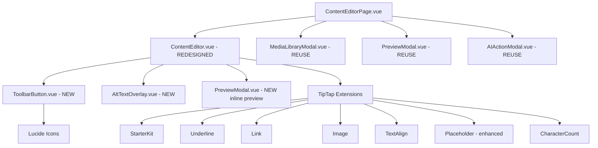
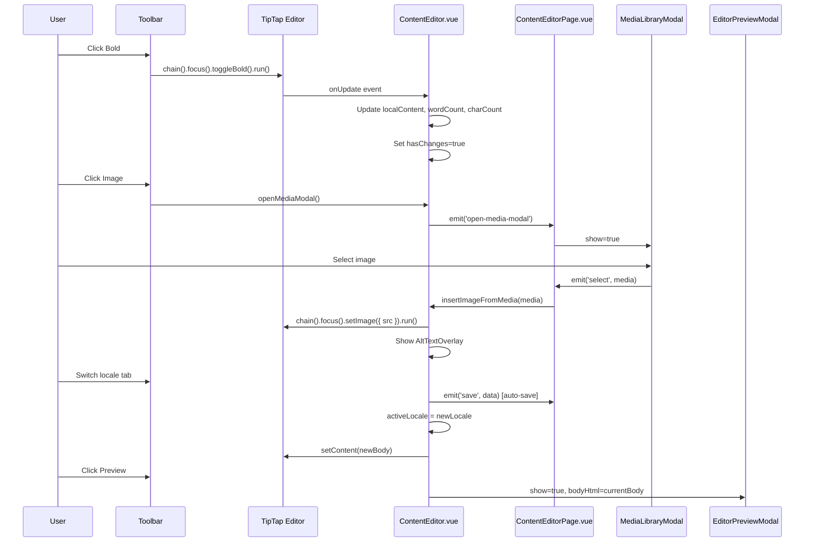

# West Pokot CMS — User-Friendly Editor Redesign Plan

## Overview

Frontend-only redesign of the TipTap-based `ContentEditor.vue` to be simpler, more guided, and visually cleaner for non-technical editors. No backend changes required.

**Stack:** Vue 3 + TipTap 3.25 + DaisyUI 4 + Tailwind CSS 3 + Lucide Icons

---

## Architecture Diagram



---

## Files to Create / Modify

### New Files

| # | File | Purpose |
|---|------|---------|
| 1 | `frontend/src/components/ToolbarButton.vue` | Reusable icon-only toolbar button with tooltip, active state, DaisyUI styling |
| 2 | `frontend/src/components/AltTextOverlay.vue` | Overlay on inserted images to prompt for alt text |
| 3 | `frontend/src/components/EditorPreviewModal.vue` | Preview modal with mobile/desktop viewport toggles (separate from existing PreviewModal which reads from store) |

### Modified Files

| # | File | Changes |
|---|------|---------|
| 4 | `frontend/src/components/ContentEditor.vue` | Complete restructure (see below) |
| 5 | `frontend/src/views/admin/ContentEditorPage.vue` | Minor: wire new preview modal, pass media library modal reference for drag-and-drop |

---

## Detailed Component Specifications

### 1. `ToolbarButton.vue` (NEW)

**Props:**
- `icon` (String, required) — Lucide icon name (e.g., `Bold`, `Heading1`)
- `active` (Boolean, default: false) — Whether the button is in active state
- `tooltip` (String, default: '') — Tooltip text shown on hover
- `disabled` (Boolean, default: false)
- `size` (String, default: 'sm') — DaisyUI btn size

**Emits:**
- `click`

**Template:**
```html
<button
  class="btn btn-ghost btn-sm btn-square tooltip"
  :class="{ 'btn-active': active, 'btn-disabled': disabled }"
  :data-tip="tooltip"
  :aria-label="tooltip"
  @click="$emit('click')"
>
  <component :is="icons[icon]" :size="18" />
</button>
```

**Behavior:**
- Uses DaisyUI `tooltip` class for hover tooltips
- Uses Lucide dynamic component (`<component :is="icons[icon]" />`)
- `btn-square` for uniform icon-only buttons
- `btn-active` for active state (replaces `btn-primary`)
- `aria-label` for accessibility

### 2. `AltTextOverlay.vue` (NEW)

**Props:**
- `visible` (Boolean)
- `imageSrc` (String)
- `currentAlt` (String, default: '')

**Emits:**
- `save` (altText: string)
- `close`

**Template:**
```html
<div v-if="visible" class="absolute inset-0 bg-black/60 flex items-center justify-center z-10">
  <div class="bg-base-100 p-4 rounded-box shadow-lg max-w-sm w-full mx-4">
    
    <label class="label"><span class="label-text">Alt Text</span></label>
    <input v-model="altText" type="text" class="input input-bordered input-sm w-full" placeholder="Describe this image..." />
    <div class="flex gap-2 mt-3 justify-end">
      <button class="btn btn-ghost btn-xs" @click="$emit('close')">Skip</button>
      <button class="btn btn-primary btn-xs" @click="$emit('save', altText)">Save</button>
    </div>
  </div>
</div>
```

### 3. `EditorPreviewModal.vue` (NEW)

**Props:**
- `show` (Boolean)
- `title` (String)
- `bodyHtml` (String)
- `locale` (String)

**Emits:**
- `close`

**State:**
- `viewportMode` — `'mobile'` | `'tablet'` | `'desktop'`

**Template:**
```html
<div v-if="show" class="fixed inset-0 z-50 flex items-start justify-center pt-4 bg-black/50 overflow-y-auto">
  <div class="modal-box max-w-5xl">
    <!-- Header with viewport toggles -->
    <div class="flex items-center justify-between mb-4">
      <h3 class="text-lg font-bold">Preview</h3>
      <div class="flex gap-1" role="group" aria-label="Viewport size">
        <button class="btn btn-xs" :class="viewportMode==='mobile' ? 'btn-primary' : 'btn-ghost'" @click="viewportMode='mobile'">📱</button>
        <button class="btn btn-xs" :class="viewportMode==='tablet' ? 'btn-primary' : 'btn-ghost'" @click="viewportMode='tablet'">📟</button>
        <button class="btn btn-xs" :class="viewportMode==='desktop' ? 'btn-primary' : 'btn-ghost'" @click="viewportMode='desktop'">🖥️</button>
      </div>
      <button class="btn btn-sm btn-circle btn-ghost" @click="$emit('close')">✕</button>
    </div>
    <!-- Preview frame -->
    <div class="border border-base-300 rounded-box overflow-auto bg-white mx-auto transition-all"
         :style="{ maxWidth: viewportMode === 'mobile' ? '375px' : viewportMode === 'tablet' ? '768px' : '100%' }">
      <div class="prose prose-sm max-w-none p-6" v-html="bodyHtml"></div>
    </div>
  </div>
</div>
```

---

## 4. `ContentEditor.vue` — Complete Restructure

### Script Section Changes

**Imports (updated):**
```javascript
import { ref, watch, onMounted, onBeforeUnmount, computed, nextTick } from 'vue'
import { useEditor, EditorContent } from '@tiptap/vue-3'
import StarterKit from '@tiptap/starter-kit'
import Underline from '@tiptap/extension-underline'
import Link from '@tiptap/extension-link'
import Image from '@tiptap/extension-image'
import TextAlign from '@tiptap/extension-text-align'
import Placeholder from '@tiptap/extension-placeholder'
import CharacterCount from '@tiptap/extension-character-count'
import ToolbarButton from './ToolbarButton.vue'
import AltTextOverlay from './AltTextOverlay.vue'
import EditorPreviewModal from './EditorPreviewModal.vue'
// Lucide icons
import { Bold, Italic, Underline as UnderlineIcon, Heading1, Heading2, Heading3, Heading4,
         List, ListOrdered, Quote, Code, Minus, Link as LinkIcon, Image as ImageIcon,
         AlignLeft, AlignCenter, AlignRight, Undo2, Redo2, Eye, Keyboard,
         MoreHorizontal, Type, Pilcrow } from 'lucide-vue-next'
```

**New computed properties:**
- `localePlaceholder` — Returns contextual placeholder per locale (e.g., "Start writing your article here… (English)")
- `localeStatus` — Returns `'draft' | 'missing' | 'translated'` based on content state per locale tab
- `readingTime` — `Math.ceil(wordCount / 200)` minutes
- `saveIndicatorText` — Formatted "Saved just now" / "Saving..." / "Last saved 2 min ago"

**New state variables:**
- `showMoreDropdown` — Toggle for "⋮" advanced toolbar
- `showPreviewModal` — Toggle for preview
- `showShortcutsModal` — Toggle for keyboard shortcuts
- `altTextOverlay` — `{ visible: false, imageSrc: '', currentAlt: '' }`
- `saveStatus` — `'saved' | 'saving' | 'unsaved'`
- `lastSavedAt` — Date object

**New methods:**
- `cycleHeading()` — Cycles through H1 → H2 → H3 → H4 → Paragraph
- `insertImageFromMedia(media)` — Inserts image at cursor, shows alt text overlay
- `handleImageDrop(event)` — Handles drag-and-drop image insertion
- `handleAltTextSave(altText)` — Updates image alt attribute in editor
- `handleTabSwitch(locale)` — Triggers auto-save before switching locale tab
- `togglePreview()` — Opens preview modal with current locale content
- `getShortcuts()` — Returns array of keyboard shortcut definitions

### Template Structure (redesigned)

```
<div class="space-y-4">
  <!-- 1. Locale Tabs with Status Badges -->
  <div class="tabs tabs-boxed bg-base-200">
    <button v-for="loc in locales" :key="loc.code"
      class="tab gap-2"
      :class="{ 'tab-active': activeLocale === loc.code }"
      @click="handleTabSwitch(loc.code)">
      {{ loc.flag }} {{ loc.label }}
      <span class="badge badge-xs" :class="statusBadge(loc.code)">{{ statusLabel(loc.code) }}</span>
    </button>
  </div>

  <!-- 2. Title Input -->
  <input v-model="localContent[activeLocale].title" ... />

  <!-- 3. Toolbar (icon-only, grouped) -->
  <div class="flex flex-wrap items-center gap-0.5 p-1.5 bg-base-200 rounded-box">
    <!-- Group 1: Text Style -->
    <div class="flex gap-0.5">
      <ToolbarButton icon="Bold" :active="isActive('bold')" tooltip="Bold (Ctrl+B)" @click="toggleBold" />
      <ToolbarButton icon="Italic" :active="isActive('italic')" tooltip="Italic (Ctrl+I)" @click="toggleItalic" />
      <ToolbarButton icon="Underline" :active="isActive('underline')" tooltip="Underline (Ctrl+U)" @click="toggleUnderline" />
      <ToolbarButton icon="Heading1" :active="isActive('heading', { level: 1 })" tooltip="Heading 1" @click="toggleHeading(1)" />
      <ToolbarButton icon="Heading2" :active="isActive('heading', { level: 2 })" tooltip="Heading 2" @click="toggleHeading(2)" />
      <ToolbarButton icon="Heading3" :active="isActive('heading', { level: 3 })" tooltip="Heading 3" @click="toggleHeading(3)" />
      <ToolbarButton icon="Heading4" :active="isActive('heading', { level: 4 })" tooltip="Heading 4" @click="toggleHeading(4)" />
    </div>
    <div class="divider divider-horizontal mx-0.5"></div>
    
    <!-- Group 2: Lists -->
    <div class="flex gap-0.5">
      <ToolbarButton icon="List" :active="isActive('bulletList')" tooltip="Bullet List" @click="toggleBulletList" />
      <ToolbarButton icon="ListOrdered" :active="isActive('orderedList')" tooltip="Numbered List" @click="toggleOrderedList" />
    </div>
    <div class="divider divider-horizontal mx-0.5"></div>

    <!-- Group 3: Links & Media -->
    <div class="flex gap-0.5">
      <ToolbarButton icon="Link" :active="isActive('link')" tooltip="Insert Link (Ctrl+K)" @click="setLink" />
      <ToolbarButton icon="Image" tooltip="Insert Image" @click="openMediaModal" />
    </div>
    <div class="divider divider-horizontal mx-0.5"></div>

    <!-- Group 4: Alignment -->
    <div class="flex gap-0.5">
      <ToolbarButton icon="AlignLeft" :active="isActive({ textAlign: 'left' })" tooltip="Align Left" @click="setTextAlign('left')" />
      <ToolbarButton icon="AlignCenter" :active="isActive({ textAlign: 'center' })" tooltip="Align Center" @click="setTextAlign('center')" />
      <ToolbarButton icon="AlignRight" :active="isActive({ textAlign: 'right' })" tooltip="Align Right" @click="setTextAlign('right')" />
    </div>
    <div class="divider divider-horizontal mx-0.5"></div>

    <!-- Group 5: Actions -->
    <div class="flex gap-0.5">
      <ToolbarButton icon="Undo2" tooltip="Undo (Ctrl+Z)" @click="undo" />
      <ToolbarButton icon="Redo2" tooltip="Redo (Ctrl+Shift+Z)" @click="redo" />
    </div>
    <div class="divider divider-horizontal mx-0.5"></div>

    <!-- Group 6: More dropdown (advanced) -->
    <div class="relative">
      <ToolbarButton icon="MoreHorizontal" tooltip="More" @click="showMoreDropdown = !showMoreDropdown" />
      <div v-show="showMoreDropdown" class="absolute top-full left-0 mt-1 bg-base-100 shadow-lg rounded-box border border-base-200 z-50 p-1 flex gap-0.5" @click.stop>
        <ToolbarButton icon="Quote" :active="isActive('blockquote')" tooltip="Blockquote" @click="toggleBlockquote" />
        <ToolbarButton icon="Code" :active="isActive('codeBlock')" tooltip="Code Block" @click="toggleCodeBlock" />
        <ToolbarButton icon="Minus" tooltip="Horizontal Rule" @click="addHorizontalRule" />
      </div>
    </div>

    <!-- Spacer -->
    <div class="flex-1"></div>

    <!-- Preview & Shortcuts -->
    <ToolbarButton icon="Eye" tooltip="Preview" @click="togglePreview" />
    <ToolbarButton icon="Keyboard" tooltip="Keyboard Shortcuts" @click="showShortcutsModal = true" />
  </div>

  <!-- 4. Editor Content Area -->
  <div class="border border-base-300 rounded-box p-4 min-h-[400px] focus-within:border-primary bg-white">
    <EditorContent :editor="editor" />
  </div>

  <!-- 5. Alt Text Overlay (positioned over editor) -->
  <AltTextOverlay ... />

  <!-- 6. Footer: Stats + Save Indicator -->
  <div class="flex items-center justify-between text-sm text-base-content/60">
    <div class="flex gap-4">
      <span>{{ wordCount }} words</span>
      <span>{{ characterCount }} chars</span>
      <span>~{{ readingTime }} min read</span>
    </div>
    <div class="flex items-center gap-2">
      <span class="flex items-center gap-1">
        <span class="w-2 h-2 rounded-full" :class="saveDotClass"></span>
        {{ saveIndicatorText }}
      </span>
      <button class="btn btn-primary btn-sm" @click="manualSave" :disabled="readOnly">
        Save
      </button>
    </div>
  </div>

  <!-- 7. Preview Modal -->
  <EditorPreviewModal ... />

  <!-- 8. Keyboard Shortcuts Modal -->
  <div v-if="showShortcutsModal" class="fixed inset-0 z-50 flex items-center justify-center bg-black/50" @click.self="showShortcutsModal = false">
    <div class="modal-box max-w-md">
      <h3 class="text-lg font-bold mb-4">Keyboard Shortcuts</h3>
      <div class="space-y-2">
        <div v-for="shortcut in shortcuts" :key="shortcut.label" class="flex justify-between text-sm">
          <span>{{ shortcut.label }}</span>
          <kbd class="kbd kbd-sm">{{ shortcut.keys }}</kbd>
        </div>
      </div>
      <div class="modal-action">
        <button class="btn btn-ghost" @click="showShortcutsModal = false">Close</button>
      </div>
    </div>
  </div>
</div>
```

### Placeholder Enhancement

Replace the static placeholder with a locale-aware computed:

```javascript
const localePlaceholder = computed(() => {
  const placeholders = {
    en: 'Start writing your article here… (English)',
    sw: 'Anza kuandika makala yako hapa… (Kiswahili)',
    pok: 'Kiira kirokoyö kilepo… (Pokot)',
  }
  return placeholders[activeLocale.value] || 'Start writing...'
})
```

Update the Placeholder extension config:
```javascript
Placeholder.configure({
  placeholder: localePlaceholder.value, // reactive via watch
})
```

Watch `activeLocale` to update placeholder dynamically:
```javascript
watch(activeLocale, (locale) => {
  if (!editor.value) return
  editor.value.extensionManager.extensions
    .find(ext => ext.name === 'placeholder')
    .options.placeholder = localePlaceholder.value
  editor.value.view.dispatch(editor.value.state.tr)
})
```

### Heading Toggle (Cycle)

```javascript
function cycleHeading() {
  if (!editor.value) return
  const levels = [1, 2, 3, 4]
  const currentLevel = levels.find(l => editor.value.isActive('heading', { level: l }))
  if (!currentLevel) {
    editor.value.chain().focus().toggleHeading({ level: 1 }).run()
  } else {
    const nextIndex = (levels.indexOf(currentLevel) + 1) % (levels.length + 1)
    if (nextIndex < levels.length) {
      editor.value.chain().focus().toggleHeading({ level: levels[nextIndex] }).run()
    } else {
      editor.value.chain().focus().setParagraph().run()
    }
  }
}
```

### Auto-Save on Tab Switch

```javascript
function handleTabSwitch(locale) {
  // Save before switching
  if (hasChanges.value) {
    emit('save', { ...localContent.value })
    hasChanges.value = false
    lastSavedAt.value = new Date()
  }
  activeLocale.value = locale
}
```

### Drag-and-Drop Image Handling

```javascript
function handleImageDrop(event) {
  event.preventDefault()
  const files = event.dataTransfer.files
  if (files.length && files[0].type.startsWith('image/')) {
    // Upload via media store, then insert
    const reader = new FileReader()
    reader.onload = (e) => {
      editor.value?.chain().focus().setImage({ src: e.target.result }).run()
      // Show alt text overlay
      altTextOverlay.value = { visible: true, imageSrc: e.target.result, currentAlt: '' }
    }
    reader.readAsDataURL(files[0])
  }
}
```

---

## Data Flow



---

## Implementation Order

| Step | File | Description |
|------|------|-------------|
| 1 | `ToolbarButton.vue` | Create reusable icon button component |
| 2 | `AltTextOverlay.vue` | Create alt text overlay component |
| 3 | `EditorPreviewModal.vue` | Create preview modal with viewport toggles |
| 4 | `ContentEditor.vue` | Restructure: new toolbar, locale badges, heading cycle, drag-drop, alt overlay, preview, shortcuts modal, save indicator |
| 5 | `ContentEditorPage.vue` | Minor: wire media modal for drag-drop, pass preview content |

---

## Key Design Decisions

1. **Lucide icons via `lucide-vue-next`** — Already available in `@lucide/vue` package. Use dynamic component binding for clean template.

2. **DaisyUI `tooltip` class** — Uses `data-tip` attribute for hover tooltips. No custom CSS needed.

3. **Separate `EditorPreviewModal.vue`** — The existing `PreviewModal.vue` reads from `contentStore.currentContent` (server data). The new one reads from the editor's current HTML (live data), so a separate component is cleaner.

4. **Alt text overlay after image insertion** — Uses a reactive overlay positioned over the editor area. The image is inserted first, then the overlay prompts for alt text.

5. **Heading toggle cycles** — Single button cycles H1→H2→H3→H4→Paragraph. Reduces toolbar clutter.

6. **"⋮" More dropdown** — Blockquote, Code Block, Horizontal Rule are less frequently used, so they go behind a "More" dropdown.

7. **No custom CSS** — All styling uses DaisyUI utility classes and Tailwind. The only scoped CSS needed is for ProseMirror content styling (kept from current version).

8. **Auto-save on tab switch** — Prevents data loss when switching locales without waiting for the 30-second interval.

---

## Accessibility Checklist

- [x] All toolbar buttons have `aria-label` matching tooltip text
- [x] Focus rings via DaisyUI `focus:outline-none focus:ring-2 focus:ring-primary`
- [x] Keyboard shortcuts modal documents all keybindings
- [x] Viewport toggle uses `role="group"` and `aria-label`
- [x] Alt text overlay has visible focus management
- [x] Tab switch preserves editor focus
