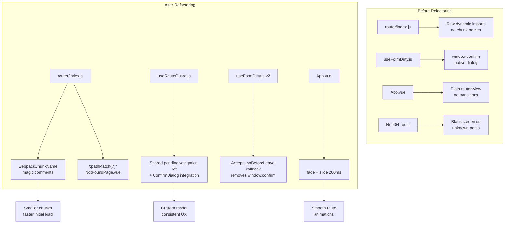

# Enhanced Router Refactoring Plan

## Overview

Refactor the Vue Router configuration in the West Pokot County ERP frontend to add route-level code splitting, a global unsaved-changes guard, a 404 catch-all page, and route transition animations. This plan covers 7 concrete deliverables with exact file paths and 8 acceptance criteria.

---

## Architecture Diagram



---

## Deliverable 1: Route-Level Code Splitting

**File:** [`frontend/src/router/index.js`](frontend/src/router/index.js)

Add explicit `/* webpackChunkName: "module-name--PageName" */` magic comments to all dynamic imports. Chunks are organized by module for predictable caching.

### Chunk Naming Convention

| Pattern | Example |
|---------|---------|
| `public--PageName` | `public--HomePage` |
| `auth--PageName` | `auth--LoginPage` |
| `admin--PageName` | `admin--DashboardPage` |
| `admin--ModuleName--PageName` | `admin--health--DashboardPage` |
| `website--PageName` | `website--FactManagerPage` |

### Complete Chunk Mapping (all 50+ imports)

#### Public Website Routes
| Route Name | Chunk Name |
|---|---|
| PublicHome | `public--HomePage` |
| PublicAbout | `public--AboutPage` |
| PublicDepartments | `public--DepartmentsPage` |
| PublicDepartmentDetail | `public--DepartmentDetailPage` |
| PublicNewsList | `public--NewsListPage` |
| PublicNewsDetail | `public--NewsDetailPage` |
| PublicEvents | `public--EventsPage` |
| PublicEventDetail | `public--EventDetailPage` |
| PublicTenders | `public--TendersPage` |
| PublicVacancies | `public--VacanciesPage` |
| PublicContact | `public--ContactPage` |
| PublicPage | `public--PageView` |
| PublicLayout | `layouts--PublicLayout` |

#### Auth Routes
| Route Name | Chunk Name |
|---|---|
| Login | `auth--LoginPage` |
| ResetPassword | `auth--ResetPasswordPage` |

#### Permit Routes
| Route Name | Chunk Name |
|---|---|
| ApplyPermit | `permit--ApplyPermitPage` |
| VerifyPermit | `permit--VerifyPermitPage` |

#### Admin Layout
| Route Name | Chunk Name |
|---|---|
| AdminLayout | `layouts--AdminLayout` |

#### Admin Core
| Route Name | Chunk Name |
|---|---|
| Dashboard | `admin--DashboardPage` |

#### Admin: User Management
| Route Name | Chunk Name |
|---|---|
| UserList | `admin--users--UserListPage` |
| UserAdd / UserEdit | `admin--users--UserFormPage` |

#### Admin: CMS Content
| Route Name | Chunk Name |
|---|---|
| ContentList | `admin--cms--ContentListPage` |
| ContentCreate / ContentEdit | `admin--cms--ContentEditorPage` |
| MediaLibrary | `admin--cms--MediaLibraryPage` |
| CategoryManager | `admin--cms--CategoryManagerPage` |
| CmsSettings / AdminSettings | `admin--cms--SettingsPage` |
| MenuManager | `admin--cms--MenuManager` |

#### Admin: Permits
| Route Name | Chunk Name |
|---|---|
| PermitList | `admin--permits--PermitListPage` |
| PermitAssign | `admin--permits--PermitAssignPage` |
| PermitDetail | `admin--permits--PermitDetailPage` |

#### Admin: Health
| Route Name | Chunk Name |
|---|---|
| HealthDashboard | `admin--health--DashboardPage` |
| HealthInventory | `admin--health--InventoryPage` |
| HealthPatients | `admin--health--PatientsPage` |
| HealthVisits | `admin--health--VisitsPage` |
| HealthCampaigns | `admin--health--CampaignsPage` |
| HealthReports | `admin--health--ReportsPage` |

#### Admin: Community Health
| Route Name | Chunk Name |
|---|---|
| CommunityHealthDashboard | `admin--communityHealth--DashboardPage` |
| CommunityHealthUnits | `admin--communityHealth--CommunityUnitsPage` |
| CommunityHealthAssistants | `admin--communityHealth--AssistantsPage` |
| CommunityHealthVolunteers | `admin--communityHealth--VolunteersPage` |
| CommunityHealthHouseholds | `admin--communityHealth--HouseholdsPage` |
| CommunityHealthVisits | `admin--communityHealth--VisitsPage` |
| CommunityHealthDialogues | `admin--communityHealth--DialoguesPage` |
| CommunityHealthActionDays | `admin--communityHealth--ActionDaysPage` |
| CommunityHealthSupplies | `admin--communityHealth--SuppliesPage` |
| CommunityHealthReports | `admin--communityHealth--ReportsPage` |
| ChvDashboard | `admin--communityHealth--ChvDashboardPage` |
| ChvHouseholds | `admin--communityHealth--ChvHouseholdsPage` |
| ChvVisits | `admin--communityHealth--ChvVisitsPage` |
| ChvSupplies | `admin--communityHealth--ChvSuppliesPage` |

#### Admin: HR
| Route Name | Chunk Name |
|---|---|
| EmployeeList / EmployeeCreate | `admin--hr--EmployeeListPage` |
| EmployeeDetail | `admin--hr--EmployeeDetailPage` |
| LeaveManagement | `admin--hr--LeavePage` |
| AttendanceManagement | `admin--hr--AttendancePage` |
| RecruitmentManagement | `admin--hr--RecruitmentPage` |
| PerformanceManagement | `admin--hr--PerformancePage` |
| HRReports | `admin--hr--ReportsPage` |

#### Admin: Website Content Management
| Route Name | Chunk Name |
|---|---|
| WebsiteNewsCreate / WebsiteEventsCreate / etc. | `admin--cms--ContentEditorPage` (shared) |
| WebsiteNews / WebsiteEvents / etc. | `admin--cms--ContentListPage` (shared) |
| WebsiteFacts | `admin--website--FactManagerPage` |
| WebsiteHeroSlides | `admin--website--HeroSlideManagerPage` |

### Implementation Pattern

```javascript
// Before
component: () => import('../views/public/HomePage.vue')

// After
component: () => import(/* webpackChunkName: "public--HomePage" */ '../views/public/HomePage.vue')
```

---

## Deliverable 2: Global Unsaved-Changes Guard Composable

**New File:** [`frontend/src/composables/useRouteGuard.js`](frontend/src/composables/useRouteGuard.js)

This composable provides a shared `pendingNavigation` ref that any component can use to block navigation with a custom modal dialog.

### API

```javascript
import { useRouteGuard } from '../composables/useRouteGuard'

// In any component:
const { pendingNavigation, confirmNavigation, cancelNavigation } = useRouteGuard()

// Block navigation:
pendingNavigation.value = {
  resolve: null,  // Will be set internally
  reject: null,   // Will be set internally
}

// After user confirms:
confirmNavigation()  // Resolves the pending navigation

// After user cancels:
cancelNavigation()   // Rejects the pending navigation
```

### Implementation Details

```javascript
// useRouteGuard.js
import { ref } from 'vue'

const pendingNavigation = ref(null)

export function useRouteGuard() {
  function confirmNavigation() {
    if (pendingNavigation.value?.resolve) {
      pendingNavigation.value.resolve(true)
    }
    pendingNavigation.value = null
  }

  function cancelNavigation() {
    if (pendingNavigation.value?.reject) {
      pendingNavigation.value.reject(false)
    }
    pendingNavigation.value = null
  }

  return {
    pendingNavigation,
    confirmNavigation,
    cancelNavigation,
  }
}
```

The `pendingNavigation` ref is module-scoped (singleton), so all components share the same instance. When a route guard detects unsaved changes, it sets `pendingNavigation` to an object with a `resolve` callback. The `ConfirmDialog` component (or any modal) can then call `confirmNavigation()` or `cancelNavigation()`.

---

## Deliverable 3: Update `useFormDirty.js`

**File:** [`frontend/src/composables/useFormDirty.js`](frontend/src/composables/useFormDirty.js)

### Changes

1. **Remove** the `onBeforeRouteLeave` import and the `registerLeaveGuard` function that uses `window.confirm()`.
2. **Add** an `onBeforeLeave` callback parameter to the composable.
3. **Export** a new `registerBeforeLeave(callback)` function that components can call to register a custom leave handler.

### New API

```javascript
const { isDirty, markClean, markDirty, setOriginalSnapshot, updateSnapshot, registerBeforeLeave } = useFormDirty()

// Register a custom before-leave handler
registerBeforeLeave(async (to, from) => {
  if (isDirty.value) {
    // Show custom ConfirmDialog
    const confirmed = await dialog.value.showDialog({
      title: 'Unsaved Changes',
      message: 'You have unsaved changes. Are you sure you want to leave?',
      confirmLabel: 'Leave',
      cancelLabel: 'Stay',
    })
    return confirmed
  }
  return true
})
```

### Implementation

```javascript
import { ref, computed, onBeforeRouteLeave } from 'vue'
import { useRouteGuard } from './useRouteGuard'

export function useFormDirty() {
  const { pendingNavigation, confirmNavigation, cancelNavigation } = useRouteGuard()
  // ... existing state ...

  let beforeLeaveHandler = null

  function registerBeforeLeave(handler) {
    beforeLeaveHandler = handler
  }

  onBeforeRouteLeave(async (to, from, next) => {
    if (beforeLeaveHandler) {
      const result = await beforeLeaveHandler(to, from)
      if (result) {
        next()
      } else {
        next(false)
      }
    } else if (isDirty.value) {
      // Default behavior: use the shared pendingNavigation
      pendingNavigation.value = {
        resolve: (confirmed) => {
          if (confirmed) next()
          else next(false)
        },
      }
    } else {
      next()
    }
  })

  return {
    isDirty,
    markClean,
    markDirty,
    setOriginalSnapshot,
    updateSnapshot,
    registerBeforeLeave,
  }
}
```

---

## Deliverable 4: 404 Catch-All Page

**New File:** [`frontend/src/views/NotFoundPage.vue`](frontend/src/views/NotFoundPage.vue)

### Design

- DaisyUI hero layout with centered content
- Large "404" heading
- Descriptive message
- Conditional navigation button based on auth state:
  - If authenticated: link to Dashboard
  - If not authenticated: link to Home page
- Uses `useAuthStore` to determine auth state

### Template Structure

```vue
<template>
  <div class="hero min-h-screen bg-base-200">
    <div class="hero-content text-center">
      <div class="max-w-md">
        <h1 class="text-9xl font-bold text-primary">404</h1>
        <p class="text-2xl font-semibold mt-4">Page Not Found</p>
        <p class="py-6 text-base-content/70">
          The page you're looking for doesn't exist or has been moved.
        </p>
        <router-link
          :to="isAuthenticated ? { name: 'Dashboard' } : { name: 'PublicHome' }"
          class="btn btn-primary"
        >
          {{ isAuthenticated ? 'Go to Dashboard' : 'Go to Home' }}
        </router-link>
      </div>
    </div>
  </div>
</template>
```

---

## Deliverable 5: 404 Catch-All Route

**File:** [`frontend/src/router/index.js`](frontend/src/router/index.js)

Add the catch-all route at the end of the routes array, after the closing `]` of the admin layout's children.

```javascript
// Must be the LAST route in the array
{
  path: '/:pathMatch(.*)*',
  name: 'NotFound',
  component: () => import(/* webpackChunkName: "public--NotFoundPage" */ '../views/NotFoundPage.vue'),
  meta: { requiresAuth: false },
}
```

**Important:** This route must be placed **after** all other routes to ensure it only matches paths that no other route matched.

---

## Deliverable 6: Vue `<Transition>` Route Animations

**File:** [`frontend/src/App.vue`](frontend/src/App.vue)

### Changes

Wrap `<router-view>` with Vue's `<Transition>` component using `mode="out-in"` with a 200ms fade + vertical slide animation.

### Template

```vue
<template>
  <router-view v-slot="{ Component, route }">
    <Transition name="route" mode="out-in">
      <component :is="Component" :key="route.path" />
    </Transition>
  </router-view>
</template>
```

### Styles

```css
.route-enter-active,
.route-leave-active {
  transition: opacity 0.2s ease, transform 0.2s ease;
}

.route-enter-from {
  opacity: 0;
  transform: translateY(10px);
}

.route-leave-to {
  opacity: 0;
  transform: translateY(-10px);
}
```

---

## Deliverable 7: Verification (Acceptance Criteria)

### AC1: All dynamic imports have `webpackChunkName` comments
- **Check:** Search for `() => import(` in [`frontend/src/router/index.js`](frontend/src/router/index.js) — every occurrence must be followed by `/* webpackChunkName: "..." */`
- **Count:** Verify 50+ magic comments exist

### AC2: Chunks load independently
- **Check:** Run `npm run build` and verify the output contains separate chunk files named after the chunk names (e.g., `public--HomePage.[hash].js`)

### AC3: `useRouteGuard.js` exports a shared `pendingNavigation` ref
- **Check:** Import the composable in two separate components and verify they share the same ref instance

### AC4: `useFormDirty.js` no longer uses `window.confirm()`
- **Check:** Search for `window.confirm` in [`frontend/src/composables/useFormDirty.js`](frontend/src/composables/useFormDirty.js) — should not exist

### AC5: Navigating to an unknown path shows `NotFoundPage.vue`
- **Check:** Visit `/some-nonexistent-page` in the browser — should see the 404 hero layout

### AC6: Auth-aware navigation on 404 page
- **Check:** When logged in, the 404 page links to Dashboard; when logged out, it links to Home

### AC7: Route transitions animate with fade + slide
- **Check:** Navigate between routes and observe a 200ms fade + vertical slide animation

### AC8: Unsaved-changes guard uses `ConfirmDialog` instead of `window.confirm()`
- **Check:** Modify a form with unsaved changes and attempt to navigate away — should see the custom DaisyUI modal

---

## Implementation Order

1. **Deliverable 1** — Add `webpackChunkName` comments to all imports in [`router/index.js`](frontend/src/router/index.js)
2. **Deliverable 2** — Create [`useRouteGuard.js`](frontend/src/composables/useRouteGuard.js)
3. **Deliverable 3** — Update [`useFormDirty.js`](frontend/src/composables/useFormDirty.js) to use the new composable
4. **Deliverable 4** — Create [`NotFoundPage.vue`](frontend/src/views/NotFoundPage.vue)
5. **Deliverable 5** — Add the 404 catch-all route to [`router/index.js`](frontend/src/router/index.js)
6. **Deliverable 6** — Update [`App.vue`](frontend/src/App.vue) with route transitions
7. **Deliverable 7** — Verify all 8 acceptance criteria

---

## Files Modified

| File | Action |
|------|--------|
| [`frontend/src/router/index.js`](frontend/src/router/index.js) | Modify — add chunk names + 404 route |
| [`frontend/src/composables/useRouteGuard.js`](frontend/src/composables/useRouteGuard.js) | **Create** — new composable |
| [`frontend/src/composables/useFormDirty.js`](frontend/src/composables/useFormDirty.js) | Modify — remove window.confirm, add callback |
| [`frontend/src/views/NotFoundPage.vue`](frontend/src/views/NotFoundPage.vue) | **Create** — 404 page |
| [`frontend/src/App.vue`](frontend/src/App.vue) | Modify — add route transitions |
