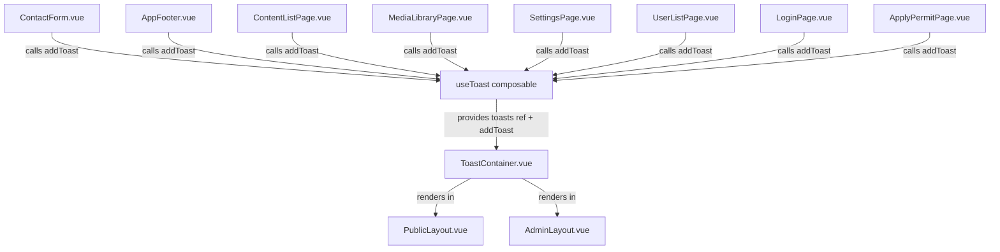

# User Feedback for Form Submissions

## Overview

Add consistent, user-friendly feedback for all form submissions across the public website and CMS admin. Every form must show:
1. **Loading state** while the request is in progress
2. **Success message** with auto-dismissal (5s)
3. **Error message** when something fails

## Current State Assessment

| Component | Loading | Success | Error | Notes |
|-----------|---------|---------|-------|-------|
| `ContactForm.vue` | ✅ Spinner on button | ✅ Inline alert, auto-dismiss 5s | ✅ Inline alert, auto-dismiss 5s | Good, but uses inline alerts instead of toast |
| `AppFooter.vue` (newsletter) | ✅ Disabled button | ✅ Inline message, auto-dismiss 4s | ✅ Inline message, auto-dismiss 4s | Good, but uses inline text instead of toast |
| `ContentEditorPage.vue` | ✅ `saving` ref | ✅ Uses `showToast()` via `ToastNotification.vue` | ✅ Uses `showToast()` | Already has toast integration |
| `ContentListPage.vue` | ❌ No loading state on bulk actions | ❌ No success feedback | ❌ No error feedback | Needs toast integration |
| `MediaLibraryPage.vue` | ❌ No loading state | ❌ No success feedback | ❌ No error feedback | Needs toast integration |
| `SettingsPage.vue` | ❌ No loading state | ❌ No success feedback | ❌ No error feedback | Needs toast integration |
| `UserListPage.vue` | ❌ No loading state | ❌ No success feedback | ❌ No error feedback | Needs toast integration |
| `LoginPage.vue` | ❌ No loading state | N/A (redirects) | ❌ No error feedback | Needs loading + error |
| `ApplyPermitPage.vue` | ❌ No loading state | ❌ No success feedback | ❌ No error feedback | Needs toast integration |

## Plan

### Step 1: Create `frontend/src/composables/useToast.js`

A shared composable that provides a reactive toast array and `addToast()` function.

```javascript
import { ref } from 'vue'

const toasts = ref([])
let nextId = 0

export function useToast() {
  const addToast = (message, type = 'info', duration = 5000) => {
    const id = nextId++
    toasts.value.push({ id, message, type })
    setTimeout(() => {
      toasts.value = toasts.value.filter(t => t.id !== id)
    }, duration)
  }

  return { toasts, addToast }
}
```

### Step 2: Create `frontend/src/components/ToastContainer.vue`

A global toast container that renders all active toasts using DaisyUI alert classes. This component:
- Uses `useToast()` composable to get the reactive `toasts` array
- Renders a `toast toast-top toast-end z-50` container
- Each toast is a DaisyUI alert with icon + message + close button
- Auto-dismisses via the composable's setTimeout

### Step 3: Update `PublicLayout.vue`

Add `<ToastContainer />` before closing `</div>` so all public pages get toast notifications.

### Step 4: Update `AdminLayout.vue`

Add `<ToastContainer />` so all admin pages get toast notifications.

### Step 5: Update `ContactForm.vue`

Replace inline success/error alerts with `addToast()` calls:
- On success: `addToast('Message sent successfully!', 'success')`
- On error: `addToast('Failed to send. Please try again.', 'error')`
- Keep loading spinner on button
- Remove inline alert divs and the `setTimeout` reset

### Step 6: Update `AppFooter.vue` (newsletter)

Replace inline success/error messages with `addToast()` calls:
- On success: `addToast('Subscribed successfully!', 'success')`
- On error: `addToast('Subscription failed. Try again.', 'error')`
- Remove inline message text and the `setTimeout` reset

### Step 7: Update `ContentListPage.vue`

Add toast feedback for:
- `bulkHide()`: loading state, success toast, error toast
- `bulkShow()`: loading state, success toast, error toast
- `deleteContent()`: loading state, success toast, error toast

### Step 8: Update `MediaLibraryPage.vue`

Add toast feedback for:
- `uploadMedia()`: loading state, success toast, error toast
- `deleteMedia()`: loading state, success toast, error toast
- `generateAltText()`: loading state, success toast, error toast

### Step 9: Update `SettingsPage.vue`

Add toast feedback for:
- `saveSettings()`: loading state, success toast, error toast

### Step 10: Update `UserListPage.vue`

Add toast feedback for:
- `createUser()`: loading state, success toast, error toast
- `updateUser()`: loading state, success toast, error toast
- `deleteUser()`: loading state, success toast, error toast

### Step 11: Update `LoginPage.vue`

Add toast feedback for:
- `handleLogin()`: loading state on button, error toast on failure

### Step 12: Update `ApplyPermitPage.vue`

Add toast feedback for:
- `submitApplication()`: loading state, success toast, error toast

## Architecture



## File Changes Summary

| File | Action |
|------|--------|
| `frontend/src/composables/useToast.js` | **CREATE** - Shared toast composable |
| `frontend/src/components/ToastContainer.vue` | **CREATE** - Global toast renderer |
| `frontend/src/layouts/PublicLayout.vue` | **MODIFY** - Add `<ToastContainer />` |
| `frontend/src/layouts/AdminLayout.vue` | **MODIFY** - Add `<ToastContainer />` |
| `frontend/src/components/public/ContactForm.vue` | **MODIFY** - Use toast instead of inline alerts |
| `frontend/src/components/public/AppFooter.vue` | **MODIFY** - Use toast instead of inline messages |
| `frontend/src/views/admin/ContentListPage.vue` | **MODIFY** - Add toast for bulk/delete actions |
| `frontend/src/views/admin/MediaLibraryPage.vue` | **MODIFY** - Add toast for upload/delete/alt-text |
| `frontend/src/views/admin/SettingsPage.vue` | **MODIFY** - Add toast for save settings |
| `frontend/src/views/admin/UserListPage.vue` | **MODIFY** - Add toast for CRUD operations |
| `frontend/src/views/LoginPage.vue` | **MODIFY** - Add loading + error toast |
| `frontend/src/views/ApplyPermitPage.vue` | **MODIFY** - Add toast for submission |
