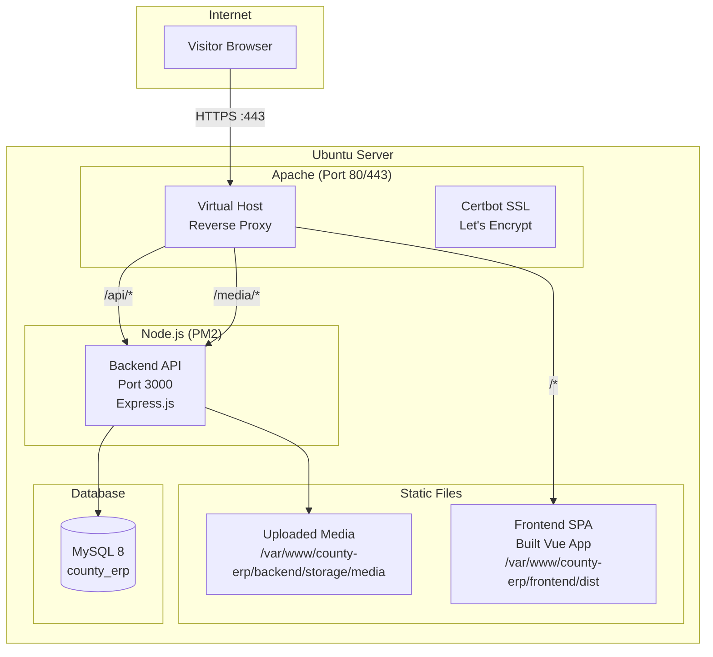
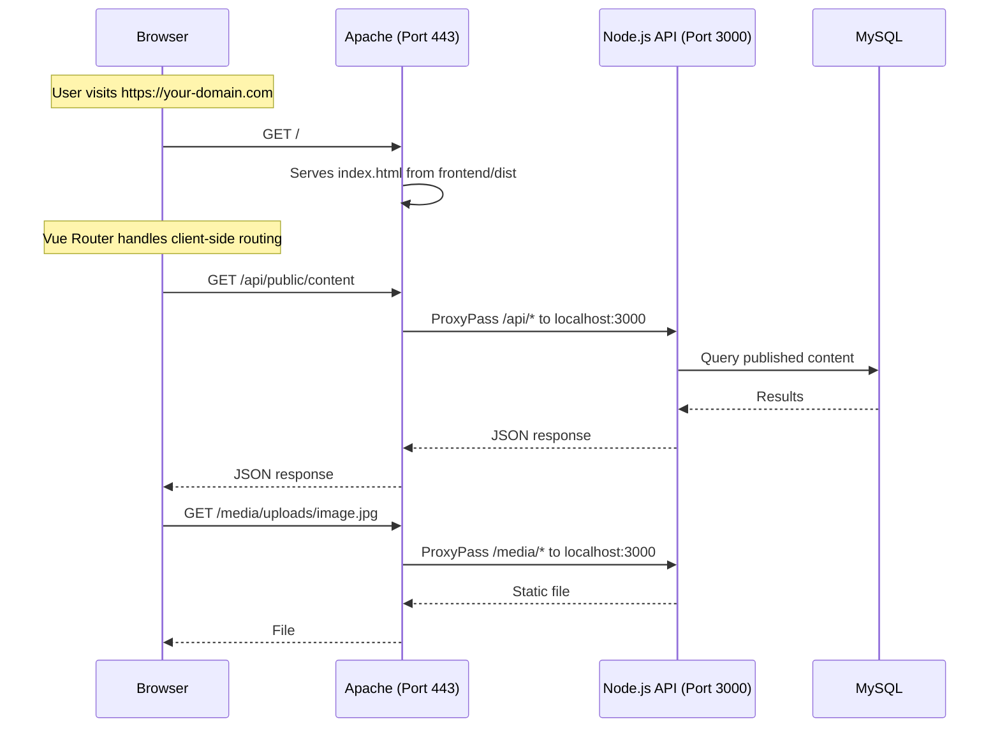

# Production Deployment Plan

## Architecture



## Request Flow



## Prerequisites on Ubuntu Server

```bash
# Update system
sudo apt update && sudo apt upgrade -y

# Install Node.js 18+
curl -fsSL https://deb.nodesource.com/setup_18.x | sudo -E bash -
sudo apt install -y nodejs

# Install MySQL 8
sudo apt install -y mysql-server
sudo mysql_secure_installation

# Install Apache
sudo apt install -y apache2

# Enable required Apache modules
sudo a2enmod proxy proxy_http proxy_balancer rewrite ssl headers

# Install PM2 globally
sudo npm install -g pm2

# Install Certbot for SSL
sudo apt install -y certbot python3-certbot-apache
```

## Deployment Steps

### 1. Clone the Repository

```bash
sudo mkdir -p /var/www/county-erp
sudo chown -R $USER:$USER /var/www/county-erp
git clone https://github.com/Jpkoech30/kenyacountygovermenterp.git /var/www/county-erp
cd /var/www/county-erp
```

### 2. Configure Backend

```bash
cd /var/www/county-erp/backend
cp .env.example .env
nano .env
```

Required `.env` values:

```env
NODE_ENV=production
PORT=3000

DB_HOST=localhost
DB_PORT=3306
DB_NAME=county_erp
DB_USER=root
DB_PASS=your_secure_password

JWT_SECRET=generate_a_strong_random_secret
JWT_EXPIRES_IN=7d

DEEPSEEK_API_KEY=sk-your-key-if-using-ai-features

# M-Pesa (optional)
MPESA_CONSUMER_KEY=your_key
MPESA_CONSUMER_SECRET=your_secret
MPESA_PASSKEY=your_passkey
MPESA_SHORTCODE=your_shortcode

# Email (optional)
SMTP_HOST=smtp.gmail.com
SMTP_PORT=587
SMTP_USER=your_email
SMTP_PASS=your_app_password
```

### 3. Install Dependencies & Build

```bash
# Backend
cd /var/www/county-erp/backend
npm install --production

# Frontend
cd /var/www/county-erp/frontend
npm install
npm run build
```

### 4. Setup Database

```bash
# Create database
sudo mysql -u root -p
CREATE DATABASE county_erp CHARACTER SET utf8mb4 COLLATE utf8mb4_unicode_ci;
CREATE USER 'county_erp_user'@'localhost' IDENTIFIED BY 'your_secure_password';
GRANT ALL PRIVILEGES ON county_erp.* TO 'county_erp_user'@'localhost';
FLUSH PRIVILEGES;
EXIT;

# Run seeders
cd /var/www/county-erp/backend
npm run seed
```

### 5. Start with PM2

```bash
cd /var/www/county-erp
pm2 start ecosystem.config.js --env production
pm2 save
pm2 startup  # Follow the instructions to enable PM2 on boot
```

### 6. Configure Apache Virtual Host

Create `/etc/apache2/sites-available/county-erp.conf`:

```apache
<VirtualHost *:80>
    ServerName your-domain.com
    ServerAlias www.your-domain.com

    # Redirect all HTTP to HTTPS
    RewriteEngine On
    RewriteCond %{HTTPS} off
    RewriteRule ^(.*)$ https://%{HTTP_HOST}$1 [R=301,L]
</VirtualHost>

<VirtualHost *:443>
    ServerName your-domain.com
    ServerAlias www.your-domain.com

    # Frontend static files
    DocumentRoot /var/www/county-erp/frontend/dist

    <Directory /var/www/county-erp/frontend/dist>
        Options -Indexes +FollowSymLinks
        AllowOverride All
        Require all granted

        # SPA fallback — serve index.html for all non-file routes
        FallbackResource /index.html
    </Directory>

    # API reverse proxy
    ProxyPreserveHost On
    ProxyPass /api http://localhost:3000/api
    ProxyPassReverse /api http://localhost:3000/api

    # Media files reverse proxy
    ProxyPass /media http://localhost:3000/media
    ProxyPassReverse /media http://localhost:3000/media

    # Security headers
    Header always set X-Content-Type-Options "nosniff"
    Header always set X-Frame-Options "DENY"
    Header always set X-XSS-Protection "1; mode=block"
    Header always set Referrer-Policy "strict-origin-when-cross-origin"

    # Logs
    ErrorLog ${APACHE_LOG_DIR}/county-erp-error.log
    CustomLog ${APACHE_LOG_DIR}/county-erp-access.log combined

    # SSL (added by Certbot)
    Include /etc/letsencrypt/options-ssl-apache.conf
    SSLCertificateFile /etc/letsencrypt/live/your-domain.com/fullchain.pem
    SSLCertificateKeyFile /etc/letsencrypt/live/your-domain.com/privkey.pem
</VirtualHost>
```

Enable the site:

```bash
sudo a2ensite county-erp.conf
sudo a2dissite 000-default.conf
sudo systemctl reload apache2
```

### 7. Setup SSL with Certbot

```bash
sudo certbot --apache -d your-domain.com -d www.your-domain.com
```

### 8. Verify Deployment

```bash
# Check PM2 status
pm2 status

# Check Apache
sudo systemctl status apache2

# Test API
curl https://your-domain.com/api/health

# Visit in browser
https://your-domain.com
```

## Maintenance

### Logs

```bash
# PM2 logs
pm2 logs west-pokot-erp-backend
pm2 logs west-pokot-erp-frontend

# Apache logs
sudo tail -f /var/log/apache2/county-erp-error.log
sudo tail -f /var/log/apache2/county-erp-access.log
```

### Updates

```bash
cd /var/www/county-erp
git pull origin master

# Backend
cd backend && npm install --production && pm2 restart west-pokot-erp-backend

# Frontend
cd ../frontend && npm install && npm run build
```

### SSL Renewal (automatic)

```bash
# Certbot auto-renews — verify with:
sudo certbot renew --dry-run
```

## Troubleshooting

| Symptom | Likely Cause | Fix |
|---------|-------------|-----|
| 502 Bad Gateway | Node.js not running | `pm2 restart west-pokot-erp-backend` |
| 403 Forbidden | Apache directory permissions | `sudo chown -R www-data:www-data /var/www/county-erp/frontend/dist` |
| API returns 404 | Proxy not configured | Check `ProxyPass` directives in vhost |
| Blank page on SPA routes | FallbackResource missing | Ensure `FallbackResource /index.html` is set |
| Database connection refused | MySQL not running or wrong credentials | `sudo systemctl status mysql`, check `.env` |
