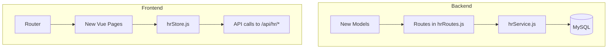
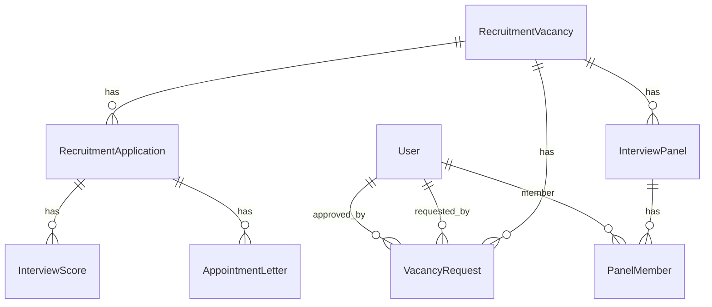

# Recruitment Module Extension Plan — Phase 1 (Reduced Scope)

## Enhanced UI/UX Design System

### Design Principles
1. **Clean & Intuitive** — Minimal visual noise, generous whitespace, clear content hierarchy. Every page has a single primary action.
2. **Progressive Disclosure** — Complex workflows are broken into steps/wizards. Advanced fields hidden behind "Show more" toggles.
3. **Inline Validation** — Forms validate on blur and show contextual error messages below fields. Submit button disabled until valid.
4. **Consistent Visual Hierarchy** — Status badges use a fixed color map (info=blue, success=green, warning=amber, error=red, ghost=gray). All tables share the same `table table-zebra` pattern.
5. **Responsive** — Card grids go 3-col → 2-col → 1-col. Tables scroll horizontally on mobile. Modals are full-screen on small screens.
6. **Contextual Help** — Complex fields show a tooltip icon that reveals helper text on hover/click.
7. **At-a-Glance Dashboards** — Each page top section shows 3-4 stat cards with key metrics (pending approvals, vacancy counts, letter progress).

### Shared Component Patterns (DaisyUI)
| Pattern | Implementation | Usage |
|---------|---------------|-------|
| Stat Cards | `div.stat` with `stat-title`, `stat-value`, `stat-desc` | Dashboard metrics row |
| Tables | `table table-zebra w-full` with sticky header | List views |
| Modals | `modal modal-open` with `modal-box max-w-2xl` | Forms, detail views |
| Badges | `badge badge-sm badge-{info/success/warning/error/ghost}` | Status indicators |
| Form Controls | `input input-bordered input-sm`, `select select-bordered select-sm` | All forms |
| Loading | `loading loading-spinner loading-lg text-primary` | Async states |
| Empty State | Centered icon + title + description | No-data views |
| Tooltips | `div.tooltip` with `data-tip` attribute | Contextual help |
| Tabs | `tabs tabs-bordered` with `tab tab-bordered` | Multi-section pages |
| Alerts | `alert alert-{info/success/warning/error}` | Notifications |
| Progress | `progress progress-primary` | Score bars, letter generation |

### Page-Specific UI Specifications

**VacancyRequestsPage.vue**
- Top row: 3 stat cards — Pending Requests (amber), Approved This Month (green), Total Requests (blue)
- Table columns: Vacancy Title, Department, Requested By, Date, Status badge, Actions
- Status badges: pending=badge-warning, approved=badge-success, rejected=badge-error
- Create form in modal: select vacancy (dropdown), notes (textarea), submit
- Approve/Reject: inline buttons in table row, reject opens a reason modal
- Empty state: "No vacancy requests" with illustration

**ShortlistPage.vue**
- Top row: 3 stat cards — Total Applicants, Shortlisted, Pending Review
- Step 1: Select vacancy (dropdown filter)
- Step 2: Table of applications with score input field per row
- Each row: applicant name, email, score input (0-100 with validation), comments textarea, Shortlist/Reject buttons
- Bulk action: "Finalize Shortlist" button (disabled until at least one shortlisted)
- Progress bar showing shortlist completion percentage
- Tooltip on score field: "Score based on qualification matching, experience, and interview performance"

**InterviewPanelsPage.vue**
- Top row: 3 stat cards — Active Panels, Total Members, Pending Scores
- Panel cards (not table): `card bg-base-100 shadow-sm border` with panel name, vacancy, chairperson, member count
- Create panel modal: name, vacancy, chairperson (user select), add members
- Member list within card: avatar + name + role badge
- Remove member: X button with confirmation
- Tab per panel showing applications with score submission form
- Tooltip on role: "Chairperson leads the interview process and compiles final scores"

**AppointmentLettersPage.vue**
- Top row: 3 stat cards — Draft Letters (ghost), Issued (info), Total Generated (blue)
- Table columns: Applicant, Vacancy, Letter Number, Status badge, Generated Date, Actions
- Status badges: draft=badge-ghost, issued=badge-info, signed=badge-success
- "Generate Letter" button opens modal with letter preview
- Letter preview shows: county letterhead, applicant details, terms, generated PDF link
- Download button for issued letters
- Issue button: marks letter as issued, sends notification
- Empty state: "No appointment letters yet. Hire an applicant first."

### Dashboard Metrics API
New endpoint: `GET /api/hr/recruitment/dashboard`
Returns: `{ pendingRequests, approvedThisMonth, totalVacancies, totalApplicants, shortlistedCount, activePanels, draftLetters, issuedLetters }`

## HR Module Audit Results

**Backend Status: ✅ WORKING**
- Server running on port 3000, all 56 models load without errors
- Auth middleware functional (JWT-based, role checks for `hr_officer`, `admin`, `board_member`, `supervisor`, `employee`)
- Public vacancies endpoint: `GET /api/public/vacancies` returns valid paginated response
- Recruitment models (`RecruitmentVacancy`, `RecruitmentApplication`) have correct fields and associations
- `hrService.js` (700 lines) covers: employee CRUD, leave workflow, attendance, recruitment, performance, disciplinary, reports
- All existing HR routes in `hrRoutes.js` (1054 lines) are structured and working

**Frontend Status: ✅ WORKING**
- Vite build completes with 0 errors (2088 modules transformed)
- 7 HR page components exist: `AttendancePage`, `EmployeeDetailPage`, `EmployeeListPage`, `LeavePage`, `PerformancePage`, `RecruitmentPage`, `ReportsPage`
- `hrStore.js` (620 lines) has all recruitment actions: `fetchVacancies`, `createVacancy`, `updateVacancy`, `fetchApplications`, `fetchApplication`, `updateApplicationStatus`
- Router has 7 HR routes under `/admin/hr/*`
- Sidebar HCM section in `AdminLayout.vue` (lines 544-565) with conditional visibility

**Gaps Found (to be addressed in this plan):**
1. `RecruitmentApplication` lacks shortlisting fields (`shortlisting_score`, `shortlisting_comments`, `elimination_reason`)
2. No `VacancyRequest` approval workflow model exists
3. No `InterviewPanel` or `PanelMember` models exist
4. No `AppointmentLetter` model exists
5. `POST /hr/applications/:id/approve-appointment` is a stub (just validates status, no letter generation)
6. No dedicated frontend pages for vacancy requests, shortlisting, interview panels, or appointment letters

## Key Decisions

1. **PDF generation is required** — use `pdfkit` library for real appointment letter PDFs with county letterhead
2. **All features under HCM** — every new page is a sub-link under the **Human Capital Management** sidebar section. Routes are under `/admin/hr/*`. No standalone sidebar entries.
3. **Phase 1 scope only** — Vacancy Requests, Shortlisting, Interview Panels, and Appointment Letters. Probation, Confirmation, Temporary/Casual, and Induction deferred to later phases.

## Architecture



## Data Model



## File Inventory

### New Backend Models (5 files)
| File | Table | Purpose |
|------|-------|---------|
| `backend/src/models/VacancyRequest.js` | `vacancy_requests` | Approval workflow for publishing vacancies |
| `backend/src/models/InterviewPanel.js` | `interview_panels` | Panel assigned to a vacancy |
| `backend/src/models/PanelMember.js` | `panel_members` | Individual panelist with role |
| `backend/src/models/InterviewScore.js` | `interview_scores` | Per-candidate interview scoring |
| `backend/src/models/AppointmentLetter.js` | `appointment_letters` | Generated appointment letters |

### Modified Backend Files (4 files)
| File | Change |
|------|--------|
| `backend/src/models/RecruitmentApplication.js` | Add `shortlisting_score`, `shortlisting_comments`, `elimination_reason` fields |
| `backend/src/models/index.js` | Register 5 new models + associations |
| `backend/src/routes/hrRoutes.js` | Add ~12 new endpoints |
| `backend/src/services/hrService.js` | Add service methods for new features |

### New Frontend Pages (4 files)
| File | Purpose |
|------|---------|
| `frontend/src/views/admin/hr/VacancyRequestsPage.vue` | Vacancy request approval workflow |
| `frontend/src/views/admin/hr/ShortlistPage.vue` | Shortlisting interface with scoring |
| `frontend/src/views/admin/hr/InterviewPanelsPage.vue` | Panel creation and management |
| `frontend/src/views/admin/hr/AppointmentLettersPage.vue` | Generate and view appointment letters |

### Modified Frontend Files (3 files)
| File | Change |
|------|--------|
| `frontend/src/stores/hr.js` | Add state + actions for new features |
| `frontend/src/router/index.js` | Add 4 new routes under `/admin/hr/*` |
| `frontend/src/layouts/AdminLayout.vue` | Add 4 sub-links under HCM sidebar |

## Implementation Steps

### Step 1: Create 5 new backend models

**1a. `VacancyRequest.js`**
- Fields: `id`, `vacancy_id` (FK→RecruitmentVacancy), `requested_by` (FK→User), `status` (pending/approved/rejected), `approval_notes`, `approved_by` (FK→User), `approved_at`, timestamps
- Purpose: Department heads request vacancies; HR/board approves before publishing

**1b. `InterviewPanel.js`**
- Fields: `id`, `vacancy_id` (FK→RecruitmentVacancy), `name`, `chairperson_id` (FK→User), `status` (active/dissolved), timestamps

**1c. `PanelMember.js`**
- Fields: `id`, `panel_id` (FK→InterviewPanel), `user_id` (FK→User), `role` (chairperson/secretary/member), timestamps

**1d. `InterviewScore.js`**
- Fields: `id`, `application_id` (FK→RecruitmentApplication), `panel_member_id` (FK→PanelMember), `score`, `comments`, timestamps

**1e. `AppointmentLetter.js`**
- Fields: `id`, `application_id` (FK→RecruitmentApplication), `letter_number` (auto-generated), `content` (JSON/Text), `pdf_path`, `status` (draft/issued/signed), `issued_at`, `signed_by` (FK→User), timestamps

### Step 2: Modify `RecruitmentApplication.js`
Add columns: `shortlisting_score` (DECIMAL), `shortlisting_comments` (TEXT), `elimination_reason` (TEXT)

### Step 3: Register models + associations in `index.js`
- `VacancyRequest.belongsTo(RecruitmentVacancy)`, `VacancyRequest.belongsTo(User, as: 'requester')`, `VacancyRequest.belongsTo(User, as: 'approver')`
- `InterviewPanel.belongsTo(RecruitmentVacancy)`, `InterviewPanel.hasMany(PanelMember)`
- `PanelMember.belongsTo(InterviewPanel)`, `PanelMember.belongsTo(User)`
- `InterviewScore.belongsTo(RecruitmentApplication)`, `InterviewScore.belongsTo(PanelMember)`
- `AppointmentLetter.belongsTo(RecruitmentApplication)`

### Step 4: Add API endpoints in `hrRoutes.js`

**Dashboard Metrics:**
- `GET /hr/recruitment/dashboard` — returns `{ pendingRequests, approvedThisMonth, totalVacancies, totalApplicants, shortlistedCount, activePanels, draftLetters, issuedLetters }` for stat cards

**Vacancy Requests:**
- `GET /hr/vacancy-requests` — list all (HR/admin)
- `POST /hr/vacancy-requests` — create request (department head)
- `PUT /hr/vacancy-requests/:id/approve` — approve (HR/admin)
- `PUT /hr/vacancy-requests/:id/reject` — reject with notes

**Shortlisting:**
- `POST /hr/applications/:id/shortlist` — shortlist with score
- `POST /hr/applications/:id/reject` — reject with reason
- `POST /hr/vacancies/:id/shortlist/complete` — finalize shortlist for a vacancy

**Interview Panels:**
- `GET /hr/interview-panels` — list panels
- `POST /hr/interview-panels` — create panel
- `PUT /hr/interview-panels/:id` — update panel
- `POST /hr/interview-panels/:id/members` — add member
- `DELETE /hr/interview-panels/:id/members/:memberId` — remove member
- `POST /hr/interview-scores` — submit score for an application

**Appointment Letters:**
- `GET /hr/appointment-letters` — list letters
- `POST /hr/appointment-letters/generate` — generate PDF for a hired application
- `PUT /hr/appointment-letters/:id/issue` — mark as issued
- `GET /hr/appointment-letters/:id/pdf` — download PDF

### Step 5: Add service methods in `hrService.js`
- `createVacancyRequest(data)` — validates vacancy exists, creates request
- `approveVacancyRequest(id, userId)` — sets status to approved, publishes vacancy
- `rejectVacancyRequest(id, notes, userId)` — sets status to rejected
- `shortlistApplication(id, score, comments)` — updates application with shortlisting data
- `finalizeShortlist(vacancyId)` — marks all shortlisted applications
- `createInterviewPanel(data)` — creates panel with members
- `addPanelMember(panelId, userId, role)` — adds member to panel
- `submitInterviewScore(data)` — records score for an application
- `generateAppointmentLetter(applicationId)` — generates PDF using pdfkit with county letterhead
- `issueAppointmentLetter(id, userId)` — marks letter as issued

### Step 6: Extend frontend `hrStore.js`
Add state: `vacancyRequests`, `interviewPanels`, `appointmentLetters`
Add actions: `fetchVacancyRequests`, `createVacancyRequest`, `approveVacancyRequest`, `rejectVacancyRequest`, `shortlistApplication`, `rejectApplication`, `finalizeShortlist`, `fetchInterviewPanels`, `createInterviewPanel`, `updateInterviewPanel`, `addPanelMember`, `removePanelMember`, `submitInterviewScore`, `fetchAppointmentLetters`, `generateAppointmentLetter`, `issueAppointmentLetter`

### Step 7: Create 4 new Vue pages (Enhanced UI/UX)

**7a. `VacancyRequestsPage.vue`**
- **Top stat cards**: Pending Requests (amber count), Approved This Month (green), Total Requests (blue)
- **Table** (`table table-zebra w-full`): Vacancy Title, Department, Requested By, Date, Status badge, Actions
- **Status badges**: pending=badge-warning, approved=badge-success, rejected=badge-error
- **Create modal**: select vacancy dropdown, notes textarea, submit button
- **Approve**: inline button per row, confirmation dialog
- **Reject**: opens modal with reason textarea (required)
- **Empty state**: centered icon + "No vacancy requests" + helper text
- **Tooltip** on status: "Pending requests require HR officer approval"

**7b. `ShortlistPage.vue`**
- **Top stat cards**: Total Applicants, Shortlisted, Pending Review
- **Step 1**: Vacancy selector dropdown with search
- **Step 2**: Application table with per-row:
  - Applicant name + email
  - Score input (type=number, min=0, max=100, step=0.5) with inline validation
  - Comments textarea (expandable)
  - Shortlist button (green) / Reject button (red)
- **Progress bar**: `progress progress-primary` showing shortlisted/total percentage
- **Finalize button**: disabled until >=1 shortlisted, with confirmation modal
- **Tooltip** on score: "Score based on qualification matching, experience, and interview performance"
- **Inline validation**: score turns red border if >100 or <0, error message below

**7c. `InterviewPanelsPage.vue`**
- **Top stat cards**: Active Panels, Total Members, Pending Scores
- **Panel cards** (not table): `card bg-base-100 shadow-sm border` layout
  - Panel name + vacancy title
  - Chairperson name with badge
  - Member count
  - Status badge
- **Create modal**: name input, vacancy select, chairperson user select, add members multi-select
- **Member list** within card: avatar + name + role badge (chairperson=badge-primary, secretary=badge-info, member=badge-ghost)
- **Remove member**: X icon button with `confirm()` dialog
- **Tab per panel**: clicking a card shows applications tab with score submission form
- **Score submission**: per application row with score input + submit button
- **Tooltip** on role: "Chairperson leads the interview process and compiles final scores"

**7d. `AppointmentLettersPage.vue`**
- **Top stat cards**: Draft Letters (ghost count), Issued (info count), Total Generated (blue count)
- **Table**: Applicant, Vacancy, Letter Number, Status badge, Generated Date, Actions
- **Status badges**: draft=badge-ghost, issued=badge-info, signed=badge-success
- **Generate modal**: select hired application, preview letter content, "Generate PDF" button
- **Letter preview**: county letterhead (styled div), applicant details, employment terms, generated PDF link
- **Download button**: appears after generation, links to `/api/hr/appointment-letters/:id/pdf`
- **Issue button**: marks letter as issued, changes badge to issued=badge-info
- **Empty state**: "No appointment letters yet. Hire an applicant first."
- **Tooltip** on letter number: "Auto-generated format: HR-APP-YYYY-NNNN"

### Step 8: Add 4 new frontend routes
```js
{ path: 'admin/hr/vacancy-requests', name: 'VacancyRequests', component: () => import('...VacancyRequestsPage.vue') }
{ path: 'admin/hr/shortlist', name: 'Shortlist', component: () => import('...ShortlistPage.vue') }
{ path: 'admin/hr/interview-panels', name: 'InterviewPanels', component: () => import('...InterviewPanelsPage.vue') }
{ path: 'admin/hr/appointment-letters', name: 'AppointmentLetters', component: () => import('...AppointmentLettersPage.vue') }
```

### Step 9: Update sidebar in `AdminLayout.vue`
Add 4 sub-links under HCM section (after existing recruitment link):
- Vacancy Requests → `/admin/hr/vacancy-requests`
- Shortlist → `/admin/hr/shortlist`
- Interview Panels → `/admin/hr/interview-panels`
- Appointment Letters → `/admin/hr/appointment-letters`

### Step 10: Install dependencies & run migration
- `npm install pdfkit` in backend
- Create migration script to add `shortlisting_score`, `shortlisting_comments`, `elimination_reason` columns to `recruitment_applications` table
- Restart PM2: `pm2 restart ecosystem.config.js`

## Business Rules Enforcement

| Rule | Where Enforced |
|------|---------------|
| Only published vacancies accept applications | `hrService.submitApplication()` — checks status and deadline |
| Vacancy must be approved before publishing | `VacancyRequest` status must be `approved` |
| Only HR/admin can approve vacancy requests | Route middleware: `authorize('hr_officer', 'admin')` |
| Panel must have at least 2 members | Service validation in `createInterviewPanel()` |
| Interview scores 0-100 | Model validation on `InterviewScore.score` |
| Appointment letter only for hired applicants | `generateAppointmentLetter()` checks status === 'hired' |
| Letter number auto-generated | `AppointmentLetter.beforeCreate` hook: `HR-APP-{year}-{sequential}` |

## Acceptance Criteria

- [ ] Vacancy request workflow: department head creates → HR approves → vacancy auto-publishes
- [ ] Shortlisting: HR scores applications → finalize shortlist → status updates to `shortlisted`
- [ ] Interview panels: create panel → add members → assign to vacancy
- [ ] Interview scoring: panel members submit scores per application
- [ ] Appointment letters: generate PDF → issue → download
- [ ] All new pages accessible under HCM sidebar
- [ ] Frontend builds with 0 errors
- [ ] Backend models load without Sequelize errors
