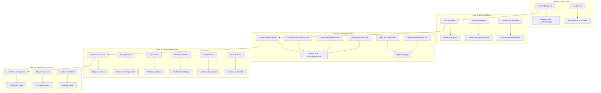

# UI/UX Refactoring Plan — West Pokot County ERP

## Executive Summary

After thorough codebase analysis, I've identified **15 categories of UI/UX issues** across the frontend. The project uses Vue 3 + Tailwind CSS + DaisyUI v4 + Lucide icons, but many pages use emoji icons, native browser dialogs (`confirm()`/`prompt()`), deprecated DaisyUI patterns (`btn-group`), and inconsistent component patterns. The refactoring is organized into **5 phases** ordered by impact and dependency.

---

## Phase 1: Critical UX Anti-patterns (High Priority)

### 1.1 Replace Native `confirm()`/`prompt()` with Confirmation Modal Component

**Problem:** 6 files use native browser dialogs which block the JS thread, cannot be styled, and provide poor UX.

**Files affected:**
- [`frontend/src/views/admin/ContentListPage.vue`](../frontend/src/views/admin/ContentListPage.vue:135) — `confirm()` for bulk hide/show (lines 135, 150), `prompt()` for rejection reason (line 248), `prompt()` for scheduling date (line 258), `confirm()` for delete (line 273)
- [`frontend/src/views/admin/CategoryManagerPage.vue`](../frontend/src/views/admin/CategoryManagerPage.vue:96) — `confirm()` for delete (line 96)
- [`frontend/src/views/admin/website/FactManagerPage.vue`](../frontend/src/views/admin/website/FactManagerPage.vue:79) — `confirm()` for delete (line 79)
- [`frontend/src/views/admin/website/HeroSlideManagerPage.vue`](../frontend/src/views/admin/website/HeroSlideManagerPage.vue:106) — `confirm()` for delete (line 106)
- [`frontend/src/views/admin/MenuManager.vue`](../frontend/src/views/admin/MenuManager.vue:67) — `confirm()` for delete (line 67)
- [`frontend/src/views/admin/MenuItemEditor.vue`](../frontend/src/views/admin/MenuItemEditor.vue:147) — `confirm()` for delete (line 147)

**Action:** Create a reusable [`ConfirmDialog.vue`](../frontend/src/components/ConfirmDialog.vue) component using DaisyUI `<dialog>` modal with:
- Title, message, confirm/cancel buttons
- `confirm-danger` variant for destructive actions (red button)
- `confirm-default` variant for informational confirmations
- Promise-based API: `const confirmed = await confirmDialog.show({ title, message, variant })`
- Keyboard support (Enter to confirm, Escape to cancel)
- Focus trap inside modal

**Implementation pattern:**
```vue
<!-- ConfirmDialog.vue -->
<script setup>
import { ref } from 'vue'
const show = ref(false)
let resolvePromise = null
const config = ref({ title: 'Confirm', message: '', variant: 'default' })

function showDialog(opts) {
  config.value = { ...config.value, ...opts }
  show.value = true
  return new Promise((resolve) => { resolvePromise = resolve })
}
function confirm() { show.value = false; resolvePromise?.(true) }
function cancel() { show.value = false; resolvePromise?.(false) }
defineExpose({ showDialog })
</script>
```

### 1.2 Replace Emoji Icons with Lucide Icon Components

**Problem:** Multiple pages use raw emoji characters (📂, 🏷️, ✏️, 🗑️, 🔗, etc.) instead of the Lucide icon library already in `package.json`. This causes inconsistent rendering across OS/browser, accessibility issues (screen readers read emoji names), and unprofessional appearance.

**Files affected:**
- [`ContentListPage.vue`](../frontend/src/views/admin/ContentListPage.vue:337) — emoji in status badges, action buttons, empty states
- [`ContentEditorPage.vue`](../frontend/src/views/admin/ContentEditorPage.vue:687) — emoji in section headers, action buttons, tabs
- [`MediaLibraryPage.vue`](../frontend/src/views/admin/MediaLibraryPage.vue:208) — emoji in filter buttons, action buttons
- [`CategoryManagerPage.vue`](../frontend/src/views/admin/CategoryManagerPage.vue:155) — emoji in tab labels (📂, 🏷️), action buttons (✏️, 🗑️), empty state
- [`FactManagerPage.vue`](../frontend/src/views/admin/website/FactManagerPage.vue:154) — emoji in action buttons
- [`HeroSlideManagerPage.vue`](../frontend/src/views/admin/website/HeroSlideManagerPage.vue:173) — emoji for link icon (🔗), action buttons
- [`AdminLayout.vue`](../frontend/src/layouts/AdminLayout.vue:453) — inline SVG for hamburger menu (replace with `Menu` icon)
- [`ToastNotification.vue`](../frontend/src/components/ToastNotification.vue:42) — emoji close button (✕)

**Action:** Replace all emoji icons with Lucide equivalents. Lucide is already imported in `AdminLayout.vue` and `ToastContainer.vue`. Add imports to each file as needed.

**Icon mapping:**
| Emoji | Lucide Component |
|-------|-----------------|
| ✏️ | `Pencil` |
| 🗑️ | `Trash2` |
| 📂 | `FolderOpen` |
| 🏷️ | `Tags` |
| 🔗 | `Link` |
| ✕ / × | `X` |
| ⬆️ | `ArrowUp` |
| ⬇️ | `ArrowDown` |
| ℹ️ | `Info` |
| ⚠️ | `AlertTriangle` |

---

## Phase 2: DaisyUI Deprecation & Pattern Fixes

### 2.1 Replace Deprecated `btn-group` with `join` Component

**Problem:** DaisyUI v5 deprecated `btn-group` in favor of `join` + `join-item`. The project uses DaisyUI v4.12.10, but should be forward-compatible.

**Files affected:**
- [`ContentListPage.vue`](../frontend/src/views/admin/ContentListPage.vue:524) — pagination uses `btn-group`
- [`MediaLibraryPage.vue`](../frontend/src/views/admin/MediaLibraryPage.vue:257) — pagination uses `btn-group`

**Action:** Replace `class="btn-group"` with `class="join"` and add `join-item` class to child buttons.

### 2.2 Replace Manual Dropdown Implementations with DaisyUI Dropdown

**Problem:** Some pages implement custom dropdown toggles with manual click-outside handlers instead of using DaisyUI's built-in `dropdown` component.

**Files affected:**
- [`ContentEditorPage.vue`](../frontend/src/views/admin/ContentEditorPage.vue:777) — custom AI Assist dropdown with `@click.stop` and manual click-outside
- [`AdminLayout.vue`](../frontend/src/layouts/AdminLayout.vue:478) — "More" dropdown with manual `v-show` + click-outside handler

**Action:** Refactor to use DaisyUI's `<details class="dropdown">` pattern where possible, or keep controlled dropdown but use DaisyUI dropdown classes.

### 2.3 Fix Modal Implementation Pattern

**Problem:** Some modals use `dialog :open="showModal"` (boolean attribute binding) which is non-standard. DaisyUI modals should use the native `<dialog>` element with `.showModal()` / `.close()` methods.

**Files affected:**
- [`FactManagerPage.vue`](../frontend/src/views/admin/website/FactManagerPage.vue:171) — `<dialog :open="showModal">`
- [`HeroSlideManagerPage.vue`](../frontend/src/views/admin/website/HeroSlideManagerPage.vue:190) — `<dialog :open="showModal">`
- [`MenuManager.vue`](../frontend/src/views/admin/MenuManager.vue:190) — custom fixed overlay instead of DaisyUI modal

**Action:** Standardize all modals to use a consistent pattern with `<dialog>` + `.showModal()` / ref-based control.

---

## Phase 3: Component Extraction & Code Organization

### 3.1 Extract ContentEditorPage.vue into Smaller Components

**Problem:** [`ContentEditorPage.vue`](../frontend/src/views/admin/ContentEditorPage.vue) is **1263 lines** — the largest file in the project. It contains:
- Form state management
- TipTap editor integration
- Media picker modal logic
- AI Assist integration
- Workflow actions (submit, approve, reject, publish, schedule)
- Version management
- Type-specific meta fields (news, event, tender, vacancy, department, person)

**Action:** Extract into:
- [`ContentEditorForm.vue`](../frontend/src/components/ContentEditorForm.vue) — form fields, validation, type-specific sections
- [`ContentWorkflowActions.vue`](../frontend/src/components/ContentWorkflowActions.vue) — workflow buttons, rejection modal, scheduling
- [`ContentVersionHistory.vue`](../frontend/src/components/ContentVersionHistory.vue) — version list, restore, diff view
- [`ContentMetaFields.vue`](../frontend/src/components/ContentMetaFields.vue) — type-specific meta fields (event date, tender closing, etc.)

### 3.2 Standardize Toast Notification Pattern

**Problem:** Two competing toast patterns exist:
1. **`useToast` composable** (global, module-level state) — used in `AdminLayout.vue`, `SettingsPage.vue`, `MenuManager.vue`, `MenuItemEditor.vue`, `AIPageCreator.vue`
2. **`ToastNotification` component** (ref-based, local) — used in `CategoryManagerPage.vue`, `FactManagerPage.vue`, `HeroSlideManagerPage.vue`

The `ToastContainer.vue` already exists in `AdminLayout.vue` and uses the composable pattern with Lucide icons.

**Action:** Remove all `ToastNotification` ref-based usage and migrate to `useToast` composable:
- [`CategoryManagerPage.vue`](../frontend/src/views/admin/CategoryManagerPage.vue:9) — replace `ToastNotification` import and `showToast` function with `useToast().addToast`
- [`FactManagerPage.vue`](../frontend/src/views/admin/website/FactManagerPage.vue:8) — same
- [`HeroSlideManagerPage.vue`](../frontend/src/views/admin/website/HeroSlideManagerPage.vue:9) — same
- Delete [`ToastNotification.vue`](../frontend/src/components/ToastNotification.vue) after migration

---

## Phase 4: Visual & Interaction Improvements

### 4.1 Add Loading Skeletons

**Problem:** All pages show a simple DaisyUI spinner (`loading loading-spinner`) during loading states. This provides no sense of layout structure and feels unpolished.

**Files affected:** All pages with loading states.

**Action:** Create a [`SkeletonLoader.vue`](../frontend/src/components/SkeletonLoader.vue) component with variants:
- `table` — skeleton rows matching table structure
- `card` — skeleton card with image placeholder
- `form` — skeleton form fields
- `page` — full page skeleton

Replace `<div v-if="loading" class="flex justify-center py-12"><span class="loading loading-spinner loading-lg"></span></div>` with `<SkeletonLoader type="table" :rows="5" />`.

### 4.2 Add Empty State Illustrations

**Problem:** Empty states show plain text messages like "No facts yet" with no visual interest.

**Action:** Create an [`EmptyState.vue`](../frontend/src/components/EmptyState.vue) component with:
- Configurable icon (Lucide)
- Title and description slots
- Optional action button slot
- Consistent styling across all pages

### 4.3 Add Form Validation Feedback

**Problem:** Forms lack inline validation feedback. Errors only show via toast notifications after submission.

**Files affected:** All forms across all pages.

**Action:** Add `vee-validate` (already in `package.json`) integration:
- Wrap forms in `<Form>` component
- Use `<Field>` with `v-model`
- Show inline error messages with `ErrorMessage` component
- Add `:class="{ 'input-error': errors.fieldName }"` on invalid fields
- Style error states with DaisyUI's `input-error` class

### 4.4 Add Media Thumbnails in Attachment Lists

**Problem:** [`ContentEditorPage.vue`](../frontend/src/views/admin/ContentEditorPage.vue:1153) shows "Media #{{ mediaId }}" instead of actual thumbnails.

**Action:** Load media metadata and display thumbnails with filename and type badge. Use the existing `/media/:diskFilename` endpoint.

### 4.5 Add Drag-and-Drop Upload Zone for Media Library

**Problem:** [`MediaLibraryPage.vue`](../frontend/src/views/admin/MediaLibraryPage.vue) uses a standard file input. No drag-and-drop zone.

**Action:** Create a [`DropZone.vue`](../frontend/src/components/DropZone.vue) component with:
- Visual drop target area with dashed border
- Drag-over state styling
- File type validation feedback
- Multiple file support
- Progress indication during upload

### 4.6 Improve Accessibility

**Problem:** Many interactive elements lack proper ARIA attributes.

**Action:** Add throughout:
- `aria-label` on icon-only buttons
- `role` attributes on custom interactive elements
- `aria-expanded` on dropdown toggles
- `aria-current="page"` on active nav links
- Keyboard navigation for dropdown menus
- Focus management in modals (focus trap)

---

## Phase 5: Responsive & Theme Improvements

### 5.1 Add Dark Mode Persistence

**Problem:** [`AdminLayout.vue`](../frontend/src/layouts/AdminLayout.vue:139) toggles dark mode via `data-theme` attribute but doesn't persist the preference.

**Action:** Save theme preference to `localStorage` and read on app mount. Add a `useTheme` composable.

### 5.2 Improve Mobile Responsiveness

**Problem:** Several pages have hardcoded widths, overflow issues, or non-responsive layouts.

**Files to audit:**
- [`ContentEditorPage.vue`](../frontend/src/views/admin/ContentEditorPage.vue) — TipTap editor toolbar wraps poorly on mobile
- [`MediaLibraryPage.vue`](../frontend/src/views/admin/MediaLibraryPage.vue) — grid columns don't adjust well
- [`ContentListPage.vue`](../frontend/src/views/admin/ContentListPage.vue) — table horizontal scroll

**Action:** Add responsive Tailwind classes, test at 320px-768px widths, ensure all tables have `overflow-x-auto`.

### 5.3 Add Keyboard Shortcuts Modal

**Problem:** No discoverable keyboard shortcuts for power users.

**Action:** Add a keyboard shortcuts modal (triggered by `?` key or help button) showing:
- `Ctrl+S` — Save content
- `Ctrl+Shift+P` — Preview
- `Escape` — Close modals
- `?` — Show this help

---

## Implementation Order (Dependency-Aware)

```
Phase 1 ──► Phase 2 ──► Phase 3 ──► Phase 4 ──► Phase 5
  (critical       (deprecation    (code org       (visual         (responsive
   UX fixes)       fixes)          & patterns)     improvements)   & theme)
```

Each phase can be worked on independently, but Phase 1 should be done first as it fixes the most egregious UX issues.

---

## Files to Create

| File | Purpose |
|------|---------|
| `frontend/src/components/ConfirmDialog.vue` | Reusable confirmation modal |
| `frontend/src/components/SkeletonLoader.vue` | Loading skeleton variants |
| `frontend/src/components/EmptyState.vue` | Empty state with icon |
| `frontend/src/components/DropZone.vue` | Drag-and-drop file upload |
| `frontend/src/components/ContentEditorForm.vue` | Extracted from ContentEditorPage |
| `frontend/src/components/ContentWorkflowActions.vue` | Extracted from ContentEditorPage |
| `frontend/src/components/ContentVersionHistory.vue` | Extracted from ContentEditorPage |
| `frontend/src/components/ContentMetaFields.vue` | Extracted from ContentEditorPage |
| `frontend/src/composables/useTheme.js` | Dark mode persistence |

## Files to Modify

| File | Changes |
|------|---------|
| `ContentListPage.vue` | Replace confirm/prompt, emoji→Lucide, btn-group→join, add ConfirmDialog |
| `ContentEditorPage.vue` | Extract components, replace emoji, add thumbnails, add validation |
| `MediaLibraryPage.vue` | Replace emoji, btn-group→join, add DropZone, add validation |
| `CategoryManagerPage.vue` | Replace confirm, emoji→Lucide, migrate toast to composable |
| `FactManagerPage.vue` | Replace confirm, emoji→Lucide, fix modal pattern, migrate toast |
| `HeroSlideManagerPage.vue` | Replace confirm, emoji→Lucide, fix modal pattern, migrate toast |
| `MenuManager.vue` | Replace confirm, fix modal pattern |
| `MenuItemEditor.vue` | Replace confirm |
| `AdminLayout.vue` | Replace inline SVG, persist dark mode, add aria attributes |
| `AIPageCreator.vue` | Fix toast.show → addToast |

## Files to Delete

| File | Reason |
|------|--------|
| `frontend/src/components/ToastNotification.vue` | Replaced by global ToastContainer + useToast composable |

---

## Architecture Diagram



---

## Detailed Task Breakdown for Code Mode

### Task 1: Create ConfirmDialog component + migrate all native dialogs
**Files:** Create `ConfirmDialog.vue`, modify `ContentListPage.vue`, `CategoryManagerPage.vue`, `FactManagerPage.vue`, `HeroSlideManagerPage.vue`, `MenuManager.vue`, `MenuItemEditor.vue`

### Task 2: Replace all emoji icons with Lucide components
**Files:** `ContentListPage.vue`, `ContentEditorPage.vue`, `MediaLibraryPage.vue`, `CategoryManagerPage.vue`, `FactManagerPage.vue`, `HeroSlideManagerPage.vue`, `AdminLayout.vue`, `ToastNotification.vue`

### Task 3: Fix DaisyUI deprecations and modal patterns
**Files:** `ContentListPage.vue`, `MediaLibraryPage.vue`, `FactManagerPage.vue`, `HeroSlideManagerPage.vue`, `MenuManager.vue`, `ContentEditorPage.vue`, `AdminLayout.vue`

### Task 4: Extract ContentEditorPage components + standardize toast pattern
**Files:** Create 4 new components, modify `ContentEditorPage.vue`, `CategoryManagerPage.vue`, `FactManagerPage.vue`, `HeroSlideManagerPage.vue`, delete `ToastNotification.vue`

### Task 5: Add SkeletonLoader, EmptyState, DropZone components
**Files:** Create 3 new components, modify all pages to use them

### Task 6: Add form validation with vee-validate
**Files:** All form pages

### Task 7: Add media thumbnails, accessibility, dark mode persistence, responsive fixes
**Files:** `ContentEditorPage.vue`, `MediaLibraryPage.vue`, `AdminLayout.vue`, create `useTheme.js`
